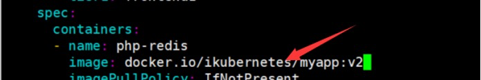

# K8s控制器Replicaset

 

前面我们学习了Pod，那我们在定义pod资源时，可以直接创建一个kind：Pod类型的自主式pod，但是这存在一个问题，假如pod被删除了，那这个pod就不能自我恢复，就会彻底被删除，线上这种情况非常危险，所以今天就给大家讲解下pod的控制器，所谓控制器就是能够管理pod，监测pod运行状况，当pod发生故障，可以自动恢复pod。也就是说能够代我们去管理pod中间层，并帮助我们确保每一个pod资源始终处于我们所定义或者我们所期望的目标状态，一旦pod资源出现故障，那么控制器会尝试重启pod或者里面的容器，如果一直重启有问题的话那么它可能会基于某种策略来进行重新布派或者重新编排；如果pod副本数量低于用户所定义的目标数量，它也会自动补全；如果多余，也会自动终止pod资源。 

 

## 1、Replicaset控制器


### Replicaset概述

ReplicaSet是kubernetes中的一种副本控制器，简称rs，主要作用是控制由其管理的pod，使pod副本的数量始终维持在预设的个数。它的主要作用就是保证一定数量的Pod能够在集群中正常运行，它会持续监听这些Pod的运行状态，在Pod发生故障时重启pod，pod数量减少时重新运行新的 Pod副本。官方推荐不要直接使用ReplicaSet，用Deployments取而代之，Deployments是比ReplicaSet更高级的概念，它会管理ReplicaSet并提供很多其它有用的特性，最重要的是Deployments支持声明式更新，声明式更新的好处是不会丢失历史变更。所以Deployment控制器不直接管理Pod对象，而是由 Deployment 管理ReplicaSet，再由ReplicaSet负责管理Pod对象。

  

### Replicaset工作原理：如何管理Pod？

Replicaset核心作用在于代用户创建指定数量的pod副本，并确保pod副本一直处于满足用户期望的数量， 起到多退少补的作用，并且还具有自动扩容缩容等机制。

 Replicaset控制器主要由三个部分组成：

1、用户期望的pod副本数：用来定义由这个控制器管控的pod副本有几个

2、标签选择器：选定哪些pod是自己管理的，如果通过标签选择器选到的pod副本数量少于我们指定的数量，需要用到下面的组件

3、pod资源模板：如果集群中现存的pod数量不够我们定义的副本中期望的数量怎么办，需要新建pod，这就需要pod模板，新建的pod是基于模板来创建的。

 

### Replicaset资源清单文件编写技巧

查看定义Replicaset资源需要的字段有哪些？

```bash
[root@xianchaomaster1 ~]# kubectl explain rs
KIND:     ReplicaSet
VERSION:  apps/v1
DESCRIPTION:
     ReplicaSet ensures that a specified number of pod replicas are running at
     any given time.
FIELDS:
   apiVersion	<string>  #当前资源使用的api版本，跟VERSION:  apps/v1保持一致
   kind	<string>     #资源类型，跟KIND: ReplicaSet保持一致
   metadata	<Object> #元数据，定义Replicaset名字的
   spec	<Object>     ##定义副本数、定义标签选择器、定义Pod模板
   status	<Object> #状态信息，不能改
```


查看replicaset的spec字段如何定义？

```bash
[root@xianchaomaster1 ~]# kubectl explain rs.spec
KIND:     ReplicaSet
VERSION:  apps/v1
RESOURCE: spec <Object>
DESCRIPTION:
     Spec defines the specification of the desired behavior of the ReplicaSet.
     More info:
     https://git.k8s.io/community/contributors/devel/sig-architecture/api-conventions.md#spec-and-status
     ReplicaSetSpec is the specification of a ReplicaSet.
FIELDS:
   minReadySeconds	<integer>
   replicas	<integer>  #定义的pod副本数，根据我们指定的值创建对应数量的pod
   selector	<Object> -required-  #用于匹配pod的标签选择器
   template	<Object>      #定义Pod的模板，基于这个模板定义的所有pod是一样的
```


查看replicaset的spec.template字段如何定义？

对于template而言，其内部定义的就是pod，pod模板是一个独立的对象

```bash
[root@xianchaomaster1 ~]# kubectl explain rs.spec.template
KIND:     ReplicaSet
VERSION:  apps/v1
RESOURCE: template <Object>
DESCRIPTION:
     Template is the object that describes the pod that will be created if
     insufficient replicas are detected。PodTemplateSpec describes the data a pod should have when created from a
     template
FIELDS:
   metadata	<Object>
   spec	<Object>

[root@xianchaomaster1 ~]# kubectl explain rs.spec.template.spec
```


通过上面可以看到，ReplicaSet资源中有两个spec字段。第一个spec声明的是ReplicaSet定义多少个Pod副本（默认将仅部署1个Pod）、匹配Pod标签的选择器、创建pod的模板。第二个spec是spec.template.spec：主要用于Pod里的容器属性等配置。 

.spec.template里的内容是声明Pod对象时要定义的各种属性，所以这部分也叫做PodTemplate（Pod模板）。还有一个值得注意的地方是：在.spec.selector中定义的标签选择器必须能够匹配到spec.template.metadata.labels里定义的Pod标签，否则Kubernetes将不允许创建ReplicaSet。

 

### Replicaset使用案例：部署Guestbook留言板


把frontend.tar.gz上传到xianchaonode2和xianchaonode1上，解压

```bash
[root@xianchaonode2]# ctr -n=k8s.io images import  frontend.tar.gz
[root@xianchaonode1]# ctr -n=k8s.io images import  frontend.tar.gz
#编写一个ReplicaSet资源清单
[root@xianchaomaster1 rs]# cat replicaset.yaml 
apiVersion: apps/v1
kind: ReplicaSet
metadata:
  name: frontend
  namespace: default
  labels:
    app: guestbook
    tier: frontend
spec:
  replicas: 3
  selector:
    matchLabels:
      tier1: frontend1
  template:
    metadata: 
      labels: 
        tier1: frontend1
    spec:
      containers:
      - name: php-redis
        image: docker.io/yecc/gcr.io-google_samples-gb-frontend:v3
        imagePullPolicy: IfNotPresent
        ports:
        - containerPort: 80
        startupProbe:
           periodSeconds: 5
           initialDelaySeconds: 20
           timeoutSeconds: 10
           httpGet:
             scheme: HTTP
             port: 80
             path: /
        livenessProbe:
           periodSeconds: 5
           initialDelaySeconds: 20
           timeoutSeconds: 10
           httpGet:
             scheme: HTTP
             port: 80
             path: /
        readinessProbe:
           periodSeconds: 5
           initialDelaySeconds: 20
           timeoutSeconds: 10
           httpGet:
             scheme: HTTP
             port: 80
             path: /
```

```bash
[root@xianchaomaster1 ~]# kubectl apply -f replicaset.yaml 
replicaset.apps/frontend created
[root@xianchaomaster1 ~]# kubectl get rs
NAME       DESIRED   CURRENT   READY   AGE
frontend      3          3            3        53m
[root@xianchaomaster1 ~]# kubectl get pods 
NAME             READY   STATUS    RESTARTS   AGE
frontend-82p9b   1/1      Running   0            36m
frontend-j6twz    1/1       Running   0            36m
frontend-lcnq6    1/1       Running   0            36m
```

pod的名字是由控制器的名字-随机数组成的

资源清单详细说明

```yaml
apiVersion: apps/v1  #ReplicaSet 这个控制器属于的核心群组
kind: ReplicaSet  #创建的资源类型
metadata:
  name: frontend  #控制器的名字
  labels:
    app: guestbook
    tier: frontend
spec:
  replicas: 3   #管理的pod副本数量
  selector:
    matchLabels:
      tier1: frontend1  #管理带有tier=frontend标签的pod
  template:  #定义pod的模板
    metadata:
      labels:
        tier1: frontend 1
#pod标签，一定要有，这样上面控制器就能找到它要管理的pod是哪些了
    spec:
      containers: #定义pod里运行的容器
      - name: php-redis #定义容器的名字
        image: yecc/gcr.io-google_samples-gb-frontend:v3
         ports:    #定义端口
         - name: http  #定义容器的名字
           containerPort:  80 #定义容器暴露的端口

```

 

### Replicaset管理pod：扩容、缩容、更新


Replicaset实现pod的动态扩容

ReplicaSet最核心的功能是可以动态扩容和回缩，如果我们觉得两个副本太少了，想要增加，只需要修改配置文件replicaset.yaml里的replicas的值即可，原来replicas: 3，现在变成replicaset: 4，修改之后，执行如下命令更新：

```bash
[root@xianchaomaster1 ~]# kubectl apply -f replicaset.yaml 
replicaset.apps/frontend configured
[root@xianchaomaster1 ~]# kubectl get rs
NAME       DESIRED   CURRENT   READY   AGE
frontend       4            4         4        62m
[root@xianchaomaster1 ~]# kubectl get pods
NAME             READY   STATUS    RESTARTS   AGE
frontend-82p9b    1/1     Running   0          62m
frontend-j6twz     1/1     Running   0          62m
frontend-kzjm7    1/1     Running   0          33s
frontend-lcnq6    1/1     Running   0          62m
```


Replicaset实现pod的动态缩容

如果我们觉得5个Pod副本太多了，想要减少，只需要修改配置文件replicaset.yaml里的replicas的值即可，把replicaset：4变成replicas: 2，修改之后，执行如下命令更新：

```bash
[root@xianchaomaster1 ~]# kubectl apply -f replicaset.yaml 
replicaset.apps/frontend configured 
[root@xianchaomaster1 ~]# kubectl get rs
NAME       DESIRED   CURRENT   READY   AGE
frontend   2         2         2       70m 
[root@xianchaomaster1 ~]# kubectl get pods
NAME             READY   STATUS    RESTARTS   AGE
frontend-j6twz   1/1     Running   0          70m
frontend-lcnq6   1/1     Running   0          70m
```


Replicaset实现pod的更新

把myapp-v2.tar.gz上传到xianchaonode1和xianchaonode2上，手动解压

`[root@xianchaonode1 ~]# ctr -n=k8s.io images import  myapp-v2.tar.gz`

`[root@xianchaonode2 ~]# ctr -n=k8s.io images import  myapp-v2.tar.gz`

 

`vim replicaset.yaml`

修改镜像，变成ikubernetes/myapp:v2

                               

```bash
[root@xianchaomaster1]# kubectl apply -f replicaset.yaml

[root@xianchaomaster1 ~]# kubectl get pods -o wide
NAME             READY   STATUS    RESTARTS   AGE   IP               NODE       NOMINATED NODE   READINESS GATES
frontend-glb2c   1/1     Running   0          34s   10.244.209.133   xianchaonode1             
frontend-lck9t   1/1     Running   0          34s   10.244.187.74    xianchaonode2                  
[root@xianchaomaster1 ~]# curl 10.244.209.133
div style="width: 50%; margin-left: 20px">
 <h2>Guestbook</h2>
[root@xianchaomaster1 ~]# curl 10.244.209.74
div style="width: 50%; margin-left: 20px">
 <h2>Guestbook</h2> 
```


上面可以看到，虽然replicaset.yaml修改了镜像，执行了kubectl apply -f replicaset.yaml，但是pod还是用的frontend:v3这个镜像，没有实现自动更新

 10.244.209.133这个ip对应的pod删除

```bash
[root@xianchaomaster1 ~]# kubectl delete pods frontend-glb2c
pod "frontend-glb2c" deleted
[root@xianchaomaster1 ~]# kubectl get pods -o wide
NAME             READY   STATUS    RESTARTS   AGE     IP              NODE       
frontend-hkhdw   1/1     Running   0          15s     10.244.187.75   xianchaonode2   
frontend-lck9t   1/1     Running   0          2m37s   10.244.187.74   xianchaonode2   
```

重新生成了一个新的pod：frontend-hkhdw

`[root@xianchaomaster1 ~]# curl 10.244.187.75`

`Hello MyApp | Version: v2 | <a href="hostname.html">Pod Name`</a>

新生成的pod的镜像已经变成了myapp的，说明更新完成了


**总结：**

生产环境如果升级，可以删除一个pod，观察一段时间之后没问题再删除另一个pod，但是这样需要人工干预多次；实际生产环境一般采用蓝绿发布，原来有一个rs1，再创建一个rs2（控制器），通过修改service标签，修改service可以匹配到rs2的控制器，这样才是蓝绿发布，这个也需要我们精心的部署规划，我们有一个控制器就是建立在rs之上完成的，叫做Deployment