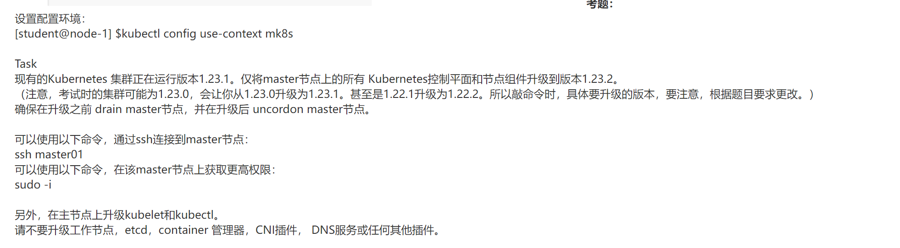

### 第二题：配置rbac的授权

**题目：**

### 第三题： 驱逐node内的pod，并设置node不可用

**题目：**

### 第四题： k8s的升级

**题目：**

### 第五题：etcd数据库的备份与还原 

**题目：**

### 第六题：网络策略

**题目：**

### 第七题：service四层代理

**题目：**

### 第八题： ingress代理

**题目：**

### 第九题：deployment 管理pod扩缩容

**题目：**

### 第十题：将pod调度到指定节点

**题目：**

### 第十一题：检查节点ready状态

**题目：**

### 第十二题：pod封装多个容器

**题目：**

### 第十三题：持久化存储

**题目：**

### 第十四题： 持久化卷

**题目：**

### 第十五题：查看pod日志

题目：

### 第十六题： Sidecar代理

**题目：**

### 第十七题：查看pod的cpu使用率

**题目：**

### 第十八题：集群故障排查

**题目：**

