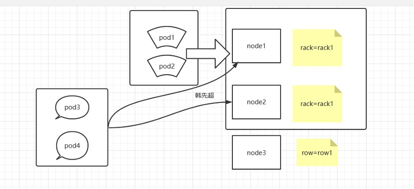
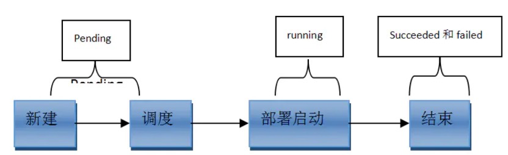

# 标签

## 1 什么是标签？

标签其实就一对 key/value ，被关联到对象上，比如Pod,标签的使用我们倾向于能够表示对象的特殊特点，就是一眼就看出了这个Pod是干什么的，标签可以用来划分特定的对象（比如版本，服务类型等），标签可以在创建一个对象的时候直接定义，也可以在后期随时修改，每一个对象可以拥有多个标签，但是，key值必须是唯一的。创建标签之后也可以方便我们对资源进行分组管理。如果对pod打标签，之后就可以使用标签来查看、删除指定的pod。

在k8s中，大部分资源都可以打标签。

 

## 2 给pod资源打标签

 

```bash
[root@xianchaomaster1]# kubectl apply -f pod-first.yaml

#对已经存在的pod打标签

[root@xianchaomaster1~]# kubectl label pods tomcat-test release=v1

#查看标签是否打成功：

[root@xianchaomaster1~]# kubectl get pods tomcat-test --show-labels
```

显示如下,显示如下，说明标签达成功了；

```
NAME      READY  STATUS  RESTARTS  AGE  LABELS

tomcat-test  1/1   Running  1     21h  release=v1, app=tomcat-pod-first
```

 

## 3 查看资源标签


```bash
#查看默认名称空间下所有pod资源的标签
[root@xianchaomaster1~]# kubectl get pods --show-labels 

#查看默认名称空间下指定pod具有的所有标签
[root@xianchaomaster1~]# kubectl get pods tomcat-test --show-labels

#列出默认名称空间下标签key是release的pod，不显示标签
[root@xianchaomaster1~]# kubectl get pods -l release

#列出默认名称空间下标签key是release、值是v1的pod，不显示标签
[root@xianchaomaster1~]# kubectl get pods -l release=v1

#列出默认名称空间下标签key是release的所有pod，并打印对应的标签值
[root@xianchaomaster1~]# kubectl get pods -L release

#查看所有名称空间下的所有pod的标签
[root@xianchaomaster1 ~]# kubectl get pods --all-namespaces --show-labels
```

 

# node节点选择器


我们在创建pod资源的时候，pod会根据schduler进行调度，那么默认会调度到随机的一个工作节点，如果我们想要pod调度到指定节点或者调度到一些具有相同特点的node节点，怎么办呢？

可以使用pod中的nodeName或者nodeSelector字段指定要调度到的node节点

## **1、nodeName：**

指定pod节点运行在哪个具体node上

```bash
#把tomcat.tar.gz上传到xianchaonode1和xianchaonode2，手动解压：

[root@xianchaonode1 ~]# ctr -n=k8s.io images import  tomcat.tar.gz 

Loaded image: tomcat:8.5-jre8-alpine

[root@xianchaonode2 ~]# ctr -n=k8s.io images import  tomcat.tar.gz 

Loaded image: tomcat:8.5-jre8-alpine

# 把busybox.tar.gz上传到xianchaonode1和xianchaonode2，手动解压：

[root@xianchaonode1 ~]# ctr -n=k8s.io images import  busybox.tar.gz

[root@xianchaonode2 ~]# ctr -n=k8s.io images import  busybox.tar.gz
```


```yaml
[root@xianchaomaster1 ~]# cat pod-node.yaml 

apiVersion: v1
kind: Pod
metadata:
 name: demo-pod
 namespace: default
 labels:
  app: myapp
  env: dev
spec:
 nodeName: xianchaonode1
 containers:
 - name: tomcat-pod-java
  ports:
  - containerPort: 8080
  image: tomcat:8.5-jre8-alpine
  imagePullPolicy: IfNotPresent
  - name: busybox
  image: busybox:latest
  command:
  - "/bin/sh"
  - "-c"
  - "sleep 3600"
```


```bash
[root@xianchaomaster1 ~]# kubectl apply -f pod-node.yaml

#查看pod调度到哪个节点

[root@xianchaomaster1 ~]# kubectl get pods -o wide

NAME       READY  STATUS  RESTARTS       

demo-pod    1/1   Running  0      xianchaonode1 
```

 

## **2、nodeSelector：**

指定pod调度到具有哪些标签的node节点上

**给node节点打标签，打个具有disk=ceph的标签**

```bash
[root@xianchaomaster1 ~]# kubectl label nodes xianchaonode2 disk=ceph

node/xianchaonode2 labeled
```

**定义pod的时候指定要调度到具有disk=ceph标签的node上**

```yaml
[root@xianchaomaster1 ~]# cat pod-1.yaml 

apiVersion: v1
kind: Pod
metadata:
 name: demo-pod-1
 namespace: default
 labels:
  app: myapp
  env: dev
spec:
 nodeSelector:
  disk: ceph
 containers:
 - name: tomcat-pod-java
  ports:
  - containerPort: 8080
  image: tomcat:8.5-jre8-alpine
  imagePullPolicy: IfNotPresent
```


```
[root@xianchaomaster1 ~]# kubectl apply -f pod-1.yaml

#查看pod调度到哪个节点

[root@xianchaomaster1 ~]# kubectl get pods -o wide

NAME       READY  STATUS  RESTARTS       

demo-pod-1    1/1   Running  0      xianchaonode2
```

 

做完上面实验，需要把default名称空间下的pod全都删除，kubectl delete pods pod名字

删除node节点打的标签：

`[root@xianchaomaster1 ~]# kubectl label nodes xianchaonode2 disk-`

 **假如yaml文件改成如下：**

```yaml

apiVersion: v1
kind: Pod
metadata:
 name: demo-pod-1
 namespace: default
 labels:
  app: myapp
  env: dev
spec:
 nodeName: xianchaonode2
 nodeSelector:
  disk: ceph
 containers:
 - name: tomcat-pod-java
  ports:
  - containerPort: 8080
  image: tomcat:8.5-jre8-alpine
  imagePullPolicy: IfNotPresent
```

那么创建pod，会报错，报什么错呢？

`Warning NodeAffinity 17s  kubelet Predicate NodeAffinity failed`

同一个yaml文件里定义pod资源，如果同时定义了nodeName和NodeSelector，那么条件必须都满足才可以，有一个不满足都会调度失败

 

假如给xianchaonode2继续打上标签

```bash
[root@xianchaomaster1 ~]# kubectl label nodes xianchaonode2 disk=ceph

[root@xianchaomaster1 pod-2]# kubectl get pods -owide

NAME     READY  STATUS  RESTARTS  AGE  IP       NODE      NOMINATED NODE  READINESS GATES

demo-pod-1  1/1   Running  0     4s  10.244.102.79  xianchaonode2  
```

 

上面可以看到pod能正常调度到xianchaonode2上

```bash
[root@xianchaomaster1 ~]# kubectl label nodes xianchaonode2 disk-

[root@xianchaomaster1]# kubectl delete -f pod-1.yaml
```

 

# 污点、容忍度、亲和性


##  1、node节点亲和性


node节点亲和性调度：nodeAffinity

```bash
[root@xianchaomaster1 ~]# kubectl explain pods.spec.affinity 
KIND:   Pod
VERSION: v1
RESOURCE: affinity <Object>
DESCRIPTION:
   If specified, the pod's scheduling constraints
  Affinity is a group of affinity scheduling rules.
FIELDS:
  nodeAffinity <Object>
  podAffinity  <Object>
  
  podAntiAffinity   <Object>
```

 

```bash
[root@xianchaomaster1 ~]# kubectl explain pods.spec.affinity.nodeAffinity
KIND:   Pod
VERSION: v1
RESOURCE: nodeAffinity <Object>
DESCRIPTION:
   Describes node affinity scheduling rules for the pod.
   Node affinity is a group of node affinity scheduling rules.
FIELDS:
  preferredDuringSchedulingIgnoredDuringExecution   <[]Object>
  requiredDuringSchedulingIgnoredDuringExecution <Object>
```

prefered表示有节点尽量满足这个位置定义的亲和性，这不是一个必须的条件，软亲和性

require表示必须有节点满足这个位置定义的亲和性，这是个硬性条件，硬亲和性

```bash
[root@xianchaomaster1 ~]# kubectl explain pods.spec.affinity.nodeAffinity.requiredDuringSchedulingIgnoredDuringExecution

KIND:   Pod

VERSION: v1

RESOURCE: requiredDuringSchedulingIgnoredDuringExecution <Object>

DESCRIPTION:

FIELDS:

  nodeSelectorTerms  <[]Object> -required-

   Required. A list of node selector terms. The terms are ORed.
```

 

```bash
[root@xianchaomaster1 ~]# kubectl explain pods.spec.affinity.nodeAffinity.requiredDuringSchedulingIgnoredDuringExecution.nodeSelectorTerms

KIND:   Pod

VERSION: v1

RESOURCE: nodeSelectorTerms <[]Object>

DESCRIPTION:

   Required. A list of node selector terms. The terms are ORed.

   A null or empty node selector term matches no objects. The requirements of

   them are ANDed. The TopologySelectorTerm type implements a subset of the

   NodeSelectorTerm.

FIELDS:

  matchExpressions   <[]Object>
  matchFields  <[]Object>
  #matchExpressions：匹配表达式的
  #matchFields： 匹配字段的
```

 

```bash
[root@xianchaomaster1 ~]# kubectl explain pods.spec.affinity.nodeAffinity.requiredDuringSchedulingIgnoredDuringExecution.nodeSelectorTerms.matchFields
KIND:   Pod
VERSION: v1
RESOURCE: matchFields <[]Object>
DESCRIPTION:

 

FIELDS:

  key  <string> -required-

  values <[]string>
```

 ```bash
 [root@xianchaomaster1 ~]# kubectl explain pods.spec.affinity.nodeAffinity.requiredDuringSchedulingIgnoredDuringExecution.nodeSelectorTerms.matchExpressions
 
 FIELDS:
 
   key <string> -required-
 
    The label key that the selector applies to.
 
   operator  <string> -required-
 
    Represents a key's relationship to a set of values. Valid operators are In,
 
    NotIn, Exists, DoesNotExist. Gt, and Lt.
 
    Possible enum values:
 
     - `"DoesNotExist"`
 
     - `"Exists"`
 
     - `"Gt"`
 
     - `"In"`
 
     - `"Lt"`
 
     - `"NotIn"`
 
   values   <[]string>
 
    An array of string values. If the operator is In or NotIn, the values array
 
    must be non-empty. If the operator is Exists or DoesNotExist, the values
 
    array must be empty. If the operator is Gt or Lt, the values array must
 
    have a single element, which will be interpreted as an integer. This array
 
    is replaced during a strategic merge patch.
 ```

key：检查label

operator：做等值选则还是不等值选则

values：给定值

 

**例1：**使用requiredDuringSchedulingIgnoredDuringExecution硬亲和性

把myapp-v1.tar.gz上传到xianchaonode2和xianchaonode1上，手动解压：

```
[root@xianchaonode1 ~]# ctr -n=k8s.io images import  myapp-v1.tar.gz 

Loaded image: ikubernetes/myapp:v1

[root@xianchaonode2 ~]# ctr -n=k8s.io images import  myapp-v1.tar.gz 

Loaded image: ikubernetes/myapp:v1
```

```yaml
[root@xianchaomaster1 ~]# cat pod-nodeaffinity-demo.yaml 

apiVersion: v1
kind: Pod
metadata:
 name: pod-node-affinity-demo
 namespace: default
 labels:
  app: myapp
  tier: frontend
spec:
 affinity:
  nodeAffinity:
   requiredDuringSchedulingIgnoredDuringExecution:
     nodeSelectorTerms:
     - matchExpressions:
      - key: zone
       operator: In
       values: 
       - foo
       - bar
 containers:
 - name: myapp
   image: docker.io/ikubernetes/myapp:v1
   imagePullPolicy: IfNotPresent
```

我们检查当前节点中有任意一个节点拥有zone标签的值是foo或者bar，就可以把pod调度到这个node节点的foo或者bar标签上的节点上

```bash
[root@xianchaomaster1 ~]# kubectl apply -f pod-nodeaffinity-demo.yaml 

[root@xianchaomaster1 ~]# kubectl get pods -o wide | grep pod-node

pod-node-affinity-demo       0/1   Pending   0  xianchaonode1      
```

status的状态是pending，上面说明没有完成调度，因为没有一个拥有zone的标签的值是foo或者bar，而且使用的是硬亲和性，必须满足条件才能完成调度

`[root@xianchaomaster1 ~]# kubectl label nodes xianchaonode1 zone=foo`

给这个xianchaonode1节点打上标签zone=foo，在查看

```bash
[root@xianchaomaster1 ~]#kubectl get pods -o wide 

#显示如下：

pod-node-affinity-demo       1/1   Running 0  xianchaonode1
```

 

**例2：**使用preferredDuringSchedulingIgnoredDuringExecution软亲和性

```bash
[root@xianchaomaster1]# cat pod-nodeaffinity-demo-2.yaml 
apiVersion: v1
kind: Pod
metadata:
  name: pod-node-affinity-demo-2
  namespace: default
  labels:
    app: myapp
    tier: frontend
spec:
  containers:
  - name: myapp
    image: docker.io/ikubernetes/myapp:v1
    imagePullPolicy: IfNotPresent
  affinity:
    nodeAffinity:
      preferredDuringSchedulingIgnoredDuringExecution:
      - preference:
          matchExpressions: 
          - key: zone1
            operator: In
            values:
            - foo1
            - bar1
        weight: 10
      - preference:
          matchExpressions:
          - key: zone2
            operator: In
            values:
            - foo2
            - bar2
        weight: 20

```


```bash
[root@xianchaomaster1 ~]# kubectl apply -f pod-nodeaffinity-demo-2.yaml
[root@xianchaomaster1 ~]# kubectl get pods -o wide |grep demo-2
pod-node-affinity-demo-2      1/1   Running   0    xianchaonode1
```

​       

上面说明软亲和性是可以运行这个pod的，尽管没有运行这个pod的节点定义的zone1标签

Node节点亲和性针对的是pod和node的关系，Pod调度到node节点的时候匹配的条件

**测试weight权重：**

  weight是相对权重，权重越高，pod调度的几率越大

  假如给xianchaonode1和xianchaonode2都打上标签

```bash
[root@xianchaomaster1 ~]# kubectl label nodes xianchaonode1 zone1=foo1
[root@xianchaomaster1 ~]# kubectl label nodes xianchaonode2 zone2=foo2
preferredDuringSchedulingIgnoredDuringExecution:
      - preference:
          matchExpressions: 
          - key: zone1
            operator: In
            values:
            - foo1
            - bar1
        weight: 10
      - preference:
          matchExpressions:
          - key: zone2
            operator: In
            values:
            - foo2
            - bar2
        weight: 20
 
```


pod在定义node节点亲和性的时候，xianchaonode1和xianchaonode2都满足条件，都可以调度pod，但是xianchaonode2具有的标签是zone2=foo2，pod在匹配zone2=foo2的权重高，那么pod就会优先调度到xianchaonode2上

 

```bash
[root@xianchaomaster1 ~]# kubectl label nodes xianchaonode1 zone1-
[root@xianchaomaster1 ~]# kubectl label nodes xianchaonode2 zone2-
[root@xianchaomaster1 ~]# kubectl label nodes xianchaonode1 zone-

[root@xianchaomaster1]# kubectl delete -f pod-nodeaffinity-demo.yaml
[root@xianchaomaster1]# kubectl delete -f pod-nodeaffinity-demo-2.yaml
 
```

 **删除默认名称空间的所有pod资源**

```bash
[root@xianchaomaster1 pod-2]# kubectl get pods -owide 
No resources found in default namespace.

```

 

## 2 Pod节点亲和性


pod自身的亲和性调度有两种表示形式

podaffinity：pod和pod更倾向腻在一起，把相近的pod结合到相近的位置，如同一区域，同一机架，这样的话pod和pod之间更好通信，比方说有两个机房，这两个机房部署的集群有1000台主机，那么我们希望把nginx和tomcat都部署同一个地方的node节点上，可以提高通信效率；

podunaffinity：pod和pod更倾向不腻在一起，如果部署两套程序，那么这两套程序更倾向于反亲和性，这样相互之间不会有影响。

第一个pod随机选则一个节点，做为评判后续的pod能否到达这个pod所在的节点上的运行方式，这就称为pod亲和性；我们怎么判定哪些节点是相同位置的，哪些节点是不同位置的；我们在定义pod亲和性时需要有一个前提，哪些pod在同一个位置，哪些pod不在同一个位置，这个位置是怎么定义的，标准是什么？以节点名称为标准，这个节点名称相同的表示是同一个位置，节点名称不相同的表示不是一个位置。 

```bash
[root@xianchaomaster1 ~]# kubectl explain pods.spec.affinity.podAffinity
KIND:     Pod
VERSION:  v1
RESOURCE: podAffinity <Object>
DESCRIPTION:
     Describes pod affinity scheduling rules (e.g. co-locate this pod in the
     same node, zone, etc. as some other pod(s)).
     Pod affinity is a group of inter pod affinity scheduling rules.
FIELDS:
   preferredDuringSchedulingIgnoredDuringExecution	<[]Object>
   requiredDuringSchedulingIgnoredDuringExecution	<[]Object>
   
#requiredDuringSchedulingIgnoredDuringExecution： 硬亲和性
#preferredDuringSchedulingIgnoredDuringExecution：软亲和性

```


```bash
[root@xianchaomaster1 ~]# kubectl explain pods.spec.affinity.podAffinity.requiredDuringSchedulingIgnoredDuringExecution
KIND:     Pod
VERSION:  v1
RESOURCE: requiredDuringSchedulingIgnoredDuringExecution <[]Object>
DESCRIPTION:
FIELDS:
   labelSelector	<Object>
   namespaces	<[]string>
   topologyKey	<string> -required-

```


topologyKey：

位置拓扑的键，这个是必须字段

怎么判断是不是同一个位置：

rack=rack1

row=row1

使用rack的键是同一个位置

使用row的键是同一个位置

labelSelector：

我们要判断pod跟别的pod亲和，跟哪个pod亲和，需要靠labelSelector，通过labelSelector选则一组能作为亲和对象的pod资源

namespace：

labelSelector需要选则一组资源，那么这组资源是在哪个名称空间中呢，通过namespace指定，如果不指定namespaces，那么就是当前创建pod的名称空间

 

​                               

 ```bash
 [root@xianchaomaster1 ~]# kubectl explain pods.spec.affinity.podAffinity.requiredDuringSchedulingIgnoredDuringExecution.labelSelector 
 KIND:     Pod
 VERSION:  v1
 RESOURCE: labelSelector <Object>
 DESCRIPTION:
      A label query over a set of resources, in this case pods.
      A label selector is a label query over a set of resources. The result of
      matchLabels and matchExpressions are ANDed. An empty label selector matches
      all objects. A null label selector matches no objects.
 FIELDS:
    matchExpressions	<[]Object>
    matchLabels	<map[string]string>
 
 ```


 

例1：pod节点亲和性

定义两个pod，第一个pod做为基准，第二个pod跟着它走

\#查看默认名称空间有哪些pod

`[root@xianchaomaster1 pod-2]# kubectl get pods`

把看到的pod删除，让默认名称空间没有pod

```bash
[root@xianchaomaster1 ~]# cat pod-required-affinity-demo-1.yaml 
apiVersion: v1
kind: Pod
metadata:
  name: pod-first
  labels:
    app2: myapp2
    tier: frontend
spec:
    containers:
    - name: myapp
      image: ikubernetes/myapp:v1
      imagePullPolicy: IfNotPresent

```

 ```bash
 [root@xianchaomaster1 ]# kubectl apply -f pod-required-affinity-demo-1.yaml
 
 [root@xianchaomaster1 ~]# cat pod-required-affinity-demo-2.yaml 
 apiVersion: v1
 kind: Pod
 metadata:
   name: pod-second
   labels:
     app: backend
     tier: db
 spec:
     containers:
     - name: busybox
       image: busybox:latest
       imagePullPolicy: IfNotPresent
       command: ["sh","-c","sleep 3600"]
     affinity:
       podAffinity:
          requiredDuringSchedulingIgnoredDuringExecution:
          - labelSelector:
               matchExpressions:
               - {key: app2, operator: In, values: ["myapp2"]}
            topologyKey: kubernetes.io/hostname
 
 ```

 上面表示创建的pod必须与拥有app=myapp标签的pod在一个节点上

```bash
[root@xianchaomaster1 ~]# kubectl apply -f pod-required-affinity-demo-2.yaml 
kubectl get pods -o wide 显示如下：
pod-first              running        xianchaonode2
pod-second             running        xianchaonode2
```

上面说明第一个pod调度到哪，第二个pod也调度到哪，这就是pod节点亲和性

```bash
[root@xianchaomaster1 ~]# kubectl delete -f pod-required-affinity-demo-1.yaml
[root@xianchaomaster1 ~]# kubectl delete -f pod-required-affinity-demo-2.yaml

```

例2：pod节点反亲和性

定义两个pod，第一个pod做为基准，第二个pod跟它调度节点相反

```bash
[root@xianchaomaster1 ~]# cat pod-required-anti-affinity-demo-1.yaml
apiVersion: v1
kind: Pod
metadata:
  name: pod-first
  labels:
    app1: myapp1
    tier: frontend
spec:
    containers:
    - name: myapp
      image: ikubernetes/myapp:v1
      imagePullPolicy: IfNotPresent

[root@xianchaomaster1 ~]# kubectl apply -f  pod-required-anti-affinity-demo-1.yaml

[root@xianchaomaster1 ~]# cat pod-required-anti-affinity-demo-2.yaml
apiVersion: v1
kind: Pod
metadata:
  name: pod-second
  labels:
    app: backend
    tier: db
spec:
    containers:
    - name: busybox
      image: busybox:latest
      imagePullPolicy: IfNotPresent
      command: ["sh","-c","sleep 3600"]
    affinity:
      podAntiAffinity:
         requiredDuringSchedulingIgnoredDuringExecution:
         - labelSelector:
              matchExpressions:
              - {key: app1, operator: In, values: ["myapp1"]}
           topologyKey: kubernetes.io/hostname

```

`[root@xianchaomaster1 ~]# kubectl apply -f pod-required-anti-affinity-demo-2.yaml`


`[root@xianchaomaster1 ~]# kubectl get pods -o wide` 显示两个pod不在一个node节点上，这就是pod节点反亲和性

```
pod-first      running    xianchaonode1

pod-second      running    xianchaonode2
```

```
[root@xianchaomaster1 ~]# kubectl delete -f pod-required-anti-affinity-demo-1.yaml

[root@xianchaomaster1 ~]# kubectl delete -f pod-required-anti-affinity-demo-2.yaml
```

**例3**：换一个topologykey

```bash
[root@xianchaomaster1 ~]# kubectl label nodes  xianchaonode2  zone=foo
[root@xianchaomaster1 ~]# kubectl label nodes  xianchaonode1  zone=foo 
[root@xianchaomaster1]# cat pod-first-required-anti-affinity-demo-1.yaml
apiVersion: v1
kind: Pod
metadata:
  name: pod-first
  labels:
    app3: myapp3
    tier: frontend
spec:
    containers:
    - name: myapp
      image: ikubernetes/myapp:v1
      imagePullPolicy: IfNotPresent

[root@xianchaomaster1 affinity]# kubectl apply -f pod-first-required-anti-affinity-demo-1.yaml

[root@xianchaomaster1]# cat pod-second-required-anti-affinity-demo-1.yaml 
apiVersion: v1
kind: Pod
metadata:
  name: pod-second
  labels:
    app: backend
    tier: db
spec:
    containers:
    - name: busybox
      image: busybox:latest
      imagePullPolicy: IfNotPresent
      command: ["sh","-c","sleep 3600"]
    affinity:
      podAntiAffinity:
         requiredDuringSchedulingIgnoredDuringExecution:
         - labelSelector:
              matchExpressions:
              - {key: app3 ,operator: In, values: ["myapp3"]}
           topologyKey:  zone


[root@xianchaomaster1 affinity]# kubectl apply -f pod-second-required-anti-affinity-demo-1.yaml

[root@xianchaomaster1 ~]#kubectl get pods -o wide 
#显示如下：
pod-first              running         xianchaonode1
pod-second            pending         <none>

[root@xianchaomaster1]# kubectl delete -f pod-first-required-anti-affinity-demo-1.yaml 
pod "pod-first" deleted
[root@xianchaomaster1]# kubectl delete -f pod-second-required-anti-affinity-demo-1.yaml

[root@xianchaomaster1 ~]#  kubectl label nodes  xianchaonode1  zone-
[root@xianchaomaster1 ~]#  kubectl label nodes  xianchaonode2  zone-
 
```

第二个pod是pending，因为两个节点是同一个位置，现在没有不是同一个位置的了，而且我们要求反亲和性，所以就会处于pending状态，如果在反亲和性这个位置把required改成preferred，那么也会运行。

podaffinity：pod节点亲和性，pod倾向于哪个pod

poduntiaffinity:pod反亲和性

nodeaffinity：node节点亲和性，pod倾向于哪个node

 

## 3 污点、容忍度


给了节点选则的主动权，我们给节点打一个污点，不容忍的pod就运行不上来，污点就是定义在节点上的键值属性数据，可以定决定拒绝那些pod；

taints是键值数据，用在节点上，定义污点；

tolerations是键值数据，用在pod上，定义容忍度，能容忍哪些污点

pod亲和性是pod属性；但是污点是节点的属性，污点定义在k8s集群的节点上的一个字段

```bash
[root@xianchaomaster1 affinity]# kubectl describe nodes xianchaomaster1

Taints:             node-role.kubernetes.io/control-plane:NoSchedule

[root@xianchaomaster1 ~]# kubectl explain node.spec.taints
KIND:     Node
VERSION:  v1
RESOURCE: taints <[]Object>
DESCRIPTION:
     If specified, the node's taints.
     The node this Taint is attached to has the "effect" on any pod that does
     not tolerate the Taint.
FIELDS:
   effect	<string> -required-
   key	<string> -required-
   timeAdded	<string>
   value	<string>

```

taints的effect用来定义对pod对象的排斥等级（效果）： 

**NoSchedule：**

仅影响pod调度过程，当pod能容忍这个节点污点，就可以调度到当前节点，后来这个节点的污点改了，加了一个新的污点，使得之前调度的pod不能容忍了，那这个pod会怎么处理，对现存的pod对象不产生影响

**NoExecute：**

既影响调度过程，又影响现存的pod对象，如果现存的pod不能容忍节点后来加的污点，这个pod就会被驱逐 

**PreferNoSchedule：**

最好不，也可以，是NoSchedule的柔性版本

 

`[root@xianchaomaster1 ~]# kubectl describe nodes xianchaomaster1`

查看master这个节点是否有污点，显示如下：

`Taints:       node-role.kubernetes.io/control-plane:NoSchedule`

上面可以看到master这个节点的污点是Noschedule

 

所以我们创建的pod都不会调度到master上，因为我们创建的pod没有容忍度

`[root@xianchaomaster1 ~]# kubectl describe pods kube-apiserver-xianchaomaster1 -n kube-system`

显示如下：

`Tolerations:    :NoExecute op=Exists`

可以看到这个pod的容忍度是NoExecute，则可以调度到xianchaomaster1上

 

**管理节点污点**

`[root@xianchaomaster1]# kubectl taint –help`

 

**例1**：把xianchaonode2当成是生产环境专用的，其他node是测试的

`[root@xianchaomaster1 ~]# kubectl taint node xianchaonode2 node-type=production:NoSchedule`

给xianchaonode2打污点，pod如果不能容忍就不会调度过来）

```bash
[root@xianchaomaster1 ~]# cat pod-taint.yaml 
apiVersion: v1
kind: Pod
metadata:
  name: taint-pod
  namespace: default
  labels:
    tomcat:  tomcat-pod
spec:
  containers:
  - name:  taint-pod
    ports:
    - containerPort: 8080
    image: tomcat:8.5-jre8-alpine
imagePullPolicy: IfNotPresent 
```

```bash
[root@xianchaomaster1 ~]# kubectl apply -f pod-taint.yaml

[root@xianchaomaster1 ~]# kubectl get pods -o wide 
```

显示如下：

`taint-pod  running  xianchaonode1`

可以看到都被调度到xianchaonode1上了，因为xianchaonode2这个节点打了污点，而我们在创建pod的时候没有容忍度，所以xianchaonode2上不会有pod调度上去的

 

**例2：**给xianchaonode1也打上污点

```bash
[root@xianchaomaster1 ~]#kubectl taint node xianchaonode1 node-type=dev:NoExecute

[root@xianchaomaster1 ~]#kubectl get pods -o wide 
```

显示如下：

taint-pod  termaitering

上面可以看到已经存在的pod节点都被撵走了

```bash
[root@xianchaomaster1 ~]# cat pod-demo-1.yaml 
apiVersion: v1
kind: Pod
metadata:
  name: myapp-deploy
  namespace: default
  labels:
    app: myapp
    release: canary
spec:
      containers:
      - name: myapp
        image: ikubernetes/myapp:v1
        imagePullPolicy: IfNotPresent
        ports:
        - name: http
          containerPort: 80
      tolerations:
      - key: "node-type"
        operator: "Equal"
        value: "production"
        effect: "NoExecute"
        tolerationSeconds: 3600
```

```bash
[root@xianchaomaster1 ~]# kubectl apply -f pod-demo-1.yaml

[root@xianchaomaster1 ~]# kubectl get pods

myapp-deploy  1/1   Pending  0     11s xianchaonode2
```

 

还是显示pending，因为我们使用的是equal（等值匹配），所以key和value，effect必须和node节点定义的污点完全匹配才可以，把上面配置effect: "NoExecute"变成

effect: "NoSchedule"成； 

tolerationSeconds: 3600这行去掉

```bash
[root@xianchaomaster1 ~]# kubectl delete -f pod-demo-1.yaml

[root@xianchaomaster1 ~]# kubectl apply -f pod-demo-1.yaml

[root@xianchaomaster1 ~]# kubectl get pods

myapp-deploy  1/1   running 0     11s xianchaonode2 
```

上面就可以调度到xianchaonode2上了，因为在pod中定义的容忍度能容忍node节点上的污点

 

**例3：**再次修改

修改如下部分：

```
tolerations:
- key: "node-type"
operator: "Exists"
value: ""
effect: "NoSchedule"
```


只要对应的键是存在的，exists，其值被自动定义成通配符

```
[root@xianchaomaster1 ~]# kubectl delete -f pod-demo-1.yaml
[root@xianchaomaster1 ~]# kubectl apply -f pod-demo-1.yaml
[root@xianchaomaster1 ~]# kubectl get pods
```

发现还是调度到xianchaonode2上

`myapp-deploy  1/1   running 0     11s xianchaonode2`

 

再次修改：

```
tolerations:
- key: "node-type"
operator: "Exists"
value: ""
effect: ""
```

有一个node-type的键，不管值是什么，不管是什么效果，都能容忍

```
[root@xianchaomaster1 ~]# kubectl delete -f pod-demo-1.yaml
[root@xianchaomaster1 ~]# kubectl apply -f pod-demo-1.yaml
```

`[root@xianchaomaster1 ~]# kubectl get pods -o wide`

 显示如下:

`myapp-deploy running  xianchaonode1`

可以看到xianchaonode2和xianchaonode1节点上都有可能有pod被调度

 

删除污点：

```
[root@xianchaomaster1 taint]# kubectl taint nodes xianchaonode1 node-type:NoExecute-

[root@xianchaomaster1 taint]# kubectl taint nodes xianchaonode2 node-type-
```

 

# Pod常见的状态和重启策略

## 1 常见的pod状态

 

 

**pod常见的状态：**

第一阶段：

挂起（Pending）：

1、正在创建Pod但是Pod中的容器还没有全部被创建完成，处于此状态的Pod应该检查Pod依赖的存储是否有权限挂载、镜像是否可以下载、调度是否正常等

2、我们在请求创建pod时，条件不满足，调度没有完成，没有任何一个节点能满足调度条件，已经创建了pod但是没有适合它运行的节点叫做挂起，调度没有完成。

失败（Failed）：Pod 中的所有容器都已终止了，并且至少有一个容器是因为失败终止。也就是说，容器以非0状态退出或者被系统终止。

未知（Unknown）：未知状态，所谓pod是什么状态是apiserver和运行在pod节点的kubelet进行通信获取状态信息的，如果节点之上的kubelet本身出故障，那么apiserver就连不上kubelet，得不到信息了，就会看Unknown，通常是由于与pod所在的node节点通信错误。

Error 状态：Pod 启动过程中发生了错误

成功（Succeeded）：Pod中的所有容器都被成功终止，即pod里所有的containers均已terminated。 

 

第二阶段：

Unschedulable：Pod不能被调度， scheduler没有匹配到合适的node节点

PodScheduled：pod正处于调度中，在scheduler刚开始调度的时候，还没有将pod分配到指定的node，在筛选出合适的节点后就会更新etcd数据，将pod分配到指定的node

Initialized：所有pod中的初始化容器已经完成了

ImagePullBackOff：Pod所在的node节点下载镜像失败

Running：Pod内部的容器已经被创建并且启动。

 

扩展：还有其他状态，如下：

Evicted状态：出现这种情况，多见于系统内存或硬盘资源不足，可df-h查看docker存储所在目录的资源使用情况，如果百分比大于85%，就要及时清理下资源，尤其是一些大文件、docker镜像。

CrashLoopBackOff：容器曾经启动了，但可能又异常退出了

 

 

## 2  pod重启策略

Pod的重启策略（RestartPolicy）应用于Pod内的所有容器，当某个容器异常退出或者健康检查失败时，kubelet将根据 重启策略来进行相应的操作。

Pod 的 spec 中包含一个 restartPolicy 字段，其可能取值包括 Always、OnFailure 和 Never。默认值是 Always。

Always：只要容器异常退出，kubelet就会自动重启该容器。（这个是默认的重启策略）

OnFailure：当容器终止运行且退出码不为0时，由kubelet自动重启该容器。

Never：不论容器运行状态如何，kubelet都不会重启该容器。

 

### 2.1 测试Always重启策略

```bash
[root@xianchaomaster1]# cat pod.yaml 
apiVersion: v1
kind: Pod
metadata:
  name: demo-pod
  namespace: default
  labels:
    app: myapp
spec:
  restartPolicy: Always
  containers:
  - name:  tomcat-pod-java
    ports:
    - containerPort: 8080
    image: xianchao/tomcat-8.5-jre8:v1
imagePullPolicy: IfNotPresent

[root@xianchaomaster1]# kubectl apply -f pod.yaml
```


 

1）正常停止容器里的tomcat服务

`[root@xianchaomaster1]# kubectl exec -it demo-pod -- /bin/bash`

`/usr/local/tomcat/bin/shutdown.sh`

查看pod状态：

```
[root@xianchaomaster1 pod-1]# kubectl get pod

NAME     READY  STATUS  RESTARTS   AGE

demo-pod  1/1   Running  1 (5s ago)  3m24s
```

 发现正常停止容器里的tomcat服务，容器重启了一次，pod又恢复正常了

 

2）非正常停止容器里的tomcat服务

```
[root@xianchaomaster1]# kubectl exec -it demo-pod -- /bin/bash

kill 1

[root@xianchaomaster1 pod-1]# kubectl get pod

NAME     READY  STATUS  RESTARTS   AGE

demo-pod  1/1   Running  2 (5s ago)  3m24s
```

上面可以看到容器终止了，并且又重启一次，重启次数增加了一次

 

### 2.2 测试never重启策略

```bash
[root@xianchaomaster1 ~]# vim pod.yaml 
apiVersion: v1
kind: Pod
metadata:
  name: demo-pod
  namespace: default
  labels:
    app: myapp
spec:
  restartPolicy: Never
  containers:
  - name:  tomcat-pod-java
    ports:
    - containerPort: 8080
    image: xianchao/tomcat-8.5-jre8:v1
imagePullPolicy: IfNotPresent	

[root@xianchaomaster1]# kubectl apply -f pod.yaml
```

1. 正常停止容器里的tomcat服务

`[root@xianchaomaster1]# kubectl exec -it demo-pod -- /bin/bash`

`/usr/local/tomcat/bin/shutdown.sh`

查看pod状态：

```
[root@xianchaomaster1 pod-1]# kubectl get pod

NAME     READY  STATUS   RESTARTS   AGE

demo-pod  1/1    Completed 0   3m24s
```

发现正常停止容器里的tomcat服务，pod正常运行，容器没有重启

 

2. 非正常停止容器里的tomcat服务

```
[root@xianchaomaster1]# kubectl exec -it tomcat-pod -- /bin/bash

kill 1

[root@xianchaomaster1 pod-1]# kubectl get pod

NAME     READY  STATUS  RESTARTS   AGE

demo-pod  1/1    error   0      3m24s
```

上面可以看到容器状态是error，并且没有重启，这说明重启策略是never，那么pod里容器服务无论如何终止，都不会重启

 

### 2.3 测试OnFailure重启策略

```bash
[root@xianchaomaster1 ~]# vim pod.yaml 
apiVersion: v1
kind: Pod
metadata:
  name: demo-pod
  namespace: default
  labels:
    app: myapp
spec:
  restartPolicy: OnFailure
  containers:
  - name:  tomcat-pod-java
    ports:
    - containerPort: 8080
    image: xianchao/tomcat-8.5-jre8:v1
imagePullPolicy: IfNotPresent	

[root@xianchaomaster1]# kubectl apply -f pod.yaml
```

1. 正常停止容器里的tomcat服务

`[root@xianchaomaster1]# kubectl exec -it demo-pod -- /bin/bash`

`/usr/local/tomcat/bin/shutdown.sh`

 

\#查看pod状态：

```
[root@xianchaomaster1 pod-1]# kubectl get pod

NAME     READY  STATUS  RESTARTS   AGE

demo-pod   0/1   complete  0   3m24s 
```

发现正常停止容器里的tomcat服务，退出码是0，pod里的容器不会重启

 

2. 非正常停止容器里的tomcat服务

```
[root@xianchaomaster1]# kubectl exec -it tomcat-pod -- /bin/bash

kill 1

[root@xianchaomaster1 pod-1]# kubectl get pod

NAME     READY  STATUS  RESTARTS   AGE

demo-pod  1/1    running  1     3m24s
```

 

上面可以看到非正常停止pod里的容器，容器退出码不是0，那就会重启容器