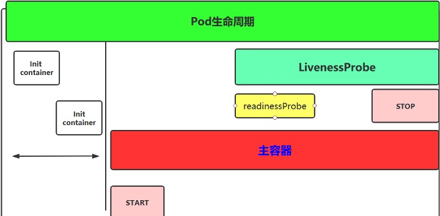
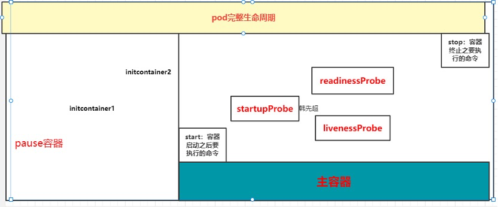

# Pod生命周期

 

pod从开始创建到终止退出的时间范围称为Pod生命周期

 

生命周期包含以下几个重要流程：

创建主容器（containers）是必须的操作，初始化容器（initContainers），容器启动后钩子，启动探测、存活性探测，就绪性探测，容器停止前钩子。

  

​                               

 

pod在整个生命周期的过程中总会处于以下几个状态：

Pending：创建了pod资源并存入etcd中，但尚未完成调度。

ContainerCreating：Pod 的调度完成，被分配到指定 Node 上。处于容器创建的过程中。通常是在拉取镜像的过程中。

Running：Pod 包含的所有容器都已经成功创建，并且成功运行起来。

Succeeded：Pod中的所有容器都已经成功终止并且不会被重启

Failed：所有容器都已经终止，但至少有一个容器终止失败，也就是说容器返回了非0值的退出状态或已经被系统终止。

Unknown：因为某些原因无法取得 Pod 的状态。这种情况通常是因为与 Pod 所在主机通信失败。

 

pod生命周期的重要行为：

1. 在启动任何容器之前，先创建pause基础容器，它初始化Pod的环境并为后续加⼊的容器提供共享的名称空间。

2. 初始化容器（initcontainer）：

一个pod可以拥有任意数量的init容器。init容器是按照顺序以此执行的，并且仅当最后一个init容器执行完毕才会去启动主容器。

3. 生命周期钩子：

pod允许定义两种类型的生命周期钩子，启动后(post-start)钩子和停止前(pre-stop)钩子

这些生命周期钩子是基于每个容器来指定的，和init容器不同的是，init容器是应用到整个pod。而这些钩子是针对容器的，是在容器启动后和停止前执行的。

4. 容器探测：

对Pod健康状态诊断。分为三种： Startupprobe、Livenessprobe(存活性探测)， Readinessprobe(就绪性检测)

Startup（启动探测）:探测容器是否正常运行

Liveness(存活性探测)：判断容器是否处于runnning状态，根据重启策略决定是否重启容器

Readiness(就绪性检测)：判断容器是否准备就绪并对外提供服务，将容器设置为不可用，不接受service转发的请求

 

三种探针用于Pod检测：

 ExecAction：在容器中执行一个命令，并根据返回的状态码进行诊断，只有返回0为成功

 TCPSocketAction：通过与容器的某TCP端口尝试建立连接

 HTTPGetAction：通过向容器IP地址的某指定端口的path发起HTTP GET请求。

 

 

5. 容器的重启策略： 

定义是否重启Pod对象

Always：但凡Pod对象终止就重启，默认设置

OnFailure：仅在Pod出现错误时才重启

Never：从不

注：一旦Pod绑定到一个节点上，就不会被重新绑定到另一个节点上，要么重启，要么终止

 

6. pod的终止过程

终止过程主要分为如下几个步骤： 

(1)用户发出删除 pod 命令：kubectl delete pods ，kubectl delete -f yaml

(2)Pod 对象随着时间的推移更新，在宽限期（默认情况下30秒），pod 被视为“dead”状态

(3)将 pod 标记为“Terminating”状态

(4)第三步同时运行，监控到 pod 对象为“Terminating”状态的同时启动 pod 关闭过程

(5)第三步同时进行，endpoints 控制器监控到 pod 对象关闭，将pod与service匹配的 endpoints 列表中删除

(6)如果 pod 中定义了 preStop 钩子处理程序，则 pod 被标记为“Terminating”状态时以同步的方式启动执行；若宽限期结束后，preStop 仍未执行结束，第二步会重新执行并额外获得一个2秒的小宽限期

(7)Pod 内对象的容器收到 TERM 信号

(8)宽限期结束之后，若存在任何一个运行的进程，pod 会收到 SIGKILL 信号

(9)Kubelet 请求 API Server 将此 Pod 资源宽限期设置为0从而完成删除操作

 

 

### 1 Init容器

 

 

spec字段下有个initContainers字段(初始化容器)，Init容器就是做初始化工作的容器。可以有一个或多个，如果多个按照定义的顺序依次执行，先执行初始化容器1，再执行初始化容器2等，等初始化容器执行完具体操作之后初始化容器就退出了，只有所有的初始化容器执行完后，主容器才启动。

由于一个Pod里容器存储卷是共享的，所以Init Container里产生的数据可以被主容器使用到，Init Container可以在多种K8S资源里被使用到，如Deployment、DaemonSet, StatefulSet、Job等，但都是在Pod启动时，在主容器启动前执行，做初始化工作。

 

初始化容器与主容器区别是:

1、初始化容器不支持 Readinessprobe,因为它们必须在Pod就绪之前运行完成

2、每个Init容器必须运行成功,下一个才能够运行

初始化容器的官方地址：

https://kubernetes.io/docs/concepts/workloads/pods/init-containers/#init-containers-in-use

 

#### 1.1 初始化容器使用案例

```bash
[root@xianchaomaster1]# cat init.yaml 
apiVersion: v1
kind: Pod
metadata:
  name: myapp-pod
  labels:
    app: myapp
spec:
  initContainers:
  - name: init-myservice
    image: busybox:1.28
    imagePullPolicy: IfNotPresent
    command: ['sh', '-c', "until nslookup myservice.$(cat /var/run/secrets/kubernetes.io/serviceaccount/namespace).svc.cluster.local; do echo waiting for myservice; sleep 2; done"]
  - name: init-mydb
    image: busybox:1.28
    imagePullPolicy: IfNotPresent
    command: ['sh', '-c', "until nslookup mydb.$(cat /var/run/secrets/kubernetes.io/serviceaccount/namespace).svc.cluster.local; do echo waiting for mydb; sleep 2; done"]
  containers:
  - name: myapp-container
    image: busybox:1.28
    command: ['sh', '-c', 'echo The app is running! && sleep 3600']

[root@xianchaomaster1]# kubectl apply -f init.yaml

[root@xianchaomaster1]# kubectl get pods
NAME                          READY   STATUS     RESTARTS   AGE
myapp-pod                     0/1     Init:0/2   0          2m29s


apiVersion: v1
kind: Pod
metadata:
  name: myapp-pod
  labels:
    app: myapp
spec:
  initContainers:
  - name: init-myservice
    image: busybox:1.28
    imagePullPolicy: IfNotPresent
    command: ['sh', '-c', "sleep 2"]
  - name: init-mydb
    image: busybox:1.28
    imagePullPolicy: IfNotPresent
    command: ['sh', '-c', "sleep 2"]
  containers:
  - name: myapp-container
    image: busybox:1.28
    imagePullPolicy: IfNotPresent
    command: ['sh', '-c', 'echo containers start running! && sleep 3600']

```

 

#### 1.2 初始化容器生产应用


主容器运行nginx服务，初始化容器用来给主容器生成index.html文件

 ```bash
 [root@xianchaomaster1 ]# cat init-1.yaml 
 apiVersion: v1
 kind: Pod
 metadata:
   name: initnginx
 spec:
   initContainers:
   - name: install
     image: docker.io/library/busybox:1.28
     imagePullPolicy: IfNotPresent
     command:
     - wget
     - "-O"
     - "/work-dir/index.html"
     - "https://www.baidu.com"
     volumeMounts:
     - name: workdir
       mountPath: /work-dir
   containers:
   - name: nginx
     image: docker.io/xianchao/nginx:v1
     imagePullPolicy: IfNotPresent
     ports:
     - containerPort: 80
     volumeMounts:
     - name: workdir
       mountPath: /usr/share/nginx/html
   dnsPolicy: Default
   volumes:
   - name: workdir
     emptyDir: {}
 
 [root@xianchaomaster1]# kubectl apply -f init-1.yaml
 
    [root@xianchaomaster1 ~]# kubectl get pods -owide
 NAME        READY   STATUS    RESTARTS   AGE   IP               NODE            NOMINATED NODE   READINESS GATES
 initnginx   1/1     Running   0          10s   10.244.102.102   xianchaonode2   <none>           <none>
 
 [root@xianchaomaster1 ~]# curl 10.244.102.102
 <!DOCTYPE html>
 <!--STATUS OK--><html> <head><meta http-equiv=content-type content=text/html;charset=utf-8><meta http-equiv=X-UA-Compatible content=IE=Edge><meta content=always name=referrer><link rel=stylesheet type=text/css href=https://ss1.bdstatic.com/5eN1bjq8AAUYm2zgoY3K/r/www/cache/bdorz/baidu.min.css><title>百度一下，你就知道</title></head> <body link=#0000cc> <div id=wrapper> <div id=head> <div class=head_wrapper> <div class=s_form> <div class=s_form_wrapper> <div id=lg>  </div> <form id=form name=f action=//www.baidu.com/s class=fm> <input type=hidden name=bdorz_come value=1> <input type=hidden name=ie value=utf-8> <input type=hidden name=f value=8> <input type=hidden name=rsv_bp value=1> <input type=hidden name=rsv_idx value=1> <input type=hidden name=tn value=baidu><span class="bg s_ipt_wr"><input id=kw name=wd class=s_ipt value maxlength=255 autocomplete=off autofocus=autofocus></span><span class="bg s_btn_wr"><input type=submit id=su value=百度一下 class="bg s_btn" autofocus></span> </form> </div> </div> <div id=u1> <a href=http://news.baidu.com name=tj_trnews class=mnav>新闻</a> <a href=https://www.hao123.com name=tj_trhao123 class=mnav>hao123</a> <a href=http://map.baidu.com name=tj_trmap class=mnav>地图</a> <a href=http://v.baidu.com name=tj_trvideo class=mnav>视频</a> <a href=http://tieba.baidu.com name=tj_trtieba class=mnav>贴吧</a> <noscript> <a href=http://www.baidu.com/bdorz/login.gif?login&amp;tpl=mn&amp;u=http%3A%2F%2Fwww.baidu.com%2f%3fbdorz_come%3d1 name=tj_login class=lb>登录</a> </noscript> <script>document.write('<a href="http://www.baidu.com/bdorz/login.gif?login&tpl=mn&u='+ encodeURIComponent(window.location.href+ (window.location.search === "" ? "?" : "&")+ "bdorz_come=1")+ '" name="tj_login" class="lb">登录</a>');
                 </script> <a href=//www.baidu.com/more/ name=tj_briicon class=bri style="display: block;">更多产品</a> </div> </div> </div> <div id=ftCon> <div id=ftConw> <p id=lh> <a href=http://home.baidu.com>关于百度</a> <a href=http://ir.baidu.com>About Baidu</a> </p> <p id=cp>&copy;2017&nbsp;Baidu&nbsp;<a href=http://www.baidu.com/duty/>使用百度前必读</a>&nbsp; <a href=http://jianyi.baidu.com/ class=cp-feedback>意见反馈</a>&nbsp;京ICP证030173号&nbsp;  </p> </div> </div> </div> </body> </html>
 
 [root@xianchaomaster1 ~]# kubectl exec -it initnginx -- /bin/bash
 Defaulted container "nginx" out of: nginx, install (init)
 root@initnginx:/# cd /usr/share/nginx/html/
 root@initnginx:/usr/share/nginx/html# ls
 index.html
 
 ```


### 2 主容器


 **容器钩子**

初始化容器启动之后，开始启动主容器，在主容器启动之后有一个post start hook（容器启动后钩子）和pre stop hook（容器结束前钩子），无论启动后还是结束前所做的事我们可以把它放两个钩子，这个钩子就表示用户可以用它来钩住一些命令，非必须选项

postStart：该钩子在容器被创建后立刻执行，如果该钩子对应的探测执行失败，则该容器会被杀死，并根据该容器的重启策略决定是否要重启该容器，这个钩子不需要传递任何参数。

preStop：该钩子在容器被删除前执行，主要用于释放资源和优雅关闭程序

 

#### 2.1 容器钩子：postStart和preStop


postStart：容器创建之后立刻执行，用于资源部署、环境准备等。

preStop：在容器被终止前执行，用于优雅关闭应用程序、通知其他系统等。


**演示postStart和preStop用法**

```
......
containers:
- image: sample:v2  
     name: war
     lifecycle：
      postStart:
       exec:
         command:
          - “cp”
          - “/sample.war”
          - “/app”
      prestop:
       httpGet:
        host: monitor.com
        path: /waring
        port: 8080
        scheme: HTTP
......

```

以上示例中，定义了一个Pod，包含一个JAVA的web应用容器，其中设置了PostStart和PreStop回调函数。即在容器创建成功后，复制/sample.war到/app文件夹中。而在容器终止之前，发送HTTP请求到http://monitor.com:8080/waring，即向监控系统发送警告。


**优雅的删除资源对象**

当用户请求删除含有pod的资源对象时（如RC、deployment等），K8S为了让应用程序优雅关闭（即让应用程序完成正在处理的请求后，再关闭软件），K8S提供两种信息通知：

1）、默认：K8S通知node执行docker stop命令，docker会先向容器中PID为1的进程发送系统信号SIGTERM，然后等待容器中的应用程序终止执行，如果等待时间达到设定的超时时间，或者默认超时时间（30s），会继续发送SIGKILL的系统信号强行kill掉进程。

2）、使用pod生命周期（利用PreStop回调函数），它执行在发送终止信号之前。

默认情况下，所有的删除操作的优雅退出时间都在30秒以内。kubectl delete命令支持--grace-period=的选项，以运行用户来修改默认值。0表示删除立即执行，并且立即从API中删除pod。在节点上，被设置了立即结束的的pod，仍然会给一个很短的优雅退出时间段，才会开始被强制杀死。如下：

```bash
spec:
      containers:
      - name: nginx-demo
        image: centos:nginx
        lifecycle:
          preStop:
            exec:
              # nginx -s quit gracefully terminate while SIGTERM triggers a quick exit
              command: ["/usr/local/nginx/sbin/nginx","-s","quit"]
        ports:
          - name: http
            containerPort: 80

```

   案例演示

```
[root@xianchaomaster1]# cat pre-start.yaml 
apiVersion: v1
kind: Pod
metadata:
  name: life-demo
spec:
  containers:
  - name: lifecycle-demo-container
    image: docker.io/xianchao/nginx:v1
    imagePullPolicy: IfNotPresent
    lifecycle:
      postStart:
         exec:
           command: ["/bin/sh", "-c","echo 'lifecycle hookshandler' > /usr/share/nginx/html/test.html"]
      preStop:
         exec:
           command:
           - "/bin/sh"
           - "-c"
           - "nginx -s stop"

```

总结：

pod在整个生命周期中有非常多的用户行为：

1、初始化容器完成初始化

2、主容器启动后可以做启动后钩子

3、主容器结束前可以做结束前钩子

4、在主容器运行中可以做一些健康检测，如startupprobe、livenessprobe，readnessprobe