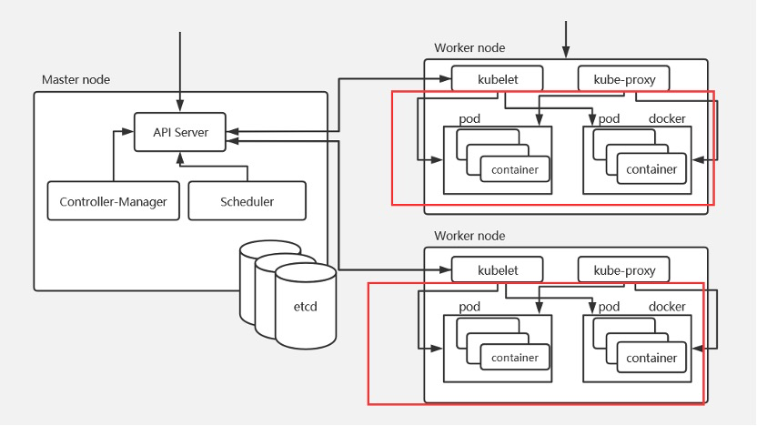
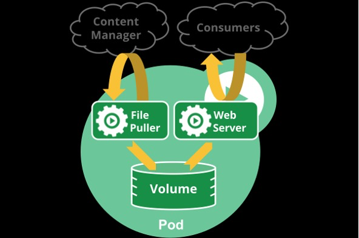
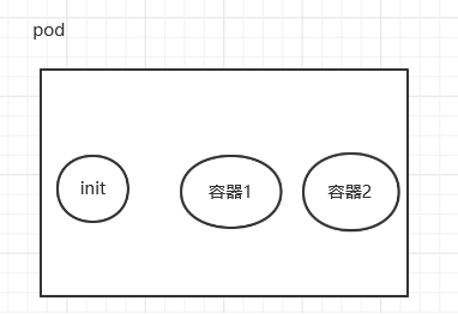
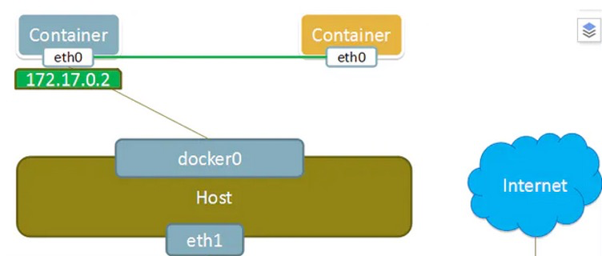
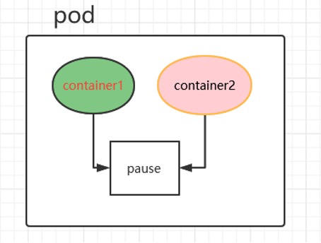
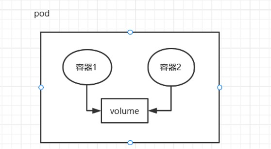
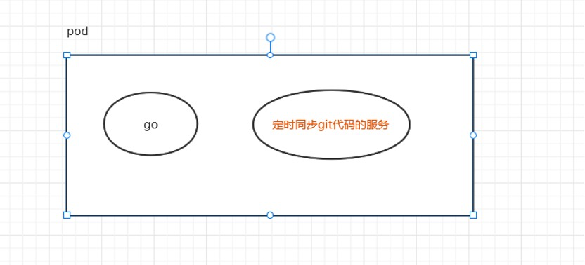
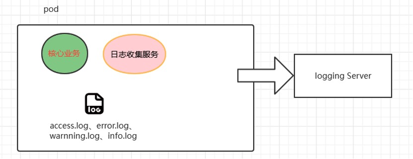

# k8s核心资源Pod介绍

 

K8s官方文档：https://kubernetes.io/

K8s中文官方文档： https://kubernetes.io/zh/

K8s Github地址：https://github.com/kubernetes/kubernetes 

Pod资源对应的官方文档：https://kubernetes.io/zh-cn/docs/concepts/workloads/pods/

 

## 1.1 Pod是什么？


官方文档：https://kubernetes.io/docs/concepts/workloads/pods/

Pod是Kubernetes中的最小调度单元，k8s是通过定义一个Pod的资源，然后在Pod里面运行容器，容器需要指定一个镜像，这样就可以用来运行具体的服务。一个Pod封装一个容器（也可以封装多个容器），Pod里的容器共享存储、网络等。也就是说，应该把整个pod看作虚拟机，然后每个容器相当于运行在虚拟机的进程。

                               

Pod是需要调度到k8s集群的工作节点来运行的，具体调度到哪个节点，是根据scheduler调度器实现的。

**白话解释：** 

可以把pod看成是一个“豌豆荚”，里面有很多“豆子”（容器）。一个豌豆荚里可以有很多豆子（容器）

 

 

pod相当于一个逻辑主机--比方说我们想要部署一个tomcat应用，如果不用容器，我们可能会部署到物理机、虚拟机或者云主机上，那么出现k8s之后，我们就可以定义一个pod资源，在pod里定义一个把tomcat容器，所以pod充当的是一个逻辑主机的角色。

 

### 1.1.1 Pod如何管理多个容器？

 

 

Pod中可以同时运行多个容器。同一个Pod中的容器会自动的分配到同一个 node 上。同一个Pod中的容器共享资源、网络环境，它们总是被同时调度，在一个Pod中同时运行多个容器是一种比较高级的用法，只有当你的容器需要紧密配合协作的时候才考虑用这种模式。例如，你有一个容器作为web服务器运行，需要用到共享的volume，有另一个“sidecar”容器来从远端获取资源更新这些文件。

一些Pod有init容器和应用容器。 在应用程序容器启动之前，运行初始化容器。

 

 

### 1.1.2 Pod网络


Pod是有IP地址的，假如pod不是共享物理机ip，由网络插件（calico、flannel、weave）划分的ip，每个pod都被分配唯一的IP地址

**Docker容器互联的方式：**

创建新容器的时候，通过`--net container`参数，指定其和已经存在的某个容器共享一个 Network Namespace。如下图所示，右方黄色新创建的container，其网卡共享左边容器。因此就不会拥有自己独立的 IP，而是共享左边容器的 IP 172.17.0.2,端口范围等网络资源



 

  

\#和已经存在的none容器共享网络

`[root@xianchaomaster1 ~]# docker run --name container2 --net=container:none -it --privileged=true centos`

**Kubernetes中容器共享的方式**

在k8s中，启动Pod时，会先启动⼀个pause 的容器，然后将后续的所有容器都 "link 到这个pause 的容器，以实现⽹络共享。



 

### 1.1.3 Pod存储


创建Pod的时候可以指定挂载的存储卷。 POD中的所有容器都可以访问共享卷，允许这些容器共享数据。 Pod只要挂载持久化数据卷，Pod重启之后数据还是会存在的。



 

## 1.2 之前学习过容器，为什么还需要Pod？


1、Pod是由一组紧耦合的容器组成的容器组，当然目前最流行的就是[Docker](https://so.csdn.net/so/search?q=Docker&spm=1001.2101.3001.7020)、containerd、podman容器，Pod就可以作为1或者多个容器的载体。

2、Pod中的所用容器会被一致调度、同节点部署，并且在一个“共享环境”中运行。Pod想成一个车：车里面好多座位，每个座位都坐不同的人，每个座位想成是一个容器，这里的“共享环境”包括以下几点：

​	1）所有容器共享一个IP地址和端口空间，意味着容器之间可以通过localhost高效访问，不能有端口冲突

​	2）允许容器之间共享存储卷，通过文件系统交互信息

3、有些容器需要紧密联系，需要一起工作。Pod提供了比容器更高层次的抽象， Pod中的所有容器使用同一个网络的namespace，即相同的IP地址和Port空间。它们可以直接用localhost通信。同样的，这些容器可以共享存储，当K8s挂载Volume到Pod上，本质上是将volume挂载到Pod中的每一个容器里。

 

### 1.2.1 代码自动发版更新


 

假如生产环境部署了一个go的应用，而且部署了几百个节点，希望这个应用可以定时的同步最新的代码，以便自动升级线上环境。这时，我们不希望改动原来的go应用，可以开发一个Git代码仓库的自动同步服务，然后通过Pod的方式进行编排，并共享代码目录，就可以达到更新java应用代码的效果。

 

### 1.2.2 收集业务日志

 



某服务模块已经实现了一些核心的业务逻辑，并且稳定运行了一段时间，日志记录在了某个目录下，按照不同级别分别为 error.log、access.log、warning.log、info.log，现在希望收集这些日志并发送到统一的日志处理服务器上。

这时我们可以修改原来的服务模块，在其中添加日志收集、发送的服务，但这样可能会影响原来服务的配置、部署方式，从而带来不必要的问题和成本，也会增加业务逻辑和基础服务的藕合度。

如果使用Pod的方式，通过简单的编排，既可以保持原有服务逻辑、部署方式不变，又可以增加新的日志收集服务。

而且如果我们对所有服务的日志生成有一个统一的标准，或者仅对日志收集服务稍加修改，就可以将日志收集服务和其他服务进行Pod编排，提供统一、标准的日志收集方式。

这里的“核心业务服务”、“日志收集服务”分别是一个镜像，运行在隔离的容器环境中。

  

## 1.3 Pod工作方式

 

在K8s中，所有的资源都可以使用一个yaml文件来创建，创建Pod也可以使用yaml配置文件。或者使用kubectl run在命令行创建Pod（不常用）。


### 1.3.1 自主式Pod


所谓的自主式Pod，就是直接定义一个Pod资源，如下：

```yaml
[root@xianchaomaster1 ~]# vim pod-tomcat.yaml

apiVersion: v1
kind: Pod
metadata:
 name: tomcat-test
 namespace: default
 labels:
  app: tomcat
spec:
 containers:
 - name: tomcat-java
 ports:
 - containerPort: 8080
 image: xianchao/tomcat-8.5-jre8:v1
 imagePullPolicy: IfNotPresent
```


```bash
#导入镜像

把xianchao-tomcat.tar.gz上传到xianchaonode1和xianchaonode2节点，手动解压：

[root@xianchaonode1 ~]# ctr -n=k8s.io images import  xianchao-tomcat.tar.gz

[root@xianchaonode2 ~]# ctr -n=k8s.io images import  xianchao-tomcat.tar.gz
```


 

```bash
#更新资源清单文件
[root@xianchaomaster1 ~]# kubectl apply -f pod-tomcat.yaml 

#查看pod是否创建成功
[root@xianchaomaster1 ~]# kubectl get pods -o wide -l app=tomcat 

NAME     READY  STATUS    IP       NODE      

tomcat-test   1/1     Running  10.244.121.45  xianchaonode1  
```

但是自主式Pod是存在一个问题的，假如我们不小心删除了pod：

```bash
[root@xianchaomaster1 ~]# kubectl delete pods tomcat-test

#查看pod是否还在

[root@xianchaomaster1 ~]# kubectl get pods -l app=tomcat

#结果是空，说明pod已经被删除了
```

通过上面可以看到，如果直接定义一个Pod资源，那Pod被删除，就彻底被删除了，不会再创建一个新的Pod，这在生产环境还是具有非常大风险的，所以今后我们接触的Pod，都是控制器管理的。

 

### 1.3.2 控制器管理的Pod


常见的管理Pod的控制器：Replicaset、Deployment、Job、CronJob、Daemonset、Statefulset。

控制器管理的Pod可以确保Pod始终维持在指定的副本数运行。

如，通过Deployment管理Pod

```bash
#解压镜像：

把xianchao-nginx.tar.gz上传到xianchaonode1和xianchaonode2节点

[root@xianchaonode1 ~]# ctr -n=k8s.io images import  xianchao-nginx.tar.gz

[root@xianchaonode2 ~]# ctr -n=k8s.io images import  xianchao-nginx.tar.gz
```

```yaml
#创建一个资源清单文件

[root@xianchaomaster1 ~]# vim nginx-deploy.yaml 
---
apiVersion: apps/v1
kind: Deployment
metadata:
 name: nginx-test
 labels:
  app: nginx-deploy
spec:
 selector:
  matchLabels:
   app: nginx
 replicas: 2
 template:
  metadata:
   labels:
    app: nginx
  spec:
   containers:
   - name: my-nginx
     image: xianchao/nginx:v1
     imagePullPolicy: IfNotPresent
     ports:
     - containerPort: 80
```

```
#更新资源清单文件
[root@xianchaomaster1 ~]# kubectl apply -f nginx-deploy.yaml


#查看Deployment
[root@xianchaomaster1 ~]# kubectl get deploy -l app=nginx-deploy

NAME     READY  UP-TO-DATE  AVAILABLE  AGE

nginx-test    2/2     2      2      16s


#查看Replicaset
[root@xianchaomaster1 ~]# kubectl get rs -l app=nginx

NAME          DESIRED  CURRENT  READY  AGE

nginx-test-75c685fdb7  2     2     2    71s

 
#查看pod

[root@xianchaomaster1 ~]# kubectl get pods -o wide -l app=nginx

NAME              READY  STATUS    IP           

nginx-test-75c685fdb7-6d4lx   1/1   Running    10.244.102.69  

nginx-test-75c685fdb7-9s95h  1/1   Running    10.244.102.68 

 
#删除nginx-test-75c685fdb7-9s95h这个pod

[root@xianchaomaster1 ~]# kubectl delete pods nginx-test-75c685fdb7-9s95h

[root@xianchaomaster1 ~]# kubectl get pods -o wide -l app=nginx

NAME              READY  STATUS       IP            

nginx-test-75c685fdb7-6d4lx   1/1    Running      10.244.102.69  

nginx-test-75c685fdb7-pr8gh   1/1    Running       10.244.102.70 

 #发现重新创建一个新的pod是nginx-test-75c685fdb7-pr8gh
```

通过上面可以发现通过deployment管理的pod，可以确保pod始终维持在指定副本数量

 

# 2.如何基于Pod运行应用？


创建pod流程：


 

`kubectl apply -f nginx-deploy.yaml->`找到`config`文件，基于config文件指定的用户访问指定的集群，这样就找到了apiserver

第一步：

通过 kubectl 命令向 apiserver 提交创建pod的请求，apiserver接收到pod创建请求后，会将pod的属性信息(metadata)写入etcd。

第二步：

apiserver触发watch机制准备创建pod，信息转发给调度器scheduler，调度器使用调度算法选择node，调度器将node信息给apiserver，apiserver将绑定的node信息写入etcd

第三步：

apiserver又通过watch机制，调用kubelet，指定pod信息，调用容器运行时创建并启动pod内的容器。

第四步：

创建完成之后反馈给kubelet, kubelet又将pod的状态信息给apiserver,apiserver又将pod的状态信息写入etcd。

 

## 2.1 通过资源清单文件创建第一个Pod


```yaml
[root@xianchaomaster1 ~]# vim pod-first.yaml
---
apiVersion: v1
kind: Pod
metadata:
 name: tomcat-test
 namespace: default
 labels:
  app: tomcat
spec:
 containers:
 - name: tomcat-java
 ports:
 - containerPort: 8080
 image: xianchao/tomcat-8.5-jre8:v1
 imagePullPolicy: IfNotPresent
```

  

```bash
#更新资源清单文件
[root@xianchaomaster1 ~]# kubectl apply -f pod-first.yaml 

#查看pod是否创建成功
[root@xianchaomaster1 pod]# kubectl get pods -l app=tomcat

#查看pod的ip和pod调度到哪个节点上
kubectl get pods -owide

#查看pod日志
kubectl logs tomcat-test

#进入到刚才创建的pod，刚才创建的pod名字是web
kubectl exec -it tomcat-test -- /bin/bash

#假如pod里有多个容器，进入到pod里的指定容器，按如下命令：
kubectl exec -it tomcat-test -c tomcat-java -- /bin/bash 

#查看pod详细信息
kubectl describe pods tomcat-test

#查看pod具有哪些标签：
[root@xianchaomaster1 pod]# kubectl get pods --show-labels 

#删除pod
kubectl delete pods tomcat-test

#或者
kubectl delete -f pod-first.yaml
```

 

我们上面创建的pod是一个自主式pod，也就是通过pod创建一个应用程序，如果pod出现故障停掉，那么我们通过pod部署的应用也就会停掉，不安全， 还有一种控制器管理的pod，通过控制器创建pod，可以对pod的生命周期做管理，可以定义pod的副本数，如果有一个pod意外停掉，那么会自动起来一个pod替代之前的pod，之后会讲解pod的控制器 

```bash
[root@xianchaomaster1]# kubectl delete -f nginx-deploy.yaml 

deployment.apps "nginx-test" deleted

You have new mail in /var/spool/mail/root

[root@xianchaomaster1]# kubectl delete -f pod-first.yaml
```

 

## 2.2 Pod资源清单字段解读


**如下：**

```yaml
[root@xianchaomaster1 ~]# vim pod-tomcat.yaml
---
apiVersion: v1 #api版本
kind: Pod    #创建的资源
metadata:  
 name: tomcat-test #Pod的名字
 namespace: default  #Pod所在的名称空间
 labels:
  app: tomcat   #Pod具有的标签
spec:
 containers:
 - name: tomcat-java  #Pod里容器的名字
  ports:
  - containerPort: 8080 #容器暴露的端口
  image: xianchao/tomcat-8.5-jre8:v1 #容器使用的镜像
 imagePullPolicy: IfNotPresent  #镜像拉取策略
```

 

```bash
#更新资源清单文件

[root@xianchaomaster1 ~]# kubectl apply -f pod-tomcat.yaml 
```

 

\# Pod资源清单编写技巧

通过kubectl explain 查看定义Pod资源包含哪些字段。

```bash
[root@xianchaomaster1 ~]# kubectl explain pod

KIND:   Pod

VERSION: v1

DESCRIPTION:

   Pod is a collection of containers that can run on a host. This resource is

   created by clients and scheduled onto hosts.
```

[Pod是可以在主机上运行的容器的集合。此资源是由客户端创建并安排到主机上。]

 

```
  FIELDS:

  apiVersion   <string>

   APIVersion defines the versioned schema of this representation of an

   object. Servers should convert recognized schemas to the latest internal

   value, and may reject unrecognized values. More info:

   https://git.k8s.io/community/contributors/devel/sig-architecture/api-conventions.md#resources
```

**[APIVersion定义了对象,代表了一个版本。]**

 

```
 kind  <string>

   Kind is a string value representing the REST resource this object

   represents. Servers may infer this from the endpoint the client submits

   requests to. Cannot be updated. In CamelCase. More info:

   https://git.k8s.io/community/contributors/devel/sig-architecture/api-conventions.md#types-kinds
```

**[Kind是字符串类型的值，代表了要创建的资源。服务器可以从客户端提交的请求推断出这个资源。]**


```
  metadata <Object>

   Standard object's metadata. More info:

   https://git.k8s.io/community/contributors/devel/sig-architecture/api-conventions.md#metadata
```

**[metadata是对象，定义元数据属性信息的]**


```
  spec  <Object>

   Specification of the desired behavior of the pod. More info:

   https://git.k8s.io/community/contributors/devel/sig-architecture/api-conventions.md#spec-and-status
```

**[spec制定了定义Pod的规格，里面包含容器的信息]**


 

```
 status <Object>

   Most recently observed status of the pod. This data may not be up to date.

   Populated by the system. Read-only. More info:

   https://git.k8s.io/community/contributors/devel/sig-architecture/api-conventions.md#spec-and-status
```

**[status表示状态，这个不可以修改，定义pod的时候也不需要定义这个字段]**

 

```
\#查看pod.metadata字段如何定义

[root@xianchaomaster1 ~]# kubectl explain pod.metadata

KIND:   Pod

VERSION: v1

RESOURCE: metadata <Object>

 

```

**metadata是对象<Object>，下面可以有多个字段** 

```
DESCRIPTION:

   Standard object's metadata. More info:

   https://git.k8s.io/community/contributors/devel/sig-architecture/api-conventions.md#metadata

   ObjectMeta is metadata that all persisted resources must have, which

   includes all objects users must create.

 

FIELDS:

  annotations  <map[string]string>

   Annotations is an unstructured key value map stored with a resource that

   may be set by external tools to store and retrieve arbitrary metadata. They

   are not queryable and should be preserved when modifying objects. More

   info: http://kubernetes.io/docs/user-guide/annotations
```


**annotations是注解，map类型表示对应的值是key-value键值对，<string,string>表示 key和value都是String类型的** 

```
"metadata": {

 "annotations": {

  "key1" : "value1",

  "key2" : "value2"

 }

}
```

用Annotation来记录的信息包括：

build信息、release信息、Docker镜像信息等，例如时间戳、release id号、镜像hash值、docker registry地址等；

日志库、监控库、分析库等资源库的地址信息；

程序调试工具信息，例如工具名称、版本号等；

团队的联系信息，例如电话号码、负责人名称、网址等。

   

```
clusterName  <string>

   The name of the cluster which the object belongs to. This is used to

   distinguish resources with same name and namespace in different clusters.

   This field is not set anywhere right now and apiserver is going to ignore

   it if set in create or update request.

#对象所属群集的名称。这是用来区分不同集群中具有相同名称和命名空间的资源。此字段现在未设置在任何位置，apiserver将忽略它，如果设置了就使用设置的值

  creationTimestamp   <string>

  deletionGracePeriodSeconds   <integer>

  deletionTimestamp   <string>

  finalizers   <[]string>

  generateName  <string>

  generation   <integer>

  labels <map[string]string> #创建的资源具有的标签

Map of string keys and values that can be used to organize and categorize

   (scope and select) objects. May match selectors of replication controllers

   and services. More info: http://kubernetes.io/docs/user-guide/labels

#labels是标签，labels是map类型，map类型表示对应的值是key-value键值对，<string,string>表示 key和value都是String类型的

  managedFields  <[]Object>

  name  <string>      #创建的资源的名字

  namespace   <string>   #创建的资源所属的名称空间

Namespace defines the space within which each name must be unique. An empty

namespace is equivalent to the "default" namespace, but "default" is the

canonical representation. Not all objects are required to be scoped to a

namespace - the value of this field for those objects will be empty.

   Must be a DNS_LABEL. Cannot be updated. More info:

   http://kubernetes.io/docs/user-guide/namespaces

# namespaces划分了一个空间，在同一个namesace下的资源名字是唯一的，默认的名称空间是default。

  ownerReferences <[]Object>

  resourceVersion <string>

  selfLink <string>

  uid   <string>
```

 

**查看pod.spec字段如何定义**

```
[root@xianchaomaster1 ~]# kubectl explain pod.spec

KIND:   Pod

VERSION: v1

RESOURCE: spec <Object>

DESCRIPTION:

   Specification of the desired behavior of the pod. More info:

   https://git.k8s.io/community/contributors/devel/sig-architecture/api-conventions.md#spec-and-status

   PodSpec is a description of a pod.
```

\#Pod的spec字段是用来描述Pod的

 

```
FIELDS:
   activeDeadlineSeconds	<integer>
#表示Pod可以运行的最长时间，达到设置的值后，Pod会自动停止。
   affinity	<Object>
  #定义亲和性的
   automountServiceAccountToken	<boolean>
   containers	<[]Object> -required-
#containers是对象列表，用来定义容器的，是必须字段。对象列表 表示下面有很多对象，对象列表下面的内容用 - 连接。
   dnsConfig	<Object>
   dnsPolicy	<string>
   enableServiceLinks	<boolean>
   ephemeralContainers	<[]Object>
   hostAliases	<[]Object>
   hostIPC	<boolean>
   hostNetwork	<boolean>
   hostPID	<boolean>
   hostname	<string>
   imagePullSecrets	<[]Object>
   initContainers	<[]Object>
   nodeName	<string>
   nodeSelector	<map[string]string>
   overhead	<map[string]string>
   preemptionPolicy	<string>
   priority	<integer>
   priorityClassName	<string>
   readinessGates	<[]Object>
   restartPolicy	<string>
   runtimeClassName	<string>
   schedulerName	<string>
   securityContext	<Object>
   serviceAccount	<string>
   serviceAccountName	<string>
   setHostnameAsFQDN	<boolean>
   shareProcessNamespace	<boolean>
   subdomain	<string>
   terminationGracePeriodSeconds	<integer>
   tolerations	<[]Object>
   topologySpreadConstraints	<[]Object>
   volumes	<[]Object>

```

 

\#查看pod.spec.containers字段如何定义

```
[root@xianchaomaster1 ~]# kubectl explain pod.spec.containers

KIND:   Pod

VERSION: v1

 

RESOURCE: containers <[]Object>

DESCRIPTION:

   List of containers belonging to the pod. Containers cannot currently be

   added or removed. There must be at least one container in a Pod. Cannot be

   updated.

   A single application container that you want to run within a pod.

\#container是定义在pod里面的，一个pod至少要有一个容器。
```

 

```bash
FIELDS:
   args	<[]string>
   command	<[]string>
   env	<[]Object>
   envFrom	<[]Object>
   image	<string>
#image是用来指定容器需要的镜像的
   imagePullPolicy	<string>
#镜像拉取策略，pod是要调度到node节点的，那pod启动需要镜像，可以根据这个字段设置镜像拉取策略，支持如下三种：
    Always：不管本地是否存在镜像，都要重新拉取镜像
    Never： 从不拉取镜像
    IfNotPresent：如果本地存在，使用本地的镜像，本地不存在，从官方拉取镜像
   lifecycle	<Object>
   livenessProbe	<Object>
   name	<string> -required-
#name是必须字段，用来指定容器名字的
   ports	<[]Object>
#port是端口，属于对象列表
   readinessProbe	<Object>
   resources	<Object>
   securityContext	<Object>
   startupProbe	<Object>
   stdin	<boolean>
   stdinOnce	<boolean>
   terminationMessagePath	<string>
   terminationMessagePolicy	<string>
   tty	<boolean>
   volumeDevices	<[]Object>
   volumeMounts	<[]Object>
   workingDir	<string>

```

 

\#查看pod.spec.container.ports字段如何定义

```bash
[root@xianchaomaster1 ~]# kubectl explain pod.spec.containers.ports
KIND:     Pod
VERSION:  v1
RESOURCE: ports <[]Object>
DESCRIPTION:
     List of ports to expose from the container. Exposing a port here gives the
     system additional information about the network connections a container
     uses, but is primarily informational. Not specifying a port here DOES NOT
     prevent that port from being exposed. Any port which is listening on the
     default "0.0.0.0" address inside a container will be accessible from the
     network. Cannot be updated.

     ContainerPort represents a network port in a single container.
FIELDS:
   containerPort	<integer> -required-
     Number of port to expose on the pod's IP address. This must be a valid port
     number, 0 < x < 65536.
#containerPort是必须字段， pod中的容器需要暴露的端口。

   hostIP	<string>
     What host IP to bind the external port to.
#将容器中的服务暴露到宿主机的端口上时，可以指定绑定的宿主机 IP。
   hostPort	<integer>
     Number of port to expose on the host. If specified, this must be a valid
     port number, 0 < x < 65536. If HostNetwork is specified, this must match
     ContainerPort. Most containers do not need this.
#容器中的服务在宿主机上映射的端口
   name	<string>
     If specified, this must be an IANA_SVC_NAME and unique within the pod. Each
     named port in a pod must have a unique name. Name for the port that can be
     referred to by services.
#端口的名字
   protocol	<string>
     Protocol for port. Must be UDP, TCP, or SCTP. Defaults to "TCP".
```


## 2.3 通过kubectl run创建Pod

 

`kubectl run tomcat --image=xianchao/tomcat-8.5-jre8:v1 --image-pull-policy='IfNotPresent' --port=8080`

\#查看kubectl的帮助命令：

`kubectl --help`