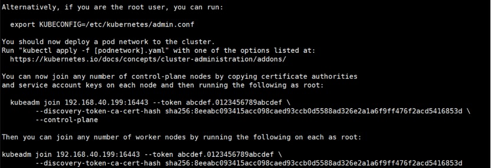
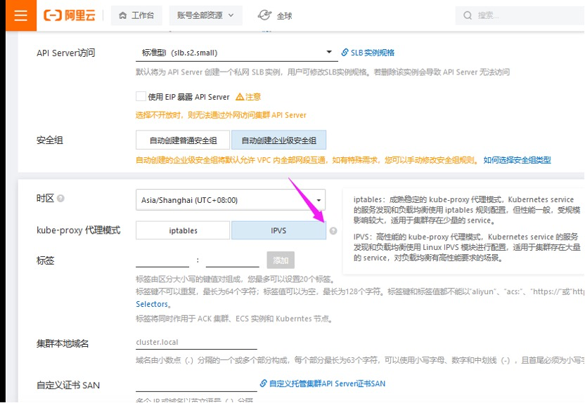
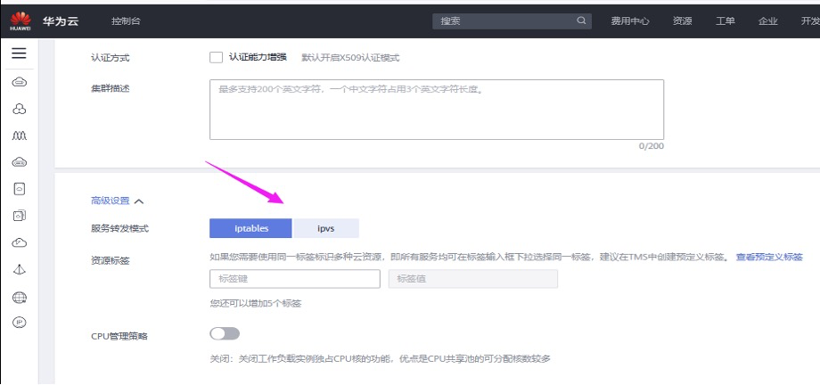
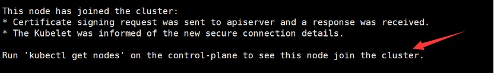
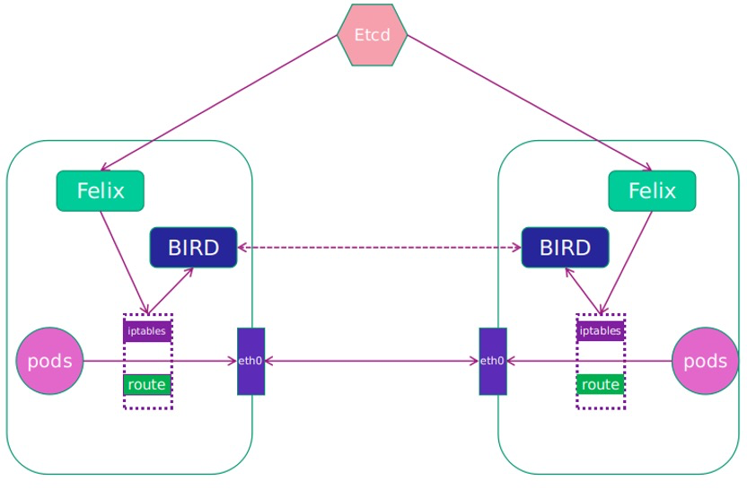
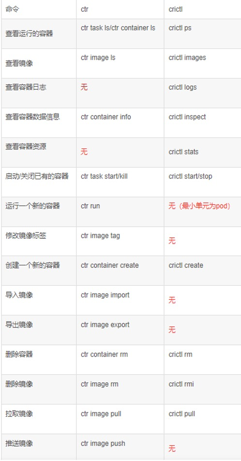

# kubeadm安装k8s1.25高可用集群

 

k8s环境规划：

 podSubnet（pod网段） 10.244.0.0/16

 serviceSubnet（service网段）: 10.96.0.0/12

 

实验环境规划：

操作系统：centos7.9

配置： 4Gib内存/4vCPU/60G硬盘

网络：NAT模式

  

| K8S集群角色 | IP             | 主机名          | 安装的组件                                                   |
| ----------- | -------------- | --------------- | ------------------------------------------------------------ |
| 控制节点    | 192.168.40.180 | xianchaomaster1 | apiserver、controller-manager、schedule、kubelet、etcd、kube-proxy、容器运行时、calico、keepalived、nginx |
| 工作节点    | 192.168.40.181 | xianchaonode1   | Kube-proxy、calico、coredns、容器运行时、kubelet             |
| 工作节点    | 192.168.40.182 | xianchaonode2   | Kube-proxy、calico、coredns、容器运行时、kubelet             |


 

## 1.1 初始化安装k8s集群的实验环境

### 1.1.1 修改机器IP，变成静态IP

```bash
vim /etc/sysconfig/network-scripts/ifcfg-ens33文件

TYPE=Ethernet

PROXY_METHOD=none

BROWSER_ONLY=no

BOOTPROTO=static

IPADDR=192.168.40.180

NETMASK=255.255.255.0

GATEWAY=192.168.40.2

DNS1=192.168.40.2

DEFROUTE=yes

IPV4_FAILURE_FATAL=no

IPV6INIT=yes

IPV6_AUTOCONF=yes

IPV6_DEFROUTE=yes

IPV6_FAILURE_FATAL=no

IPV6_ADDR_GEN_MODE=stable-privacy

NAME=ens33

DEVICE=ens33

ONBOOT=yes
```

 

\#修改配置文件之后需要重启网络服务才能使配置生效，重启网络服务命令如下：

`service network restart`

 

注：/etc/sysconfig/network-scripts/ifcfg-ens33文件里的配置说明：

```bash
DEVICE=ens33  #网卡设备名，大家ip addr可看到自己的这个网卡设备名，每个人的机器可能这个名字不一样，需要写自己的

BOOTPROTO=static  #static表示静态ip地址

ONBOOT=yes  #开机自启动网络，必须是yes

IPADDR=192.168.40.180  #ip地址，需要跟自己电脑所在网段一致

NETMASK=255.255.255.0 #子网掩码，需要跟自己电脑所在网段一致

GATEWAY=192.168.1.2  #网关，在自己电脑打开cmd，输入ipconfig /all可看到

DNS1=192.168.1.2   #DNS，在自己电脑打开cmd，输入ipconfig /all可看到 

```

  

各个节点执行如下命令更新yum源和操作系统：

`yum update -y`

 

### 1.1.2 关闭selinux，所有k8s机器均操作

```bash
sed -i 's/SELINUX=enforcing/SELINUX=disabled/g' /etc/selinux/config

#修改selinux配置文件之后，重启机器，selinux配置才能永久生效，重启之后，登录到机器，执行如下命令：

getenforce

#如果显示Disabled说明selinux已经关闭
```

 

### 1.1.3 配置机器主机名

在192.168.40.180上执行如下：

`hostnamectl set-hostname xianchaomaster1 && bash `

在192.168.40.181上执行如下：

`hostnamectl set-hostname xianchaonode1 && bash`

在192.168.40.182上执行如下：

`hostnamectl set-hostname xianchaonode2 && bash`

 

### 1.1.4 配置主机hosts文件，相互之间通过主机名互相访问

修改每台机器的/etc/hosts文件，文件最后增加如下内容：

```bash
192.168.40.180  xianchaomaster1 

192.168.40.181  xianchaonode1 

192.168.40.182  xianchaonode2
```

 

修改之后的文件如下:

```bash
127.0.0.1  localhost localhost.localdomain localhost4 localhost4.localdomain4

::1     localhost localhost.localdomain localhost6 localhost6.localdomain6

192.168.40.180  xianchaomaster1

192.168.40.181  xianchaonode1 

192.168.40.182  xianchaonode2
```

 

### 1.1.5 配置主机之间无密码登录

 配置xianchaomaster1到其他机器免密登录

`[root@xianchaomaster1 ~]# ssh-keygen #一路回车，不输入密码`

把本地生成的密钥文件和私钥文件拷贝到远程主机

```bash
[root@xianchaomaster1 ~]# ssh-copy-id xianchaomaster1
                               
[root@xianchaomaster1 ~]# ssh-copy-id xianchaonode1

[root@xianchaomaster1 ~]# ssh-copy-id xianchaonode2
```


配置xianchaonode1到其他机器免密登录

`[root@xianchaonode1~]# ssh-keygen #一路回车，不输入密码`

把本地生成的密钥文件和私钥文件拷贝到远程主机

```bash
[root@xianchaonode1 ~]# ssh-copy-id xianchaomaster1

[root@xianchaonode1 ~]# ssh-copy-id xianchaonode1

[root@xianchaonode1 ~]# ssh-copy-id xianchaonode2
```


配置xianchaonode2到其他机器免密登录

`[root@ xianchaonode2~]# ssh-keygen #一路回车，不输入密码`

把本地生成的密钥文件和私钥文件拷贝到远程主机

```bash
[root@ xianchaonode2~]# ssh-copy-id xianchaomaster1

[root@ xianchaonode2~]# ssh-copy-id xianchaonode1

[root@ xianchaonode2~]# ssh-copy-id xianchaonode2
```


### 1.1.6 关闭交换分区swap，提升性能

```bash
#临时关闭

[root@xianchaomaster1 ~]# swapoff -a

[root@xianchaonode1 ~]# swapoff -a

[root@xianchaonode2 ~]# swapoff -a

#永久关闭：注释swap挂载，给swap这行开头加一下注释

[root@xianchaomaster1 ~]# vim /etc/fstab  

#/dev/mapper/centos-swap swap   swap  defaults    0 0

[root@xianchaonode1 ~]# vim /etc/fstab

#/dev/mapper/centos-swap swap   swap  defaults    0 0

[root@xianchaonode2~]# vim /etc/fstab

#/dev/mapper/centos-swap swap   swap  defaults    0 0
```

 

**问题1：为什么要关闭swap交换分区**？

```
Swap是交换分区，如果机器内存不够，会使用swap分区，但是swap分区的性能较低，k8s设计的时候为了能提升性能，默认是不允许使用交换分区的。Kubeadm初始化的时候会检测swap是否关闭，如果没关闭，那就初始化失败。如果不想要关闭交换分区，安装k8s的时候可以指定--ignore-preflight-errors=Swap来解决。
```

 

### 1.1.7 修改机器内核参数 


```bash
[root@xianchaomaster1 ~]# modprobe br_netfilter

[root@xianchaomaster1 ~]# cat > /etc/sysctl.d/k8s.conf <<EOF

net.bridge.bridge-nf-call-ip6tables = 1

net.bridge.bridge-nf-call-iptables = 1

net.ipv4.ip_forward = 1

EOF

[root@xianchaomaster1 ~]# sysctl -p /etc/sysctl.d/k8s.conf

 

[root@xianchaonode2 ~]# modprobe br_netfilter

[root@xianchaonode2 ~]# cat > /etc/sysctl.d/k8s.conf <<EOF

net.bridge.bridge-nf-call-ip6tables = 1

net.bridge.bridge-nf-call-iptables = 1

net.ipv4.ip_forward = 1

EOF

 

[root@xianchaonode1~]# sysctl -p /etc/sysctl.d/k8s.conf

[root@xianchaonode1 ~]# modprobe br_netfilter

[root@xianchaonode1~]# cat > /etc/sysctl.d/k8s.conf <<EOF

net.bridge.bridge-nf-call-ip6tables = 1

net.bridge.bridge-nf-call-iptables = 1

net.ipv4.ip_forward = 1

EOF

[root@ xianchaonode1~]# sysctl -p /etc/sysctl.d/k8s.conf
```

  

**问题1：sysctl是做什么的？**

在运行时配置内核参数

 -p  从指定的文件加载系统参数，如不指定即从/etc/sysctl.conf中加载

 

**问题2：为什么要执行modprobe br_netfilter？**

修改/etc/sysctl.d/k8s.conf文件，增加如下三行参数：

net.bridge.bridge-nf-call-ip6tables = 1

net.bridge.bridge-nf-call-iptables = 1

net.ipv4.ip_forward = 1

 

**sysctl -p /etc/sysctl.d/k8s.conf出现报错：**

 

sysctl: cannot stat /proc/sys/net/bridge/bridge-nf-call-ip6tables: No such file or directory

sysctl: cannot stat /proc/sys/net/bridge/bridge-nf-call-iptables: No such file or directory

 

**解决方法**：

modprobe br_netfilter

 

**问题3：为什么开启net.bridge.bridge-nf-call-iptables内核参数？**

在centos下安装docker，执行docker info出现如下警告：

WARNING: bridge-nf-call-iptables is disabled

WARNING: bridge-nf-call-ip6tables is disabled

 

**解决办法：**

vim /etc/sysctl.d/k8s.conf

net.bridge.bridge-nf-call-ip6tables = 1

net.bridge.bridge-nf-call-iptables = 1

 

**问题4：为什么要开启net.ipv4.ip_forward = 1参数？**

kubeadm初始化k8s如果报错：

 

就表示没有开启ip_forward，需要开启。

 

**net.ipv4.ip_forward是数据包转发：**

出于安全考虑，Linux系统默认是禁止数据包转发的。所谓转发即当主机拥有多于一块的网卡时，其中一块收到数据包，根据数据包的目的ip地址将数据包发往本机另一块网卡，该网卡根据路由表继续发送数据包。这通常是路由器所要实现的功能。

要让Linux系统具有路由转发功能，需要配置一个Linux的内核参数net.ipv4.ip_forward。这个参数指定了Linux系统当前对路由转发功能的支持情况；其值为0时表示禁止进行IP转发；如果是1,则说明IP转发功能已经打开。

 

### 1.1.8 关闭firewalld防火墙

```bash
[root@xianchaomaster1 ~]# systemctl stop firewalld ; systemctl disable firewalld

[root@xianchaonode1 ~]# systemctl stop firewalld ; systemctl disable firewalld

[root@xianchaonode2 ~]# systemctl stop firewalld ; systemctl disable firewalld
```

 

### 1.1.9 配置阿里云的repo源

```bash
#配置国内安装docker和containerd的阿里云的repo源

[root@xianchaomaster1 ~]#yum install yum-utils -y

[root@xianchaonode1 ~]#yum install yum-utils -y

[root@xianchaonode2 ~]#yum install yum-utils -y

[root@xianchaomaster1 ~]# yum-config-manager --add-repo http://mirrors.aliyun.com/docker-ce/linux/centos/docker-ce.repo

[root@xianchaonode1 ~]# yum-config-manager --add-repo http://mirrors.aliyun.com/docker-ce/linux/centos/docker-ce.repo

[root@xianchaonode2 ~]# yum-config-manager --add-repo http://mirrors.aliyun.com/docker-ce/linux/centos/docker-ce.repo

```

 

### 1.1.10 配置安装k8s组件需要的阿里云的repo源 

```bash
[root@xianchaomaster1 ~]#cat > /etc/yum.repos.d/kubernetes.repo <<EOF

[kubernetes]

name=Kubernetes

baseurl=https://mirrors.aliyun.com/kubernetes/yum/repos/kubernetes-el7-x86_64/

enabled=1

gpgcheck=0

EOF

 

[root@xianchaonode1 ~]#cat > /etc/yum.repos.d/kubernetes.repo <<EOF

[kubernetes]

name=Kubernetes

baseurl=https://mirrors.aliyun.com/kubernetes/yum/repos/kubernetes-el7-x86_64/

enabled=1

gpgcheck=0

EOF

 

[root@xianchaonode2 ~]#cat > /etc/yum.repos.d/kubernetes.repo <<EOF

[kubernetes]

name=Kubernetes

baseurl=https://mirrors.aliyun.com/kubernetes/yum/repos/kubernetes-el7-x86_64/

enabled=1

gpgcheck=0

EOF
```

 

### 1.1.11 配置时间同步


在xianchaomaster1上执行如下：

```bash
#安装ntpdate命令

[root@xianchaomaster1 ~]# yum install ntpdate -y

#跟网络时间做同步

[root@xianchaomaster1 ~]# ntpdate cn.pool.ntp.org

#把时间同步做成计划任务

[root@xianchaomaster1 ~]# crontab -e

* */1 * * * /usr/sbin/ntpdate  cn.pool.ntp.org

#重启crond服务

[root@xianchaomaster1 ~]#service crond restart
```

 

在xianchaonode1上执行如下：

```bash
#安装ntpdate命令

[root@xianchaonode1 ~]# yum install ntpdate -y

#跟网络时间做同步

[root@xianchaonode1 ~]#ntpdate cn.pool.ntp.org

#把时间同步做成计划任务

[root@xianchaonode1 ~]#crontab -e

* */1 * * * /usr/sbin/ntpdate  cn.pool.ntp.org

#重启crond服务

[root@xianchaonode1 ~]#service crond restart
```

 

在xianchaonode2上执行如下：

```bash
#安装ntpdate命令

[root@xianchaonode2 ~]# yum install ntpdate -y

#跟网络时间做同步

[root@xianchaonode2 ~]#ntpdate cn.pool.ntp.org

#把时间同步做成计划任务

[root@xianchaonode2 ~]#crontab -e

* */1 * * * /usr/sbin/ntpdate  cn.pool.ntp.org

#重启crond服务

[root@xianchaonode2~]#service crond restart
```

 

### 1.1.12 安装基础软件包

```bash
[root@xianchaomaster1 ~]# yum install -y device-mapper-persistent-data lvm2 wget net-tools nfs-utils lrzsz gcc gcc-c++ make cmake libxml2-devel openssl-devel curl curl-devel unzip sudo ntp libaio-devel wget vim ncurses-devel autoconf automake zlib-devel python-devel epel-release openssh-server socat ipvsadm conntrack telnet ipvsadm

[root@xianchaonode1 ~]# yum install -y device-mapper-persistent-data lvm2 wget net-tools nfs-utils lrzsz gcc gcc-c++ make cmake libxml2-devel openssl-devel curl curl-devel unzip sudo ntp libaio-devel wget vim ncurses-devel autoconf automake zlib-devel python-devel epel-release openssh-server socat ipvsadm conntrack telnet ipvsadm

[root@xianchaonode2 ~]# yum install -y device-mapper-persistent-data lvm2 wget net-tools nfs-utils lrzsz gcc gcc-c++ make cmake libxml2-devel openssl-devel curl curl-devel unzip sudo ntp libaio-devel wget vim ncurses-devel autoconf automake zlib-devel python-devel epel-release openssh-server socat ipvsadm conntrack telnet ipvsadm
```

  

## 1.2、安装containerd服务

### 1.2.1 安装containerd

```bash
[root@xianchaomaster1 ~]#yum install containerd.io-1.6.6 -y

#接下来生成 containerd 的配置文件:

[root@xianchaomaster1 ~]#mkdir -p /etc/containerd

[root@xianchaomaster1 ~]#containerd config default > /etc/containerd/config.toml
```

 

修改配置文件：

打开`/etc/containerd/config.toml`

把`SystemdCgroup = false`修改成`SystemdCgroup = true`

把`sandbox_image = "k8s.gcr.io/pause:3.6"`修改成`sandbox_image="registry.aliyuncs.com/google_containers/pause:3.7"`

 

配置 containerd 开机启动，并启动 containerd

```bash
[root@xianchaomaster1 ~]#systemctl enable containerd --now

[root@xianchaonode1 ~]#yum install containerd.io-1.6.6 -y
```


接下来生成 containerd 的配置文件:

```bash
[root@xianchaonode1 ~]#mkdir -p /etc/containerd

[root@xianchaonode1 ~]#containerd config default > /etc/containerd/config.toml
```

 

修改配置文件：

打开`/etc/containerd/config.toml`

把`SystemdCgroup = false`修改成`SystemdCgroup = true`

把`sandbox_image = "k8s.gcr.io/pause:3.6"`修改成`sandbox_image="registry.aliyuncs.com/google_containers/pause:3.7"`

 

配置 containerd 开机启动，并启动 containerd

```bash
[root@xianchaonode1 ~]#systemctl enable containerd --now

[root@xianchaonode2 ~]#yum install containerd.io-1.6.6 -y
```

接下来生成 containerd 的配置文件:

```bash
[root@xianchaonode2 ~]#mkdir -p /etc/containerd

[root@xianchaonode2 ~]#containerd config default > /etc/containerd/config.toml
```

 

修改配置文件：

打开`/etc/containerd/config.toml`

把`SystemdCgroup = false`修改成`SystemdCgroup = true`

把`sandbox_image = "k8s.gcr.io/pause:3.6"`修改成`sandbox_image="registry.aliyuncs.com/google_containers/pause:3.7"`

 

配置 containerd 开机启动，并启动 containerd

```
[root@xianchaonode2 ~]#systemctl enable containerd --now
```

修改/etc/crictl.yaml文件

```
[root@xianchaomaster1 ~]#cat > /etc/crictl.yaml <<EOF

runtime-endpoint: unix:///run/containerd/containerd.sock

image-endpoint: unix:///run/containerd/containerd.sock

timeout: 10

debug: false

EOF

[root@xianchaomaster1 ~]#systemctl restart containerd

[root@xianchaonode1 ~]#cat > /etc/crictl.yaml <<EOF

runtime-endpoint: unix:///run/containerd/containerd.sock

image-endpoint: unix:///run/containerd/containerd.sock

timeout: 10

debug: false

EOF

[root@xianchaonode1 ~]#systemctl restart containerd


[root@xianchaonode2 ~]#cat > /etc/crictl.yaml <<EOF

runtime-endpoint: unix:///run/containerd/containerd.sock

image-endpoint: unix:///run/containerd/containerd.sock

timeout: 10

debug: false

EOF

[root@xianchaonode2 ~]#systemctl restart containerd


[root@xianchaonode2 ~]#cat > /etc/crictl.yaml <<EOF

runtime-endpoint: unix:///run/containerd/containerd.sock

image-endpoint: unix:///run/containerd/containerd.sock

timeout: 10

debug: false

EOF

[root@xianchaonode2 ~]#systemctl restart containerd
```

 

备注：docker也要安装，docker跟containerd不冲突，安装docker是为了能基于dockerfile构建镜像

```
[root@xianchaomaster1 ~]#yum install docker-ce -y

[root@xianchaonode1 ~]#yum install docker-ce -y

[root@xianchaonode2 ~]#yum install docker-ce -y

[root@xianchaomaster1 ~]#systemctl enable docker --now

[root@xianchaonode1 ~]#systemctl enable docker --now

[root@xianchaonode2 ~]#systemctl enable docker --now

```

配置containerd镜像加速器，k8s所有节点均按照以下配置：

编辑`vim /etc/containerd/config.toml`文件

找到`config_path = ""`，修改成如下目录：

`config_path = "/etc/containerd/certs.d"`

```bash
#保存退出

mkdir /etc/containerd/certs.d/docker.io/ -p

vim /etc/containerd/certs.d/docker.io/hosts.toml

#写入如下内容：

[host."https://vh3bm52y.mirror.aliyuncs.com",host."https://registry.docker-cn.com"]

 capabilities = ["pull"]

#重启containerd：

systemctl restart containerd
```

 

配置docker镜像加速器，k8s所有节点均按照以下配置

```bash
vim /etc/docker/daemon.json

#写入如下内容：
{

 "registry-mirrors":["https://vh3bm52y.mirror.aliyuncs.com","https://registry.docker-cn.com","https://docker.mirrors.ustc.edu.cn","https://dockerhub.azk8s.cn","http://hub-mirror.c.163.com"]

}

#重启docker：

systemctl restart docker
```

 

## 1.3、安装初始化k8s需要的软件包


```bash
[root@xianchaomaster1 ~]# yum install -y kubelet-1.25.0 kubeadm-1.25.0 kubectl-1.25.0

[root@xianchaomaster1 ~]# systemctl enable kubelet

[root@xianchaonode1 ~]# yum install -y kubelet-1.25.0 kubeadm-1.25.0 kubectl-1.25.0

[root@xianchaonode1 ~]# systemctl enable kubelet

[root@xianchaonode2 ~]# yum install -y kubelet-1.25.0 kubeadm-1.25.0 kubectl-1.25.0

[root@xianchaonode2 ~]# systemctl enable kubelet 
```

注：每个软件包的作用

**Kubeadm**: kubeadm是一个工具，用来初始化k8s集群的

**kubelet**:  安装在集群所有节点上，用于启动Pod的，kubeadm安装k8s，k8s控制节点和工作节点的组件，都是基于pod运行的，只要pod启动，就需要kubelet

**kubectl**:  通过kubectl可以部署和管理应用，查看各种资源，创建、删除和更新各种组件

 

## 1.4、kubeadm初始化k8s集群

```
#设置容器运行时

[root@xianchaomaster1~]# crictl config runtime-endpoint /run/containerd/containerd.sock

[root@xianchaonode1~]# crictl config runtime-endpoint /run/containerd/containerd.sock

[root@xianchaonode2~]# crictl config runtime-endpoint /run/containerd/containerd.sock

#使用kubeadm初始化k8s集群

[root@xianchaomaster1 ~]# kubeadm config print init-defaults > kubeadm.yaml
```


根据我们自己的需求修改配置，比如修改 imageRepository 的值，kube-proxy 的模式为 ipvs，需要注意的是由于我们使用的containerd作为运行时，所以在初始化节点的时候需要指定cgroupDriver为systemd

kubeadm.yaml配置文件如下：

```yaml
apiVersion: kubeadm.k8s.io/v1beta3

kind: InitConfiguration

localAPIEndpoint:

 advertiseAddress: 192.168.40.180 #控制节点的ip

 bindPort: 6443

nodeRegistration:

 criSocket: unix:///run/containerd/containerd.sock #指定containerd容器运行时

 imagePullPolicy: IfNotPresent

 name: xianchaomaster1 #控制节点主机名

 taints: null

---

apiVersion: kubeadm.k8s.io/v1beta3

certificatesDir: /etc/kubernetes/pki

clusterName: kubernetes

controllerManager: {}

dns: {}

etcd:

 local:

  dataDir: /var/lib/etcd

imageRepository: registry.cn-hangzhou.aliyuncs.com/google_containers

# 指定阿里云镜像仓库地址

kind: ClusterConfiguration

kubernetesVersion: 1.25.0 #k8s版本

networking:

 dnsDomain: cluster.local

 podSubnet: 10.244.0.0/16 #指定pod网段， 需要新增加这个

 serviceSubnet: 10.96.0.0/12 #指定Service网段

scheduler: {}

#在文件最后，插入以下内容，（复制时，要带着---）：

---

apiVersion: kubeproxy.config.k8s.io/v1alpha1

kind: KubeProxyConfiguration

mode: ipvs

---

apiVersion: kubelet.config.k8s.io/v1beta1

kind: KubeletConfiguration

cgroupDriver: systemd
```


```bash
#基于kubeadm.yaml初始化k8s集群

[root@xianchaomaster1 ~]# ctr -n=k8s.io images import k8s_1.25.0.tar.gz

[root@xianchaonode1 ~]# ctr -n=k8s.io images import k8s_1.25.0.tar.gz

[root@xianchaonode2 ~]# ctr -n=k8s.io images import k8s_1.25.0.tar.gz
```

 

备注：k8s_1.25.0.tar.gz这个文件如何来的？

这个文件把安装k8s需要的镜像都集成好了，这个是我第一次安装1.25.0这个版本，获取到对应的镜像，通过ctr images export 这个命令把镜像输出到k8s_1.25.0.tar.gz文件，如果大家安装其他版本，那就不需要实现解压镜像，可以默认从网络拉取镜像即可。

ctr是containerd自带的工具，有[命名空间](https://so.csdn.net/so/search?q=命名空间&spm=1001.2101.3001.7020)的概念，若是k8s相关的镜像，都默认在k8s.io这个命名空间，所以导入镜像时需要指定命令空间为k8s.io

```bash
#使用ctr命令指定命名空间导入镜像

ctr -n=k8s.io images import k8s_1.25.0.tar.gz

#查看镜像，可以看到可以查询到了

crictl images

[root@xianchaomaster1 ~]# kubeadm init --config=kubeadm.yaml --ignore-preflight-errors=SystemVerification
```

  

显示如下，说明安装完成：

 


特别提醒：--image-repository registry.aliyuncs.com/google_containers为保证拉取镜像不到国外站点拉取，手动指定仓库地址为registry.aliyuncs.com/google_containers。kubeadm默认从k8s.gcr.io拉取镜像。  我们本地有导入到的离线镜像，所以会优先使用本地的镜像。

mode: ipvs 表示kube-proxy代理模式是ipvs，如果不指定ipvs，会默认使用iptables，但是iptables效率低，所以我们生产环境建议开启ipvs，阿里云和华为云托管的K8s，也提供ipvs模式，如下：






```bash
\#配置kubectl的配置文件config，相当于对kubectl进行授权，这样kubectl命令可以使用这个证书对k8s集群进行管理

[root@xianchaomaster1 ~]# mkdir -p $HOME/.kube

[root@xianchaomaster1 ~]# sudo cp -i /etc/kubernetes/admin.conf $HOME/.kube/config

[root@xianchaomaster1 ~]# sudo chown $(id -u):$(id -g) $HOME/.kube/config

 
[root@xianchaomaster1 ~]# kubectl get nodes

NAME       STATUS     ROLES         AGE   VERSION

xianchaomaster1  NotReady    control-plane     2m25s  v1.25.0
```

 

## 1.5、扩容k8s集群-添加第一个工作节点

在xianchaomaster1上查看加入节点的命令：

`[root@xianchaomaster1 ~]# kubeadm token create --print-join-command`

 显示如下：

`kubeadm join 192.168.40.180:6443 --token vulvta.9ns7da3saibv4pg1   --discovery-token-ca-cert-hash sha256:72a0896e27521244850b8f1c3b600087292c2d10f2565adb56381f1f4ba7057a`

 

把xianchaonode1加入k8s集群：

`[root@xianchaonode1~]# kubeadm join 192.168.40.180:6443 --token vulvta.9ns7da3saibv4pg1   --discovery-token-ca-cert-hash sha256:72a0896e27521244850b8f1c3b600087292c2d10f2565adb56381f1f4ba7057a --ignore-preflight-errors=SystemVerification`

 

 

```bash
#看到上面说明xianchaonode1节点已经加入到集群了,充当工作节点

#在xianchaomaster1上查看集群节点状况：

[root@xianchaomaster1 ~]# kubectl get nodes

NAME       STATUS   ROLES        AGE  VERSION

xianchaomaster1   Ready  control-plane,master    49m  v1.25.0

xianchaonode1    Ready  <none>           39s  v1.25.0

 

 
#可以对xianchaonode1打个标签，显示work

[root@xianchaomaster1 ~]# kubectl label nodes xianchaonode1 node-role.kubernetes.io/work=work

[root@xianchaomaster1 ~]# kubectl get nodes

NAME       STATUS   ROLES      AGE   VERSION

xianchaomaster1  NotReady  control-plane  10m   v1.25.0

xianchaonode1   NotReady  work      27s   v1.25.0


```

 

## 1.6、扩容k8s集群-添加第二个工作节点

在xianchaomaster1上查看加入节点的命令：

`[root@xianchaomaster1 ~]# kubeadm token create --print-join-command`

 

显示如下：

`kubeadm join 192.168.40.180:6443 --token vulvta.9ns7da3saibv4pg1   --discovery-token-ca-cert-hash sha256:72a0896e27521244850b8f1c3b600087292c2d10f2565adb56381f1f4ba7057a`

 

把xianchaonode2加入k8s集群：

`[root@xianchaonode2~]# kubeadm join 192.168.40.180:6443 --token vulvta.9ns7da3saibv4pg1   --discovery-token-ca-cert-hash sha256:72a0896e27521244850b8f1c3b600087292c2d10f2565adb56381f1f4ba7057a --ignore-preflight-errors=SystemVerification`

 

  

**#看到上面说明xianchaonode2节点已经加入到集群了,充当工作节点**

 

```bash
#在xianchaomaster2上查看集群节点状况：

[root@xianchaomaster1 ~]# kubectl get nodes

NAME       STATUS   ROLES        AGE  VERSION

NAME       STATUS   ROLES      AGE   VERSION

xianchaomaster1  NotReady  control-plane  10m   v1.25.0

xianchaonode1   NotReady  work      27s   v1.25.0

xianchaonode2   NotReady  none      27s   v1.25.0
```

  

```bash
#可以对xianchaonode2打个标签，显示work

[root@xianchaomaster1 ~]# kubectl label nodes xianchaonode2 node-role.kubernetes.io/work=work

[root@xianchaomaster1 ~]# kubectl get nodes

NAME       STATUS   ROLES      AGE   VERSION

xianchaomaster1  NotReady  control-plane  10m   v1.25.0

xianchaonode1   NotReady  work      27s   v1.25.0

xianchaonode1    NotReady   work          39s  v1.25.0
```

 


## 1.7、安装kubernetes网络组件-Calico

把安装calico需要的镜像calico.tar.gz传到xianchaomaster1、xianchaomaster2、xianchaomaster3和xianchaonode1节点，手动解压：

```bash
[root@xianchaomaster1 ~]# ctr -n=k8s.io images import calico.tar.gz

[root@xianchaonode1 ~]# ctr -n=k8s.io images import calico.tar.gz

[root@xianchaonode2 ~]# ctr -n=k8s.io images import calico.tar.gz
```

 

上传calico.yaml到xianchaomaster1上，使用yaml文件安装calico 网络插件 。

`[root@xianchaomaster1 ~]# kubectl apply -f calico.yaml`

注：在线下载配置文件地址是： https://docs.projectcalico.org/manifests/calico.yaml

 

```bash
[root@xianchaomaster1 ~]# kubectl get node

NAME       STATUS  ROLES      AGE  VERSION

xianchaomaster1  Ready  control-plane  36m  v1.25.0

xianchaonode1   Ready  work      21m  v1.25.0

xianchaonode2   Ready  work      21m  v1.25.0

```

  

### 1.7.1 Calico架构图

 

 

**Calico网络模型主要工作组件：**

1.Felix：运行在每一台 Host 的 agent 进程，主要负责网络接口管理和监听、路由、ARP 管理、ACL 管理和同步、状态上报等。保证跨主机容器网络互通。

2.etcd：分布式键值存储，相当于k8s集群中的数据库，存储着Calico网络模型中IP地址等相关信息。主要负责网络元数据一致性，确保 Calico 网络状态的准确性；

3.BGP Client（BIRD）：Calico 为每一台 Host 部署一个 BGP Client，即每台host上部署一个BIRD。 主要负责把 Felix 写入 Kernel 的路由信息分发到当前 Calico 网络，确保 Workload 间的通信的有效性；

4.BGP Route Reflector：在大型网络规模中，如果仅仅使用 BGP client 形成 mesh 全网互联的方案就会导致规模限制，因为所有节点之间俩俩互联，需要 N^2 个连接，为了解决这个规模问题，可以采用 BGP 的 Router Reflector 的方法，通过一个或者多个 BGP Route Reflector 来完成集中式的路由分发。 

  

#### 1.7.2 calico网络插件配置文件说明

1、Daemonset配置

```yaml
---

containers:

   # Runs calico-node container on each Kubernetes node. This
   # container programs network policy and routes on each
   # host.
   - name: calico-node
     image: docker.io/calico/node:v3.18.0

---

env:
      # Use Kubernetes API as the backing datastore.
      - name: DATASTORE_TYPE
        value: "kubernetes"

      # Cluster type to identify the deployment type
      - name: CLUSTER_TYPE
        value: "k8s,bgp"
      # Auto-detect the BGP IP address.
      - name: IP
        value: "autodetect"
     #pod网段
     - name: CALICO_IPV4POOL_CIDR 
       value: "10.244.0.0/16"
       # Enable IPIP
     - name: CALICO_IPV4POOL_IPIP
       value: "Always"
```

 

**calico-node服务的主要参数如下:**

CALICO_IPV4POOL_IPIP：是否启用IPIP模式。启用IPIP模式时，Calico将在Node上创建一个名为tunl0的虚拟隧道。IP Pool可以使用两种模式：BGP或IPIP。使用IPIP模式时，设置CALICO_IPV4POOL_IPIP="Always"，不使用IPIP模式时，设置CALICO_IPV4POOL_IPIP="Off"，此时将使用BGP模式。

IP_AUTODETECTION_METHOD：获取Node IP地址的方式，默认使用第1个网络接口的IP地址，对于安装了多块网卡的Node，可以使用正则表达式选择正确的网卡，例如"interface=eth.*"表示选择名称以eth开头的网卡的IP地址。

\-  name: IP_AUTODETECTION_METHOD

 value: "interface=ens33"

 

**扩展：calico的IPIP模式和BGP模式对比分析**

1）IPIP

把一个IP数据包又套在一个IP包里，即把IP层封装到IP层的一个 tunnel，它的作用其实基本上就相当于一个基于IP层的网桥，一般来说，普通的网桥是基于mac层的，根本不需要IP，而这个ipip则是通过两端的路由做一个tunnel，把两个本来不通的网络通过点对点连接起来； 

calico以ipip模式部署完毕后，node上会有一个tunl0的网卡设备，这是ipip做隧道封装用的,也是一种overlay模式的网络。当我们把节点下线，calico容器都停止后，这个设备依然还在，执行 rmmodipip命令可以将它删除。

2）BGP

BGP模式直接使用物理机作为虚拟路由路（vRouter），不再创建额外的tunnel

边界网关协议（BorderGateway Protocol, BGP）是互联网上一个核心的去中心化的自治路由协议。它通过维护IP路由表或‘前缀’表来实现自治系统（AS）之间的可达性，属于矢量路由协议。BGP不使用传统的内部网关协议（IGP）的指标，而是基于路径、网络策略或规则集来决定路由。因此，它更适合被称为矢量性协议，而不是路由协议，通俗的说就是将接入到机房的多条线路（如电信、联通、移动等）融合为一体，实现多线单IP；

BGP 机房的优点：服务器只需要设置一个IP地址，最佳访问路由是由网络上的骨干路由器根据路由跳数与其它技术指标来确定的，不会占用服务器的任何系统；

官方提供的calico.yaml模板里，默认打开了ip-ip功能，该功能会在node上创建一个设备tunl0，容器的网络数据会经过该设备被封装一个ip头再转发。这里，calico.yaml中通过修改calico-node的环境变量：CALICO_IPV4POOL_IPIP来实现ipip功能的开关：默认是Always，表示开启；Off表示关闭ipip。

```yaml
- name: CLUSTER_TYPE

      value: "k8s,bgp"

     # Auto-detect the BGP IP address.

    - name: IP
      value: "autodetect"

    # Enable IPIP
   - name: CALICO_IPV4POOL_IPIP
     value: "Always"
```

 

**总结：**

calico BGP通信是基于TCP协议的，所以只要节点间三层互通即可完成，即三层互通的环境bird就能生成与邻居有关的路由。但是这些路由和flannel host-gateway模式一样，需要二层互通才能访问的通，因此如果在实际环境中配置了BGP模式生成了路由但是不同节点间pod访问不通，可能需要再确认下节点间是否二层互通。

为了解决节点间二层不通场景下的跨节点通信问题，calico也有自己的解决方案——IPIP模式


## 1.8、测试在k8s创建pod是否可以正常访问网络

```bash
#把busybox-1-28.tar.gz上传到xianchaonode1和xianchaonode2节点，手动解压

[root@xianchaonode1 ~]# ctr -n k8s.io images import busybox-1-28.tar.gz

[root@xianchaonode2 ~]# ctr -n k8s.io images import busybox-1-28.tar.gz

[root@xianchaomaster1 ~]# kubectl run busybox --image docker.io/library/busybox:1.28 --image-pull-policy=IfNotPresent --restart=Never --rm -it busybox -- sh

 

 

 # ping www.baidu.com

PING www.baidu.com (39.156.66.18): 56 data bytes

64 bytes from 39.156.66.18: seq=0 ttl=127 time=39.3 ms

#通过上面可以看到能访问网络，说明calico网络插件已经被正常安装了

# nslookup kubernetes.default.svc.cluster.local

Server:  10.96.0.10

Address 1: 10.96.0.10 kube-dns.kube-system.svc.cluster.local

Name:   kubernetes.default.svc.cluster.local

Address 1: 10.96.0.1 kubernetes.default.svc.cluster.local

 # exit #退出pod
```

 

10.96.0.10 就是我们coreDNS的clusterIP，说明coreDNS配置好了。

解析内部Service的名称，是通过coreDNS去解析的。

\#注意：

busybox要用指定的1.28版本，不能用最新版本，最新版本，nslookup会解析不到dns和ip 

 

## 1.9、ctr和crictl区别

 

背景：在部署k8s的过程中，经常要对镜像进行操作（拉取、删除、查看等）

 

问题：使用过程中会发现ctr和crictl有很多相同功能，也有些不同，那区别到底在哪里？

 

说明：

 

1.ctr是containerd自带的CLI命令行工具，crictl是k8s中CRI（容器运行时接口）的客户端，k8s使用该客户端和containerd进行交互；

 

2.ctr和crictl命令具体区别如下，也可以--help查看。crictl缺少对具体镜像的管理能力，可能是k8s层面镜像管理可以由用户自行控制，能配置pod里面容器的统一镜像仓库，镜像的管理可以有habor等插件进行处理。

 

 