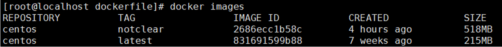
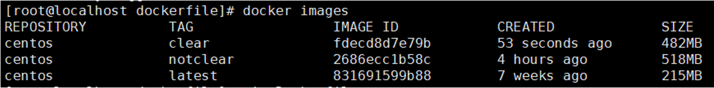
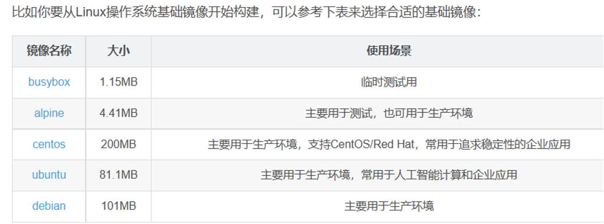
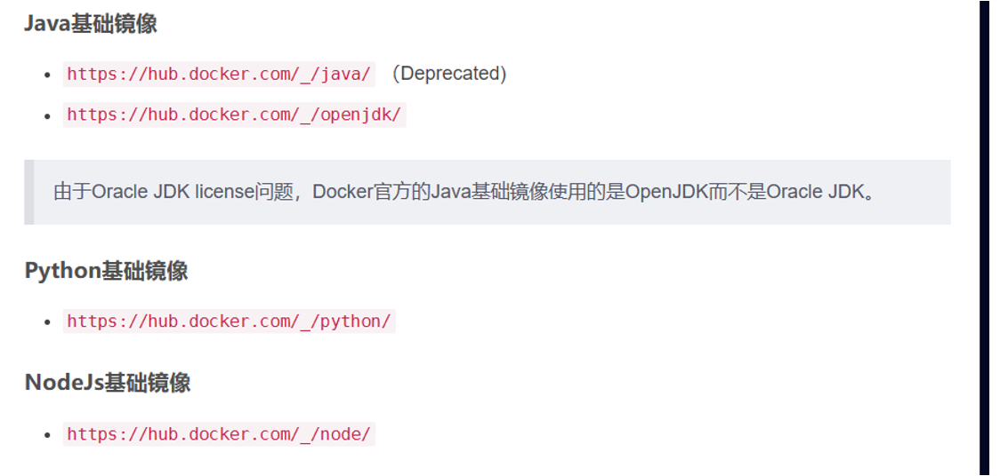
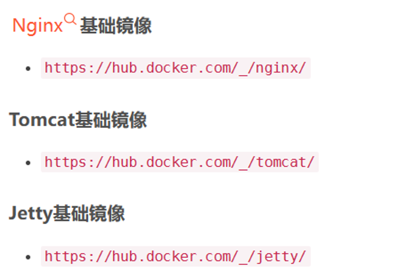
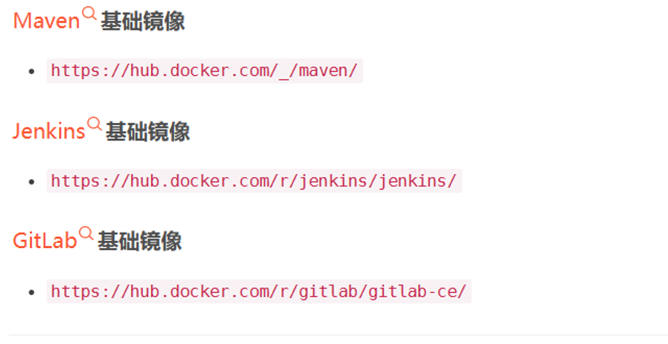

# Docker和Containerd对比分析

如果你使用Docker作为K8S容器运行时的话，kubelet需要先要通过**dockershim**去调用Docker，再通过*Docker*去调用==containerd==。 

如果你使用containerd作为K8S容器运行时的话， kubelet可以直接调用containerd。

使用containerd不仅性能提高了（调用链变短了），而且资源占用也会变小（Docker不是一个纯粹的容器运行时，具有大量其他功能）。

调用链

Docker 作为 k8s 容器运行时，调用关系如下：

`kubelet --> docker shim （在 kubelet 进程中） --> dockerd --> containerd`

Containerd 作为 k8s 容器运行时，调用关系如下：

`kubelet --> cri plugin（在 containerd 进程中） --> containerd`

**同时彼此的镜像可以通用， docker save -o 生成的镜像文件，可以基于ctr –n=k8s.io images import导出来**

## dockerfile构建镜像注意事项

### Dockerfile 的指令每执行一次都会在 docker 上新建一层。所以过多无意义的层，会造成镜像膨胀过大。

```bash   
FROM centos

RUN yum install wget

RUN wget -O redis.tar.gz "http://download.redis.io/releases/redis-5.0.3.tar.gz"

RUN tar -xvf redis.tar.gz
```

以上执行会创建 3 层镜像。可简化为以下格式：

```bash 
FROM centos

RUN yum install wget \

  && wget -O redis.tar.gz "http://download.redis.io/releases/redis-5.0.3.tar.gz" \

  && tar -xvf redis.tar.gz
```

### 多个FROM声明

**尝试使用多个FROM声明来将不同的镜像组合到一起，这样不会起任何作用。Docker仅使用最后一个FROM并且忽略前面所有的。**

所以如果你有这样的Dockerfile：

```bash 
# !!! ANTIPATTERN !!!

FROM node:6.2.1

FROM python:3.5

CMD ["sleep", "infinity"]

# !!! ANTIPATTERN !!! 
```

那么docker exec进入运行的容器中，会得到下面的结果：

```bash 
$ docker exec -it d86fcf0775d3 bash

root@d86fcf0775d3:/# which python

/usr/local/bin/python

root@d86fcf0775d3:/# which node

root@d86fcf0775d3:/#
```

•这其实是GitHub上的一个问题：合并不同的镜像，但它看起来不会很快就增加的功能。

### 清理无用数据

**一次RUN形成新的一层**，如果没有在同一层删除，无论文件是否最后删除，都会带到下一层，所以要在**每一层清理对应的残留数据，减小镜像大小**。

未清理当前镜像层数的缓存的Dockerfile:

```yaml 
FROM centos

RUN yum install epel-release -y && \

  yum install -y gcc gcc-c++ make gd-devel libxml2-devel \

  libcurl-devel libjpeg-devel libpng-devel openssl-devel \

  libmcrypt-devel libxslt-devel libtidy-devel autoconf \

  iproute net-tools telnet wget curl
```

执行命令，构建镜像：`docker build -t centos:notclear .`

构建成功，查看镜像大小：



清理当前镜像层数的缓存的Dockerfile：

```dockerfile
FROM centos

RUN yum install epel-release -y && \

  yum install -y gcc gcc-c++ make gd-devel libxml2-devel \

  libcurl-devel libjpeg-devel libpng-devel openssl-devel \

  libmcrypt-devel libxslt-devel libtidy-devel autoconf \

  iproute net-tools telnet wget curl && \

  yum clean all && \

  rm -rf /var/cache/yum/*
```

执行命令，构建镜像：docker build -t centos:clear .

构建成功，查看镜像大小：



## 操作系统基础镜像



1. busybox

描述：可以将busybox理解为一个超级简化版嵌入式Linux系统。

官网：https://www.busybox.net/

镜像：https://hub.docker.com/_/busybox/

包管理命令：apk, lbu

包管理文档：https://wiki.alpinelinux.org/wiki/Alpine_Linux_package_managemen

2. Alpine

描述：Alpine是一个面向安全的、轻量级的Linux系统，基于musl libc和busybox。

官网：https://www.alpinelinux.org/

镜像：https://hub.docker.com/_/alpine/

包管理命令：apk, lbu

包管理文档：https://wiki.alpinelinux.org/wiki/Alpine_Linux_package_managemen

3. CentOS

描述：可以理解CentOS是RedHat的社区版

官网：https://www.centos.org/

镜像：https://hub.docker.com/_/centos/

包管理命令：yum, rpm

4. Ubuntu

描述：另一个非常出色的Linux发行版

官网：http://www.ubuntu.com/

镜像：https://hub.docker.com/_/ubuntu/

包管理命令：apt-get, dpkg

5. Debian

描述：另一个非常出色的Linux发行版

官网：https://www.debian.org/

镜像：https://hub.docker.com/_/debian/

包管理命令：apt-get, dpkg


## 基础镜像

### 基础程序镜像



### 基础应用镜像




### 其他镜像




## 对etcd做高可用

修改xianchaomaster1、xianchaomaster2、xianchaomaster3上的etcd.yaml文件

vim /etc/kubernetes/manifests/etcd.yaml

**把**

**- --initial-cluster=xianchaomaster1=https://192.168.40.180:2380**

**变成如下：**

**- --initial-cluster=xianchaomaster1=https://192.168.40.180:2380,xianchaomaster2=https://192.168.40.181:2380,xianchaomaster3=https://192.168.40.183:2380**