# docker  swarm介绍与搭建

### 1、什么是docker swarm ？

Swarm是Docker公司推出的用来管理docker集群的平台，几乎全部用GO语言来完成的开发的，代码开源在https://github.com/docker/swarm

简单理解就是多台服务器搭建一个docker集群，每个服务器就是集群中的一个节点。

参考：Docker三剑客之Docker Swarm - 一本正经的搞事情 - 博客园

### 2、docker swarm的几个关键概念

swarm ：集群管理工具

node ：节点，一个节点就是docker集群中的一个实例，我们可以在单台服务器上运行一个或多个节点。

service ：应用编排

task ： 应用实例

从集群角度来说，一个 Swarm 由一个或多个 Docker 节点组成。这些节点可以是物理服务器、虚拟机、树莓派（Raspberry Pi）或云实例。唯一的前提就是要求所有节点通过可靠的网络相连。

节点会被配置为管理节点（Manager）或工作节点（Worker）。管理节点负责集群控制面（Control Plane），进行诸如监控集群状态、分发任务至工作节点等操作。工作节点接收来自管理节点的任务并执行。

Swarm 的配置和状态信息保存在一套位于所有管理节点上的分布式 etcd 数据库中。该数据库运行于内存中，并保持数据的最新状态。关于该数据库最棒的是，它几乎不需要任何配置，作为 Swarm 的一部分被安装，无须管理。

关于集群管理，最大的挑战在于保证其安全性。搭建 Swarm 集群时将不可避免地使用 TLS，因为它被 Swarm 紧密集成。

在安全意识日盛的今天，这样的工具值得大力推广。Swarm 使用 TLS 进行通信加密、节点认证和角色授权。自动密钥轮换（Automatic Key Rotation）更是锦上添花！其在后台默默进行，用户甚至感知不到这一功能的存在。

关于应用编排，Swarm 中的最小调度单元是服务。它是随 Swarm 引入的，在 API 中是一个新的对象元素，它基于容器封装了一些高级特性，是一个更高层次的概念。当容器被封装在一个服务中时，我们称之为一个任务或一个副本，服务中增加了诸如扩缩容、滚动升级以及简单回滚等特性。

参考：Docker Swarm简介

### 3、swarm的调度策略

swarm在调度（scheduler）节点（leader节点）运行容器的时候，会根据指定的策略来计算最适合运行容器的节点，目前支持的策略有：spread，binpack，random

1）Random
顾名思义，就是随机选择一个Node来运行容器，一般用作调试用，spread和binpack策略会根据各个节点的可用的CPU, RAM以及正在运
行的容器的数量来计算应该运行容器的节点。

2）Spread
在同等条件下，Spread策略会选择运行容器最少的那台节点来运行新的容器，binpack策略会选择运行容器最集中的那台机器来运行新的节点。
使用Spread策略会使得容器会均衡的分布在集群中的各个节点上运行，一旦一个节点挂掉了只会损失少部分的容器。

3）Binpack
Binpack策略最大化的避免容器碎片化，就是说binpack策略尽可能的把还未使用的节点留给需要更大空间的容器运行，尽可能的把容器运行在
一个节点上面。

### 4、swarm模式的特性

1）强大的集群的容错性
当容器副本中的其中某一个或某几个节点宕机后，cluster会根据自己的服务注册发现机制，以及之前设定的值--replicas n，
在集群中剩余的空闲节点上，重新拉起容器副本。整个副本迁移的过程无需人工干预，迁移后原本的集群的load balance依旧好使！
不难看出，docker service其实不仅仅是批量启动服务这么简单，而是在集群中定义了一种状态。Cluster会持续检测服务的健康状态
并维护集群的高可用性。

2）服务节点的可扩展性
Swarm Cluster不光只是提供了优秀的高可用性，同时也提供了节点弹性扩展或缩减的功能。当容器组想动态扩展时，只需通过scale
参数即可复制出新的副本出来。

仔细观察的话，可以发现所有扩展出来的容器副本都run在原先的节点下面，如果有需求想在每台节点上都run一个相同的副本，方法
其实很简单，只需要在命令中将"--replicas n"更换成"--mode=global"即可！

复制服务（--replicas n）
将一系列复制任务分发至各节点当中，具体取决于您所需要的设置状态，例如“--replicas 3”。

全局服务（--mode=global）
适用于集群内全部可用节点上的服务任务，例如“--mode global”。如果大家在 Swarm 集群中设有 7 台 Docker 节点，则全部节点之上都将存在对应容器。

### 5、swarm集群部署

a 准备工作

准备三台linux服务器，并且在三台服务器上安装docker，命令：yum -y install docker

CentOS-docker-0312
系统版本：CentOS 7
IP地址：192.168.21.142
主机名：manager0312

CentOS-docker-0313
系统版本：CentOS 7
IP地址：192.168.21.143
主机名：node0313

CentOS-docker-0314
系统版本：CentOS 7
IP地址：192.168.21.144
主机名：node0314

1）修改主机名

```
#192.168.21.142 服务器执行

[root@localhost ~]# hostnamectl set-hostname manager0312

#192.168.21.143 服务器执行

[root@localhost ~]# hostnamectl set-hostname node0313

#192.168.21.143 服务器执行

[root@localhost ~]# hostnamectl set-hostname node0314
```

2）关闭三台服务器上的防火墙

```
[root@manager0312 ~]# systemctl stop firewalld.service

[root@manager0312 ~]# systemctl disable firewalld.service
```

b 创建swarm并添加节点

1）在主服务器上创建swarm集群

```
[root@manager0312 multi-user.target.wants]# docker swarm init --advertise-addr 192.168.21.142
Swarm initialized: current node (qcjc4vkza2nr4uj2p1fwvpx4e) is now a manager.

To add a worker to this swarm, run the following command:

#这就是添加节点的方式(要保存初始化后token，因为在节点加入时要使用token作为通讯的密钥)
```


    docker swarm join 
    --token SWMTKN-1-4kdb7ysckerhxc6gxc3bpltkxtm8o45yq1ikyv1kie825zibhh-bhwazb9y8i3s92v8mpv5c06so 
    192.168.21.142:2377

To add a manager to this swarm, run 'docker swarm join-token manager' and follow the instructions.

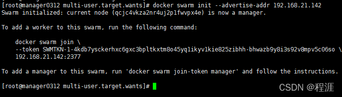

 2）节点加入集群

在两台节点服务器上执行以下命令，将服务器加入到swarm集群，作为集群的节点使用

    docker swarm join 
    --token SWMTKN-1-4kdb7ysckerhxc6gxc3bpltkxtm8o45yq1ikyv1kie825zibhh-bhwazb9y8i3s92v8mpv5c06so 
    192.168.21.142:2377

（注意：这是一条命令，只是这条命令太长了，一行放不下，此处换行了而已）

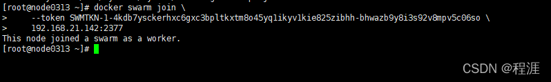

  3）查看节点信息

```
 [root@manager0312 ~]# docker info
```

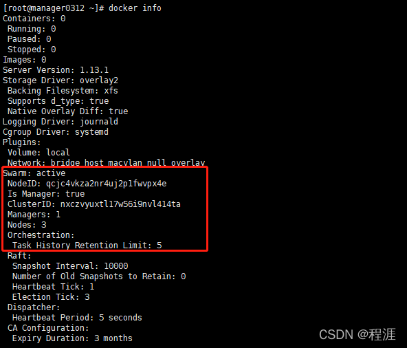

 可以看到swarm集群中已经有三个节点了

```
[root@manager0312 ~]# docker node ls
```

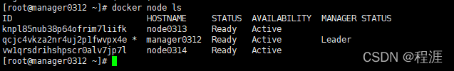

swarm集群中node的availability状态可以为 active或者drain，其中：
       active状态下，node可以接受来自manager节点的任务分派；
       drain状态下，node节点会结束task，且不再接受来自manager节点的任务分派（也就是下线节点）

```
[root@manager0312 ~]# docker node update --availability drain node0313
```

 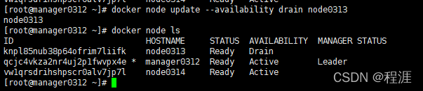

可以看到 node0313 的状态已经是Drain

 当node1的状态改为drain后，那么该节点就不会接受task任务分发，就算之前已经接受的任务也会转移到别的节点上。

再次上线node0313节点

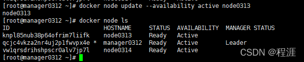

 c 在swarm中部署服务（以nginx为例）

  1）创建网络

```
[root@manager0312 ~]# docker network create -d overlay nginx_net
ossslz9pehhm0hofbuxw3497z

[root@manager0312 ~]# docker network ls | grep nginx_net
ossslz9pehhm        nginx_net           overlay             swarm
```

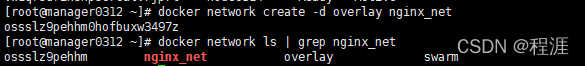

  2）部署服务

```
[root@manager0312 ~]# docker service create --replicas 1 --network nginx_net --name my_nginx -p 80:80 nginx
```

查看正在运行的服务

```
[root@manager0312 ~]# docker service ls
ID                    NAME        MODE        REPLICAS    IMAGE
qexfji2dx3b2   my_nginx   replicated     0/2                nginx:latest
```

查询到哪个节点正在运行my_nginx这个服务

```
[root@manager0312 ~]# docker service ps my_nginx
```

删除指定的服务

```
[root@manager0312 ~]# docker service rm my_nginx
```

service 的其他指令可以用docker service --help 查看

在manager-node节点上使用上面这个覆盖网络创建nginx服务：
其中，--replicas 参数指定服务由几个实例组成。
注意：不需要提前在节点上下载nginx镜像，这个命令执行后会自动下载这个容器镜像（比如此处创建tomcat容器，就将下面命令中的镜像改为tomcat镜像）。

#管理器manager0312查看镜像和容器

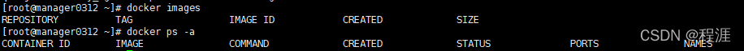

#节点node0313查看镜像和容器

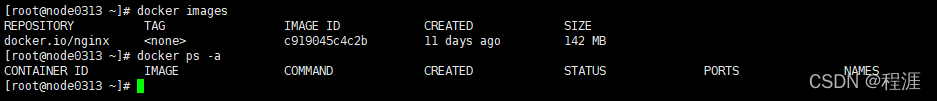

#节点node0314查看镜像和容器

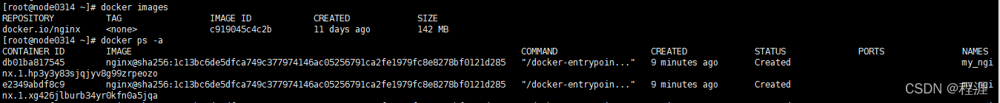

#查询swarm中的服务信息

[root@manager0312 ~]# docker service inspect --pretty my_nginx

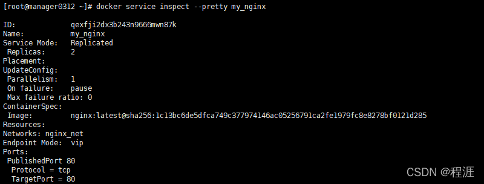


 --pretty 是格式化输出

3）在Swarm中动态扩展服务(scale)

比如将上面的my_nginx的实例个数扩展到4个（扩容）

```
[root@manager0312 ~]# docker service scale my_nginx=4
```

然后将my_nginx的实例个数缩减到3个（缩容）

```
[root@manager0312 ~]# docker service scale my_nginx=3
```

4）如果一个节点宕机了（即该节点就会从swarm集群中被踢出），则在该节点运行的容器，会被调度到其他节点运行，以满足指定数量的副本保持运行状态。

5）改变某个服务的task任务个数除了使用scale命令外，还可以使用docker service update命令

```
[root@manager0312 ~]# docker service update --replicas 3 my_nginx
```

update命令是对服务参数进行修改的

比如直接升级my_nginx服务的镜像

```
[root@manager0312 ~]# docker service update --image nginx:new my_nginx
```

### Swarm 管理器高可用性（HA）

Raft协议:保证大多数管理节点存活 集群才可以用,集群中管理节点至少大于三台,
假设当前集群中有三个管理节点,当挂了一个管理节点后 还有两个存活(大多数都存活) 所以集群仍可用

Swarm使用了Raft来实现了支持管理节点的HA，即使一个或多个节点发生故障，剩余管理节点也会继续保证 Swarm 的运转。

从技术上来说，Swarm 实现了一种主从方式的多管理节点的 HA。这意味着，即使你可能有多个管理节点，也总是仅有一个节点处于活动状态。

通常处于活动状态的管理节点被称为“主节点”（leader），而主节点也是唯一一个会对 Swarm 发送控制命令的节点。也就是说，只有主节点才会变更配置，或发送任务到工作节点。如果一个备用（非活动）管理节点接收到了 Swarm 命令，则它会将其转发给主节点。

这一过程如下图所示。步骤 ① 指命令从一个远程的 Docker 客户端发送给一个管理节点；步骤 ② 指非主节点将命令转发给主节点；步骤 ③ 指主节点对 Swarm 执行命令。

[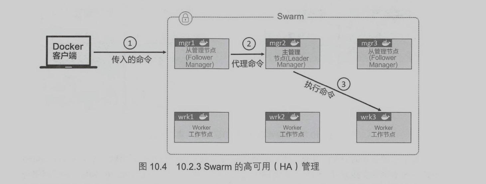](https://img2020.cnblogs.com/blog/2365686/202201/2365686-20220113191659556-1386027497.png)

关于 HA，有以下两条最佳实践原则。

- 部署**奇数**个管理节点。
- 不要部署太多管理节点（**建议 3 个或 5 个**）。

部署奇数个管理节点有利于减少脑裂（Split-Brain）情况的出现机会。假如有 4 个管理节点，当网络发生分区时，可能会在每个分区有两个管理节点。这种情况被称为脑裂。

每个分区都知道曾经有 4 个节点，但是当前网络中仅有两个节点，糟糕的是，每个分区都无法知道其余两个节点是否运行，也无从得知本分区是否掌握大多数（Quorum）。

虽然在脑裂情况下集群依然在运行，但是已经无法变更配置，或增加和管理应用负载了。不过，如果部署有 3 个或 5 个管理节点，并且也发生了网络分区，就不会出现每个分区拥有同样数量的管理节点的情况。

这意味着掌握多数管理节点的分区能够继续对集群进行管理。下图中右侧的例子，阐释了这种情况，左侧的分区知道自己掌握了多数的管理节点。

[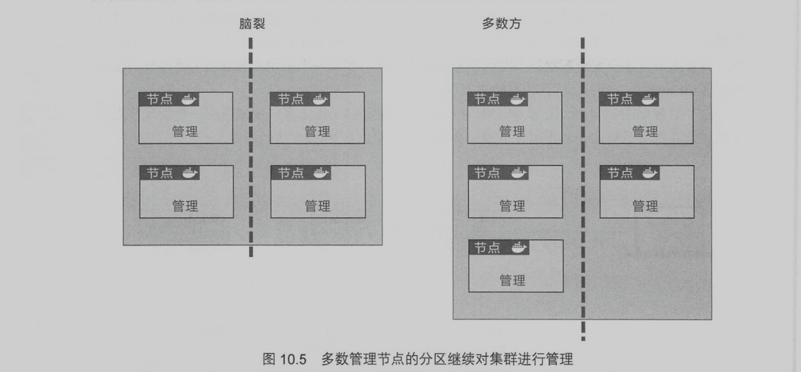](https://img2020.cnblogs.com/blog/2365686/202201/2365686-20220113191713337-1625386790.png)

对于所有的共识算法来说，更多的参与节点就意味着需要花费更多的时间来达成共识。这就像决定去哪吃饭，只有3个人的时候总是比有33个人的时候能更快确定。

考虑到这一点，最佳的实践原则是部署 3 个或 5 个节点用于 HA。7 个节点可以工作，但是通常认为 3 个或 5 个是更优的选择。当然绝对不要多于 7 个，因为需要花费更长的时间来达成共识。

关于管理节点的 HA 再补充一点。显然将管理节点分布到不同的可用域（Availability Zone）中是一种不错的实践方式，但是一定要确保它们之间的网络连接是可靠的，否则由于底层网络分区导致的问题将是令人痛苦的。

### 锁定 Swarm

 尽管内置有如此多的原生安全机制，重启一个旧的管理节点或进行备份恢复仍有可能对集群造成影响。一个旧的管理节点重新接入 Swarm 会自动解密并获得 Raft 数据库中长时间序列的访问权，这会带来安全隐患。进行备份恢复可能会抹掉最新的 Swarm 配置。

 为了规避以上问题，Docker 提供了自动锁机制来锁定 Swarm，这会强制要求重启的管理节点在提供一个集群解锁码之后才有权从新接入集群。

通过在执行 `docker swarm init` 命令来创建一个新的 Swarm 集群时传入 --autolock 参数可以直接启用锁。然而，前面已经搭建了一个 Swarm 集群，这时也可以使用 `docker swarm update` 命令来启用锁。

在某个 Swarm 管理节点上运行如下命令。

```shell
$ docker swarm update --autolock=true
Swarm updated.
To unlock a swarm manager after it restarts, run the
`docker swarm unlock`command and provide the following key:

SWMKEY-1-5+ICW2kRxPxZrVyBDWzBkzZdSd0Yc7Cl2o4Uuf9NPU4

Please remember to store this key in a password manager, since without
it you will not be able to restart the manager.
```

请确保将解锁码妥善保管在安全的地方！重启某一个管理节点，以便观察其是否能够自动重新接入集群。

```shell
$ service docker restart
```

尝试列出Swarm中的节点。

```shell
$ docker node ls
Error response from daemon: Swarm is encrypted and needs to be unlocked

before it can be used.
```

 尽管 Docker 服务已经重启，该管理节点仍然未被允许重新接入集群。

为了进一步验证，可以到其他管理节点执行 `docker node ls` 命令，会发现重启的管理节点会显示 down 以及 unreachable。

 执行 `docker swarm unlock` 命令来为重启的管理节点解锁 Swarm。该命令需要在重启的节点上执行，同时需要提供解锁码。

```x86asm
$ docker swarm unlock
Please enter unlock key: <enter your key>
```

 该节点将被允许重新接入 Swarm，并且再次执行 `docker node ls` 命令会显示 ready 和 reachable。

## Swarm集群创建服务

可以动态扩缩容 屏蔽底层差异

集群服务的相关命令docker service

```sql
beginner@beginner-virtual-machine:~$ docker service 

Usage:  docker service COMMAND

Manage services

Commands:
  create      Create a new service
  inspect     Display detailed information on one or more services
  logs        Fetch the logs of a service or task
  ls          List services
  ps          List the tasks of one or more services
  rm          Remove one or more services
  rollback    Revert changes to a service's configuration
  scale       Scale one or multiple replicated services
  update      Update a service
```

启动一个示例

```lua
docker service create -p 8888:80 --name my-nginx nginx:latest

--mode global所有节点都可以创建任务副本运行
--mode replicas 只有工作节点才能运行     
```

查看服务

```bash
docker service ls
```

动态扩缩容实现高可用

```perl
docker service update --relipcas 10 my-nginx  #现在让整个项目整体产生10个服务

docker service update --relipcas 2 my-nginx  # 将集群缩减为两个服务

docker service scale my-nginx=10
docker service scale my-nginx=2
与上面两个一模一样
```

滚动更新

```shell
docker service update \
--image nginx:2.0 \
--update-parallelism 2 \
--update-delay 20s my-nginx

# 将镜像更新为2.0 每次更新两个副本 每20s更新一次
```

移除服务

```bash
docker service rm my-nginx
```

## 命令总结

- docker swarm init 用于创建一个新的 Swarm。执行该命令的节点会成为第一个管理节点，并且会切换到 Swarm 模式。
- docker swarm join-token 用于查询加入管理节点和工作节点到现有 Swarm 时所使用的命令和 Token。 要获取新增管理节点的命令，请执行 docker swarm join-token manager 命令； 要获取新增工作节点的命令，请执行 docker swarm join-token worker 命令。
- docker node ls 用于列出 Swarm 中的所有节点及相关信息，包括哪些是管理节点、哪个是主管理节点。
- docker service create 用于创建一个新服务
- docker service ls 用于列出 Swarm 中运行的服务，以及诸如服务状态、服务副本等基本信息
- docker service ps 该命令会给出更多关于某个服务副本的信息
- docker service inspect 用于获取关于服务的详尽信息。附加 --pretty 参数可限制仅显示重要信息。
- docker service scale 用于对服务副本个数进行增减。
- docker service update 用于对运行中的服务的属性进行变更。
- docker service rm 用于从 Swarm 中删除某服务。该命令会在不做确认的情况下删除服务的所有副本，所以使用时应保持警惕