# 前言

使用一个Dockerfile模板文件可以定义一个单独的应用容器，如果需要定义多个容器就需要服务编排。下面介绍Docker官方产品，Docker Compose。

Dockerfile可以让用户管理一个单独的应用容器，而compose则允许用户在一个模板（yaml格式）中定义一组相关联的应用容器（被称为一个project，即项目）

例如一个web服务再加上后端的数据库服务容器等。

# 一、Docker-compose简介

## **1、docker-compose基础概念**

docker-compose项目是docker官方的开源项目， 负责实现对docker容器集群的快速编排。

docker-compose将所管理的容器分为三层， 分别是**工程（project），服务（service）以及容器（containner）**

- docker-compose运行目录下的所有文件（docker-compose.yml文件、extends文件或环境变量等）组成一个工程，如无特殊指定，工程名即为当前目录名。
- 一个工程当中，可以包含多个服务，每个服务中定义了容器运行的镜像、参数、依赖。
- 一个服务中可以包括多个容器实例，docker-compose并没有解决负载均衡的问题。因此需要借助其他工具实现服务发现及负载均衡，比如consul。

docker-compose的工程配置文件默认为docker-compose.yml。可以通过环境变量COMPOSE_FILE -f 参数自定义配置文件，其自定义多个有依赖关系的服务及每个人服务运行的容器。

## **2、为什么要使用docker-compose**

使用一个Dockerfile模板文件，可以让用户很方便的定义一个单独应用容器。在工作中，经常会碰到需要多个容器相互配合来完成某项任务的情况，例如要实现一个web项目，除了web服务容器本身，往往还需要再加上后端的数据库服务容器，甚至还包括负载均衡容器等。

compose允许用户通过一个单独docker-compose.yml模板文件（YAML格式）来定义一组相关联的应用容器为一个项目（project）

docker-compose项目由pypthon编写，调用docker服务提供的API来对容器进行管理，因此， 只要所操作的平台支持docker-API，就可以在其上利用conpose来进行编排管理。

简单来说：就是来管理多个容器的，定义启动顺序的，合理编排，方便管理。

# 二、YAML文件格式及编写注意事项

## **1、YAML文件格式**

- YAML是一种标记性语言，它可以很直观的展示数据序列化格式，可读性高。
- 类似于json数据描述语言，但是语法要比json简单很多。
- YAML数据结构通过缩进来表示，连续的项目通过减号来表示，键值对用冒号分隔，数组用中括号[ ] 括起来，bash用花括号{ } 括起来。

## **2、YAML格式的注意事项**

- 不支持制表符tab键缩进，只能使用空格缩进
- 通常开头缩进2个空格
- 字符后缩进1个空格，如冒号【：】、逗号【，】、横杠【-】
- 用#号表示注释
- 如果包含特殊字符用单引号【’ '】引起来作为普通字符，如果用双引号【“ ”】表示特殊字符本身的意思，
- 布尔值必须用【“ ”】括起来
- YAML区分大小写

## **3、YAML数据结构案例**

```yaml
#键值对表示

animal:pets

#数组:一组按次序排列的列表

- cat
- dog
- goldfish

#布尔值
debug: "true"
debug: "false"

#yaml实例
languages:        #序列的映射 

  - java
  - Golang
  - Python

websites:         #映射的映射
  Baidu: www.baidu.com
  Wangyi: www.163.com
  Souhu: www.souhu.com

#或者
languages: ["java","Golong","Python"]
websites:
  Baidu:
    www.baidu.com
  Wangyi:
    www.163.com
  Souhu:
    www.souhu.com

#Json格式
{
  languages: [
    'Java',
    'Golong',
    'Python',
  ],
  websites: [
    Baidu: 'www.baidu.com',
    Wangyi: 'www.163.com',
    Souhu: 'www.souhu.com',
  ]
}
```

# 三、Docker Compose 配置常用字段

## **1、Docker Compose配置常用字段**

|      字段      |                           **描述**                           |
| :------------: | :----------------------------------------------------------: |
|     build      | 指定Dockerfile文件名（要指定的Dockerfile文件需要在build标签的子级标签中用dockefile标签指定） |
|   dockerfile   |                      构建镜像上下文路径                      |
|    context     |       可以是dockerfile路径，或者时执行git仓库的url地址       |
|     images     |                      指定镜像（已存在）                      |
|    command     | 执行命令，会覆盖容器启动后默认执行的命令（会覆盖dockefile中的CMD指令） |
| container_name | 指定容器名称，由于容器名称是唯一的，如果指定自定义名称，则无法scale指定容器数量。 |
|     deploy     |       指定部署和运行服务相关配置，只能在swarm模式使用        |
|  environment   |                         添加环境变量                         |
|    networks    |               加入网络，引用顶级networks下条目               |
|  network-mode  |                      设置容器的网络模式                      |
|     ports      |          暴露容器端口，与-p相同，但是端口不能低于60          |
|    volumes     | 挂载一个宿主机目录或命令卷到容器，命令卷要在顶级volumes定义卷名称 |
|  volumes_from  | 从另一个服务或容器挂载卷，可选参数：ro和rw（仅版本‘2’支持）  |
|    hostname    |                     在容器内设置内核参数                     |
|     links      |             连接诶到另一个容器，- 服务名称[ : ]              |
|   privileged   |           用来给容器root权限，注意是不安全的，true           |
|    restart     | 重启策略，定义是否重启容器1、no，默认策略，在容器退出时不重启容器2、on-failure，在容器非正常退出时（退出状态非0），才会重启容器3、on-failure：3 在容器非正常退出时，重启容器，最多重启3次4、always，在容器退出时总是重启容器，5、unless-stopped，在容器退出时总是重启容器，但是不考虑在Docker守护进程启动时就已经停止了的容器。 |
|   depends_on   | 此标签用于解决容器的依赖，启动先后问题。如启动应用容器，需要先启动数据库容器。php:depends_on:- apache- mysql |

## **2、Docker-compose常用命令**

运行这些命令需要结合docker-compose一起使用。

且必须要在含有docker-compose.yml文件的目录中才可以使用，不然报错。

|        命令        |             描述             |
| :----------------: | :--------------------------: |
|       build        |         重新构建服务         |
|         ps         |           列出容器           |
|         up         |        创建和启动容器        |
|        exec        |      在容器里面执行命令      |
|       scale        |   指定一个服务容器启动数量   |
|        top         |    显示正在运行的容器进程    |
|        logs        |      查看服务容器的输出      |
|        down        | 删除容器、网络、数据卷和镜像 |
| stop/start/restart |      停止/启动/重启服务      |

# 四、docker-compose安装

docker-compose是docker的独立产品，因此需要安装docker之后再单独安装docker compose。

```
curl -L https://github.com/docker/compose/releases/download/1.21.1/docker-compose-`uname -s`-`uname -m` -o /usr/local/bin/docker-compose
#下载docker-compose文件

mv docker-compose /usr/local/bin
#将文件复制到/usr/local/bin环境变量下面

chmod +x /usr/local/bin/docker-compose
#给他一个执行权限

yum install epel-release &&yum makecache  
yum install docker-compose-plusin
```

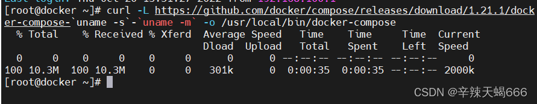

# 五、docker-compose部署nginx服务访问自定义页面

## **1、准备依赖文件**

```bash
mkdir /root/compose_nginx
yum install -y tree 
vim /root/compose_nginx/docker-compose.yml
```

```yaml
version: '3' 
services:  
  nginx: 
   hostname: nginx 
   build: 
      context: ./nginx 
      dockerfile: Dockerfile 
   ports: 
    - 1216:80 
    - 1217:443 
   networks: 
    - cluster 
   volumes: 
   - ./wwwroot:/usr/local/nginx/html 
   networks: 
    cluster:
```

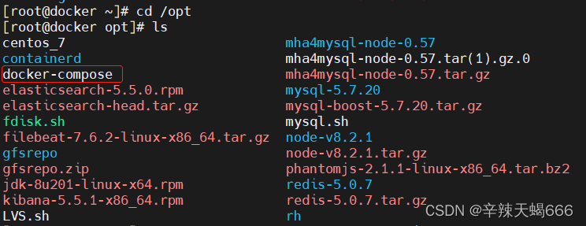

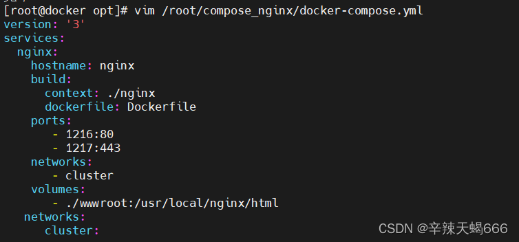

```bash
[root@docker compose_nginx]# vim /root/compose_nginx/docker-compose.yml
[root@docker compose_nginx]# ls
docker-compose.yml
[root@docker compose_nginx]# mkdir nginx
[root@docker compose_nginx]# mkdir wwwroot
[root@docker compose_nginx]# ls
docker-compose.yml  nginx  wwwroot
[root@docker compose_nginx]# echo "liyong xuexijiugenwanyiyang" > wwwroot/index.html
[root@docker compose_nginx]# cat wwwroot/index.html 
liyong xuexijiugenwanyiyang
[root@docker compose_nginx]# cd nginx
[root@docker nginx]# ls
[root@docker nginx]# rz -E
rz waiting to receive.
[root@docker nginx]# ls
nginx-1.20.2.tar.gz
```

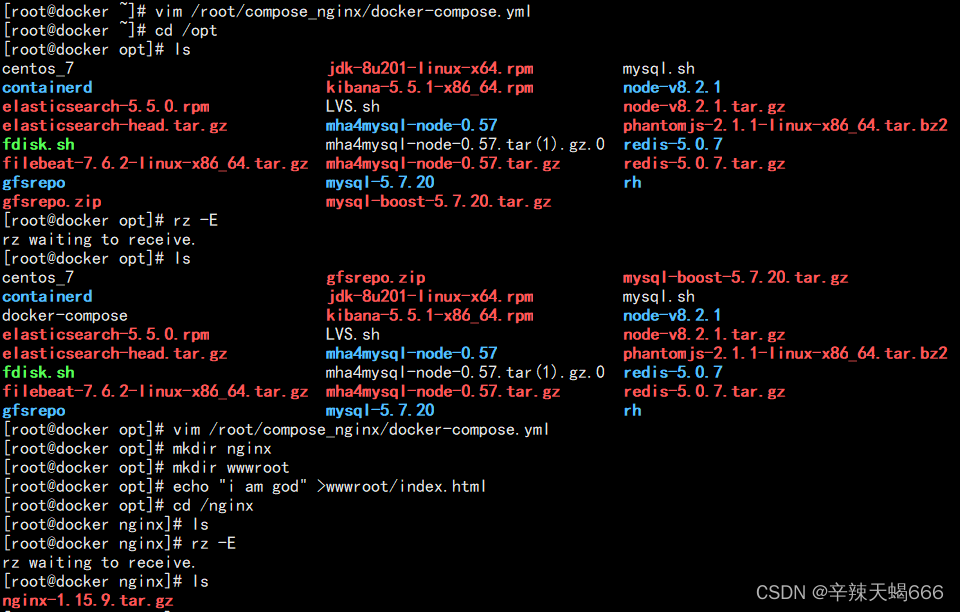

```bash
mkdir -p /opt/compose_nginx/nginx

cd /opt/compose_nginx/nginx

#上传nginx的包

vim Dockerfile

FROM centos:7
RUN yum -y install pcre-devel zlib-devel gcc gcc-c++ make &> /dev/null
RUN useradd -M -s /sbin/nologin nginx
ADD nginx-1.15.9.tar.gz /usr/local/src
WORKDIR /usr/local/src/nginx-1.15.9
RUN ./configure \
--prefix=/usr/local/nginx \
--user=nginx \
--group=nginx \
--with-http_stub_status_module &> /dev/null
RUN make -j 4 && make install &> /dev/null
RUN ln -s /usr/local/nginx/sbin/nginx /usr/local/sbin/
#ENV PATH /usr/local/nginx/sbin/:PATH
EXPOSE 80
EXPOSE 443
RUN echo "daemon off;" >> /usr/local/nginx/conf/nginx.conf
CMD ["/usr/local/nginx/sbin/nginx"] 
```

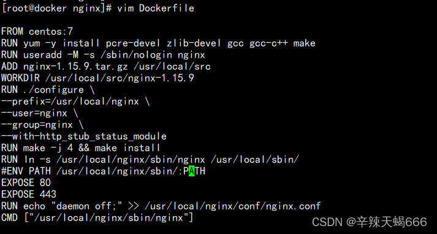

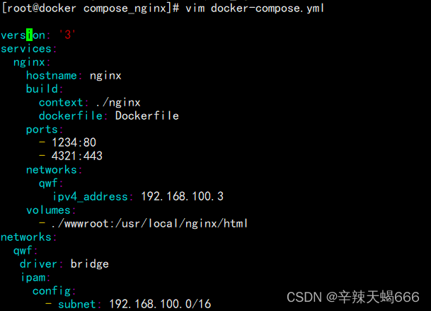

## **2、编写配置文件docker-compose.yml文件**

```bash
cd /opt/compose_nginx

vim docker-compose.yml

```

```yaml
version: '3'   #定义编排版本，共3版(1,2,3),1被淘汰,2的话只能单机编排，3的话即可以实现单机编排，也可以实现多机编排。
services:     #定义服务
  nginx:      #定义nginx服务
    hostname: nginx      #容器的主机名为nginx
    build:               #定义创建容器的过程 //如果有线程的镜像，直接写images: 
      context: ./nginx   #指定创建容器的目录位置(存储dockerfile的目录)
      dockerfile: Dockerfile   #指定Dockerfile文件
    ports:            #定义端口
      - 1234:80       #暴露端口
      - 4321:443      #暴露端口
    networks:                      #指定网络
      ydq:                         #指定网络名称
        ipv4_address: 172.100.0.10  #指定ip地址
    volumes:                                 #数据卷，挂载目录
      - ./wwwroot:/usr/local/nginx/html      #前面宿主机，后面容器
networks:               #自定义网络
  ydq:                  #自定义网络名称
   driver: bridge       #自定义网络模式
   ipam:                #网络管理器
     config:            #配置参数
       - subnet: 172.100.0.0/16    #配置子网网段 
       
#networks的参数ipam即网络管理，其下还有driver参数即指定使用的网络模式，以及config配置参数（比如配置子网等）
       

```

```bash
echo "this is ydq" >/opt/compose_nginx/wwwroot/index.html
```


## **3、生成镜像容器**

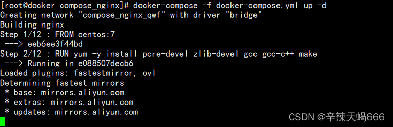

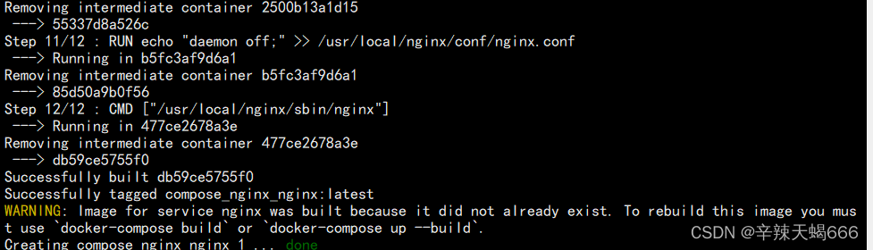

## **4、查看目录结构**

```
yum -y install tree &>/dev/null

cd /opt/compose_nginx
tree
```

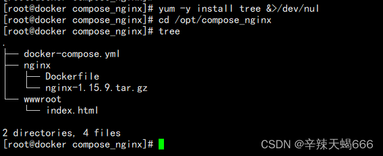

```bash
docker-compose -f 
docker-compose.yaml up -d  #-f调用文件。-d:开启守护进程

docker network ls
docker ps -a
docker-compose ps
```

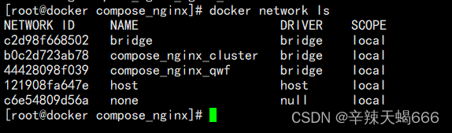

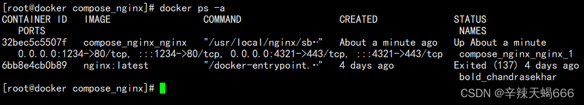

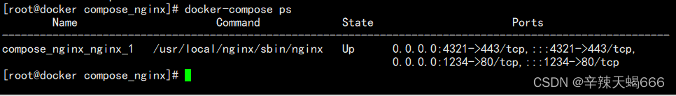


## 5、访问测试

```
curl 192.168.100.3:1234

#或者

#网页访问：http:192.168.100.3:1234
```

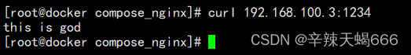


