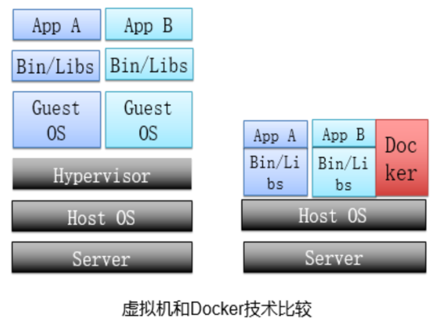
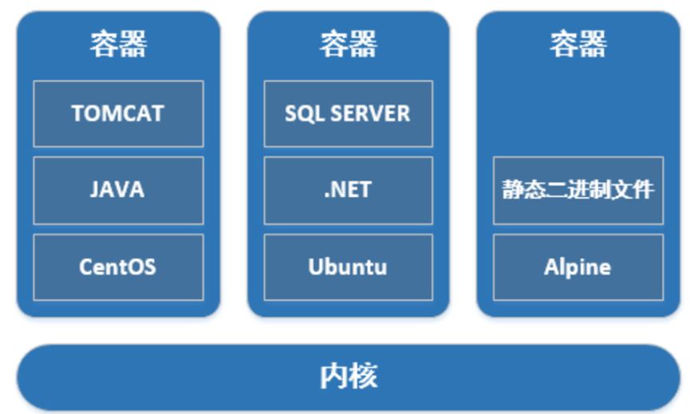
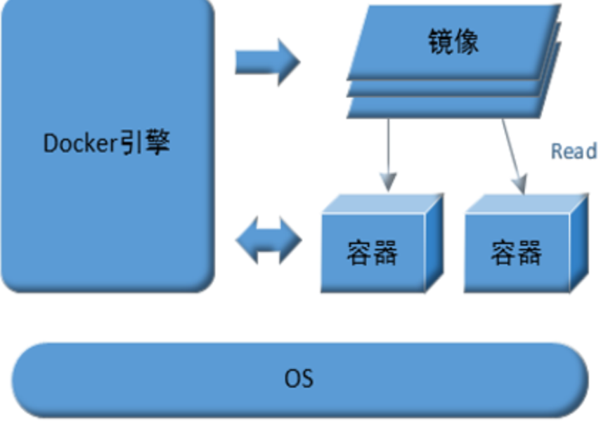
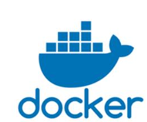

# docker介绍

## 容器跟虚拟机什么区别？   

                     

App在虚拟机中运行时，调用需要经过虚拟化软件的处理，才能调用到真正的宿主机操作系统。

在容器中运行，直接可以使用宿主机操作系统，省事省力，可喜可贺。

那么容器技术的又有了优点：

敏捷和高性能：直接调用宿主机操作系统，不需要经过虚拟化软件的处理。 

Docker的思想来自于集装箱，集装箱解决了什么问题？在一艘大船上，可以把货物规整的摆放起来。并且各种各样的货物被集装箱标准化了，集装箱和集装箱之间不会互相影响。那么我就不需要专门运送水果的船和专门运送化学品的船了。只要这些货物在集装箱里封装的好好的，那我就可以用一艘大船把他们都运走。

服务器就好比大船。容器就是集装箱。

1、不同的应用程序可能会有不同的应用环境，比如.net开发的网站和php开发的网站依赖的软件就不一样，如果把他们依赖的软件都安装在一个服务器上就要调试很久，而且很麻烦，还会造成一些冲突。比如IIS和Apache访问端口冲突。这个时候你就要隔离.net开发的网站和php开发的网站。常规来讲，我们可以在服务器上创建不同的虚拟机在不同的虚拟机上放置不同的应用，但是虚拟机开销比较高。docker可以实现虚拟机隔离应用环境的功能，并且开销比虚拟机小，小就意味着省钱了。

2、你开发软件的时候用的是Ubuntu，但是运维管理的都是centos，运维在把你的软件从开发环境转移到生产环境的时候就会遇到一些Ubuntu转centos的问题，比如：有个特殊版本的数据库，只有Ubuntu支持，centos不支持，在转移的过程当中运维就得想办法解决这样的问题。这时候要是有docker你就可以把开发环境直接封装转移给运维，运维直接部署你给他的docker就可以了（就问你叼不叼）。而且部署速度快。

3、在服务器负载方面，如果你单独开一个虚拟机，那么虚拟机会占用空闲内存的，docker部署的话，这些内存就会利用起来。

Docker是一次封装到处运行，因为docker解决了应用环境的问题，安装了docker的平台就能跑“docker包”，这样就决绝了“开发环境能跑，一上线就崩”的尴尬。

## 为什么学习Docker？

把服务打包成容器。

一个Java 代码，需要编译打包，会打包成 war包或者jar包，把war包或者jar包启动成功，就可以对外提供服务了（能正常访问页面，做操作）。如果是war包，需要弄到一台linux机器的tomcat目录的webapp下面启动。

没有用容器之前通常会出现如下问题：

1.开发环境没问题，测试环境报错---->排查后发现是启动脚本里jdk版本跟代码要求的版本不匹配

2.测试环境没问题，生产环境报错 -->排查发现是tomcat版本和jdk版本不匹配。

然后：

开发、运维、测试同事都都觉得自己没问题，总结的时候会相互撕，影响产品上线效率，最重要的是还影响团队绩效，把你的钱蹭蹭的扣

打包 机制就不一样了，他很强，可以把我这个代码需要的 一切 ，包括tomcat，jdk，甚至是linux文件都 打包到一起。打包这个东西叫做镜像

 

这个打出来的包叫做镜像。 镜像运行时叫做容器。

可以发现 镜像可以很方便的做迁移，备份，存储，交付。

运行镜像，能对外提供服务能力的镜像运行时，叫做容器。

 

这样，打出来的包，优点就出来了

1.环境的强一致性。docker镜像提供了除内核外完成的运行时环境，保证其他使用人员，能完整复现应用运行时环境。不会出现“这应用在xxx环境没问题”这种情况。

2.迁移方便，持续交付和部署。一次打包，到处运行。

Docker官网：https://docs.docker.com/

Docker的github地址：https://github.com/moby/moby

Dockerhub官网[https://registry.hub.docker.com](https://registry.hub.docker.com)

如果docker官方registry拉取镜像速度很慢，可以尝试daocloud提供的加速器服务

[https://dashboard.daocloud](https://dashboard.daocloud.io/mirror)

## docker是什么？

Docker 是一个开源项目，诞生于 2013 年初，最初是 dotCloud 公司内部的一个业余项目。它基于 Google 公司推出的 Go 语言实现。项目后来加入了 Linux 基金会，遵从了 Apache 2.0 协议，项目代码在[GitHub](https://github.com/docker/docker) 上进行维护。

Docker是一个开源的引擎，可以轻松的为任何应用创建一个轻量级的、可移植的、自给自足的容器。开发者可以打包他们的应用以及依赖包到一个可移植的镜像中，然后发布到任何支持docker的机器上运行。容器是完全使用沙箱机制，相互之间不会有任何接口调用。

**Docker logo**：

 

**Docker**的思想来自于集装箱，集装箱解决了什么问题？在一艘大船上，可以把货物规整的摆放起来。并且各种各样的货物被装在集装箱里，集装箱和集装箱之间不会互相影响。那么我就不需要专门运送蔬菜的船和专门运送货物的船了。只要这些货物在集装箱里封装的好好的，那我就可以用一艘大船把他们都运走。

**docker**就是类似的理念。云计算就好比大货轮。docker就是集装箱。

## docker的优点

1）快

运行时的性能快，管理操作(启动，停止，开始，重启等等) 都是以秒或毫秒为单位的。

2）敏捷

像虚拟机一样敏捷，而且会更便宜，在bare metal(裸机)上布署像点个按钮一样简单。

3）灵活

将应用和系统“容器化”，不添加额外的操作系统

4）轻量

在一台服务器上可以布署100~1000个Containers容器。

5）便宜

开源的，免费的，低成本的。

**docker的版本：**

docker-ce：社区版

docker-ee: 商业版

 

 

**3、docker缺点**

**所有容器共用linux kernel资源，资源能否实现最大限度利用，所以在安全上也会存在漏洞。**