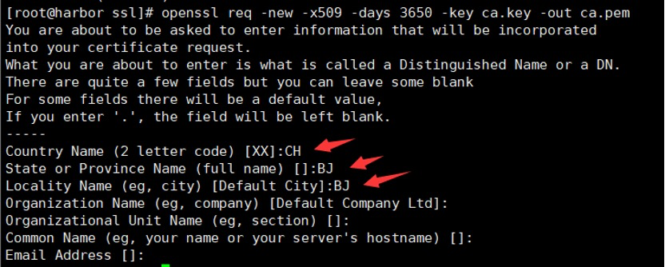
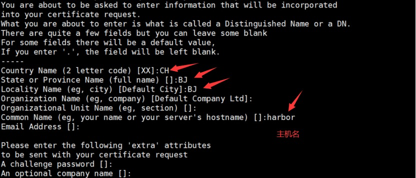
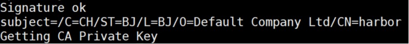
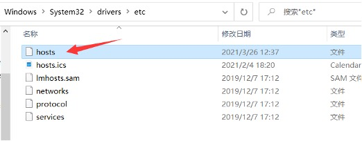
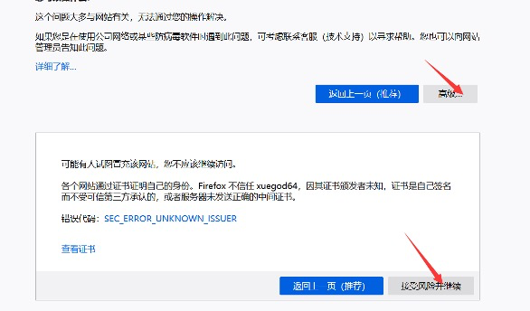
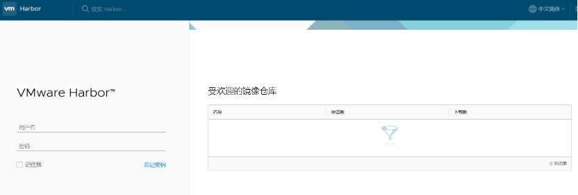
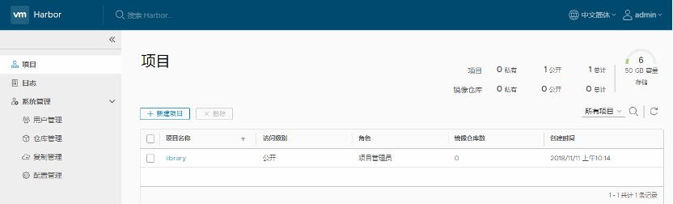
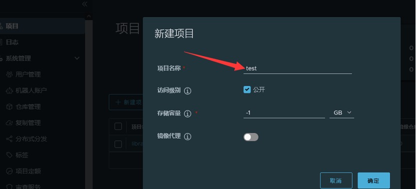
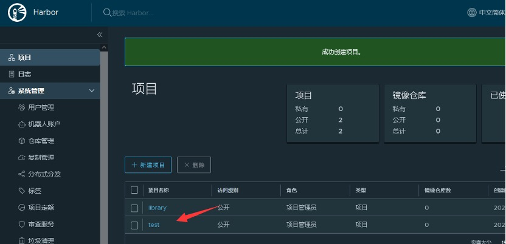

# docker私有镜像仓库harbor

## **Harbor介绍**

Docker容器应用的开发和运行离不开可靠的镜像管理，虽然Docker官方也提供了公共的镜像仓库，但是从安全和效率等方面考虑，部署我们私有环境内的Registry也是非常必要的。Harbor是由VMware公司开源的企业级的Docker Registry管理项目，它包括权限管理(RBAC)、LDAP、日志审核、管理界面、自我注册、镜像复制和中文支持等功能。

官网地址：https://github.com/goharbor/harbor

实验环境： 

安装harbor的机器，**主机名设置成harbor**

机器需要的**内存至少要2G**，我分配的是4G 

机器ip：192.168.40.181

**4vCPU/4G内存/100G硬盘**

## 为Harbor自签发证书

```
[root@192 ~]# hostnamectl set-hostname harbor && bash

[root@harbor ~]# mkdir /data/ssl -p

[root@harbor ~]# cd /data/ssl/
```

### **生成ca证书：**

```
openssl genrsa -out ca.key 3072

#生成一个3072位的key，也就是私钥

openssl req -new -x509 -days 3650 -key ca.key -out ca.pem

#生成一个数字证书ca.pem，3650表示证书的有效时间是3年，按箭头提示填写即可，没有箭头标注的为空：
```

​                               

### **生成域名的证书：**

```
openssl genrsa -out harbor.key 3072

#生成一个3072位的key，也就是私钥

openssl req -new -key harbor.key -out harbor.csr

#生成一个证书请求，一会签发证书时需要的，标箭头的按提示填写，没有箭头标注的为空：

```

 

### **签发证书：**

```
openssl x509 -req -in harbor.csr -CA ca.pem -CAkey ca.key -CAcreateserial -out harbor.pem -days 3650
```

显示如下，说明证书签发好了：

 

 

## 安装Harbor

###  安装Docker

```
#关闭防火墙

[root@ harbor~]# systemctl stop firewalld && systemctl disable firewalld

#关闭iptables防火墙

[root@ harbor~]# yum install iptables-services -y #安装iptables

#禁用iptables

root@ harbor~]# service iptables stop  && systemctl disable iptables

#清空防火墙规则

[root@ harbor~]# iptables -F 


#关闭selinux

[root@ harbor~]# setenforce 0

[root@harbor~]# sed -i 's/SELINUX=enforcing/SELINUX=disabled/g' /etc/selinux/config

#注意：修改selinux配置文件之后，重启机器，selinux才能永久生效


#配置时间同步

[root@harbor~]# yum install -y ntp ntpdate

[root@xianchaomaster1 ~]# ntpdate cn.pool.ntp.org 

#编写计划任务

[root@harbor~]# crontab -e 

* */1 * * * /usr/sbin/ntpdate  cn.pool.ntp.org

#重启crond服务使配置生效：

[root@xianchaomaster1 ~]# systemctl restart crond


#配置hosts文件

[root@xianchaomaster1 ~]# cat /etc/hosts

127.0.0.1  localhost localhost.localdomain localhost4 localhost4.localdomain4

::1     localhost localhost.localdomain localhost6 localhost6.localdomain6

192.168.40.180 xianchaomaster1

192.168.40.181 harbor


[root@harbor harbor]# cat /etc/hosts

127.0.0.1  localhost localhost.localdomain localhost4 localhost4.localdomain4

::1     localhost localhost.localdomain localhost6 localhost6.localdomain6

192.168.40.180 xianchaomaster1

192.168.40.181 harbor


#安装基础软件包

[root@ harbor~]# yum install -y wget net-tools nfs-utils lrzsz gcc gcc-c++ make cmake libxml2-devel openssl-devel curl curl-devel unzip sudo ntp libaio-devel wget vim ncurses-devel autoconf automake zlib-devel python-devel epel-release openssh-server socat ipvsadm conntrack 


#安装docker-ce

#配置docker-ce国内yum源（阿里云）

[root@ harbor~]# yum-config-manager --add-repo http://mirrors.aliyun.com/docker-ce/linux/centos/docker-ce.repo


#安装docker依赖包

[root@ harbor~]# yum install -y yum-utils device-mapper-persistent-data lvm2


#安装docker-ce

[root@ harbor~]# yum install docker-ce -y


#启动docker服务

[root@ harbor~]# systemctl start docker && systemctl enable docker

[root@ harbor~]# systemctl status docker

● docker.service - Docker Application Container Engine

  Loaded: loaded (/usr/lib/systemd/system/docker.service; enabled; vendor preset: disabled)

  Active: active (running) since Thu 2021-07-01 21:29:18 CST; 30s ago

   Docs: [https://docs.docker.com](https://docs.docker.com)


#看到running，表示docker正常运行


#查看Docker 版本信息

[root@ harbor~]# docker version   
```


### 开启包转发功能和修改内核参数

```
#内核参数修改：br_netfilter模块用于将桥接流量转发至iptables链，br_netfilter内核参数需要开启转发。

[root@ harbor~]# modprobe br_netfilter

[root@ harbor~]# cat > /etc/sysctl.d/docker.conf <<EOF

net.bridge.bridge-nf-call-ip6tables = 1

net.bridge.bridge-nf-call-iptables = 1

net.ipv4.ip_forward = 1

EOF

  [root@harbor ~]# sysctl -p /etc/sysctl.d/docker.conf

 


```

#注：

Docker 安装后出现：WARNING: bridge-nf-call-iptables is disabled 的解决办法：

net.bridge.bridge-nf-call-ip6tables = 1

net.bridge.bridge-nf-call-iptables = 1

net.ipv4.ip_forward = 1：

将Linux系统作为路由或者VPN服务就必须要开启IP转发功能。当linux主机有多个网卡时一个网卡收到的信息是否能够传递给其他的网卡 如果设置成1 的话 可以进行数据包转发，可以实现VxLAN 等功能。不开启会导致docker部署应用无法访问。

**重启docker**

```
[root@xianchaomaster1 ~]# systemctl restart docker  

[root@xianchaomaster1 ~]# scp /etc/docker/daemon.json 192.168.40.181:/etc/docker/

[root@harbor ~]# systemctl daemon-reload

[root@harbor ~]# systemctl restart docker
```

### 安装harbor

```
#创建安装目录

[root@harbor ssl]# mkdir /data/install -p

[root@harbor ssl]# cd /data/install/

#安装harbor

#/data/ssl目录下有如下文件：

ca.key ca.pem ca.srl harbor.csr harbor.key harbor.pem
[root@harbor install]# cd /data/install/

#把harbor的离线包harbor-offline-installer-v2.3.0-rc3.tgz上传到这个目录，离线包在课件里提供了
```

**下载harbor离线包的地址：**

https://github.com/goharbor/harbor/releases/tag/

 

**解压：**

```
[root@harbor install]# tar zxvf harbor-offline-installer-v2.3.0-rc3.tgz

[root@harbor install]# cd harbor

[root@harbor harbor]# cp harbor.yml.tmpl harbor.yml 

[root@harbor harbor]# vim harbor.yml
```

修改配置文件：

hostname: harbor 

\#修改hostname，跟上面签发的证书域名保持一致

\#协议用https

certificate: /data/ssl/harbor.pem

private_key: /data/ssl/harbor.key

邮件和ldap不需要配置，在harbor的web界面可以配置

其他配置采用默认即可

修改之后保存退出

**注：harbor默认的账号密码：admin/Harbor12345**

 

#### **安装docker-compose**

上传课件里的docker-compose-Linux-x86_64文件到harbor机器

```
[root@harbor harbor]# mv docker-compose-Linux-x86_64.64 /usr/bin/docker-compose

[root@harbor harbor]# chmod +x /usr/bin/docker-compose
#或安装docker-compose-plugin包
yum install -y docker-compose-plugin 
```

**注： docker-compose项目是Docker官方的开源项目，负责实现对Docker容器集群的快速编排。Docker-Compose的工程配置文件默认为docker-compose.yml，Docker-Compose运行目录下的必要有一个docker-compose.yml。docker-compose可以管理多个docker实例。**

 

安装harbor需要的离线镜像包docker-harbor-2-3-0.tar.gz在课件，可上传到harbor机器，通过docker load -i解压

```
[root@harbor install]# docker load -i docker-harbor-2-3-0.tar.gz 

[root@harbor install]# cd /data/install/harbor

[root@harbor harbor]# ./install.sh
```

看到下面内容，说明安装成功：

```
[Step 5]: starting Harbor ...

Creating network "harbor_harbor" with the default driver

Creating harbor-log ... done

Creating registryctl  ... done

Creating harbor-db   ... done

Creating redis     ... done

Creating registry   ... done

Creating harbor-portal ... done

Creating harbor-core  ... done

Creating harbor-jobservice ... done

Creating nginx       ... done

✔ ----Harbor has been installed and started successfully.----
```

在自己电脑修改hosts文件

 

在hosts文件添加如下一行，然后保存即可

192.168.40.181 harbor

 

**扩展：**

```
#如何停掉harbor：

[root@harbor harbor]# cd /data/install/harbor

[root@harbor harbor]# docker-compose stop 

#如何启动harbor：

[root@harbor harbor]# cd /data/install/harbor

[root@harbor harbor]# docker-compose start 
```

**如果docker-compose start启动harbor之后，还是访问不了，那就需要重启虚拟机**

## Harbor 图像化界面使用说明

在浏览器输入：

[https://harbor](https://xuegod64)


 

接收风险并继续，出现如下界面，说明访问正常



账号：admin

密码：Harbor12345

输入账号密码出现如下：

 

所有基础镜像都会放在library里面，这是一个公开的镜像仓库

新建项目->起个项目名字test（把访问级别公开那个选中，让项目才可以被公开使用）

 

 


## 测试使用harbor私有镜像仓库

```
#修改docker配置 

[root@xianchaomaster1 ~]# vim /etc/docker/daemon.json

 

{ "registry-mirrors": ["https://rsbud4vc.mirror.aliyuncs.com","https://registry.docker-cn.com","https://docker.mirrors.ustc.edu.cn","https://dockerhub.azk8s.cn","http://hub-mirror.c.163.com"],

"insecure-registries": ["192.168.40.181","harbor"]

}
```

 

```
#修改配置之后使配置生效：

[root@xianchaomaster1 ~]# systemctl daemon-reload && systemctl restart docker

#查看docker是否启动成功

[root@xianchaomaster1 ~]# systemctl status docker
#显示如下，说明启动成功：

Active: active (running) since Fri … ago
```

**注意：**

**配置新增加了一行内容如下：**

**"insecure-registries":["192.168.40.181"],** 

**上面增加的内容表示我们内网访问harbor的时候走的是http，192.168.40.181是安装harbor机器的ip**

 

```
#登录harbor：

[root@xianchaomaster1]# docker login 192.168.40.181

 

Username：admin 

Password: Harbor12345
```

 

输入账号密码之后看到如下，说明登录成功了：

Login Succeeded

\#导入tomcat镜像，tomcat.tar.gz在课件里

```
[root@xianchaomaster1 ~]# docker load -i tomcat.tar.gz

#把tomcat镜像打标签

[root@xianchaomaster1 ~]# docker tag tomcat:latest 192.168.40.181/test/tomcat:v1

#执行上面命令就会把192.168.40.181/test/tomcat:v1上传到harbor里的test项目下

[root@xianchaomaster1 ~]# docker push 192.168.40.181/test/tomcat:v1

#执行上面命令就会把192.168.40.181/test/tomcat:v1上传到harbor里的test项目下
```

 

### 从harbor仓库下载镜像

```
#在xianchaomaster1机器上删除镜像

[root@xianchaomaster1 ~]# docker rmi -f 192.168.40.181/test/tomcat:v1

#拉取镜像

[root@xianchaomaster1 ~]#docker pull 192.168.40.181/test/tomcat:v1
```

