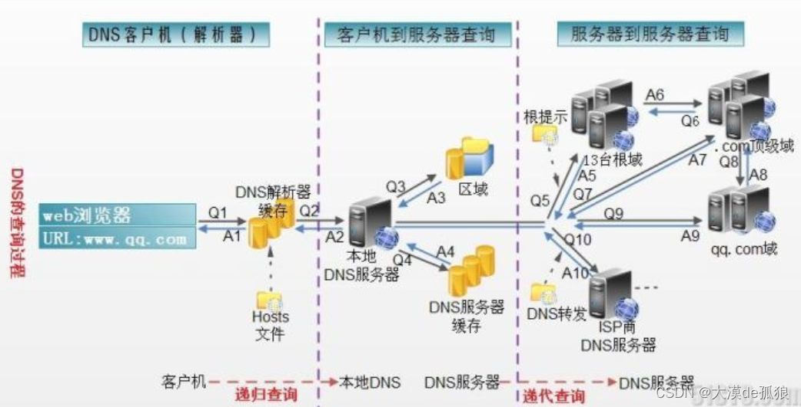

# 关于负载均衡

## 总述 

 当应用或者服务发展到一定程度，负载问题就会被提上日程。所谓负载均衡是建立在现有网络基础值上的一种用来均衡宽带，网络，以达到应用服务更加健壮性和灵活性的一种解决方案。

负载均衡按种类划分可分为如下几种：

- DNS负载均衡

- 硬件负载均衡

- 软件负载均衡

- 负载均衡按照网络层次结构划分可分为如下几种：

- 二层负载均衡（基于MAC负载）

- 三层负载均衡（基于IP负载）

- 四层负载均衡（基于IP和PORT负载）

- 七层负载均衡（基于URL应用层负载）

### **DNS负载**

1. **什么是DNS?**
     DNS解析是一种服务，可以将域名解析成IP。DNS解析服务是一种树状结构的层级服务，全球有13台根DNS服务器。当本机计算机在hosts文件中找不到域名对应的IP,从本地DN解析服务器中查询，如果本地DSN服务器中也没有，会向根DNS服务器发起请求，根DNS服务器会采用递归迭代的方式进行搜索。

名词解释：本地DNS一般是指你电脑上网时IPv4或者IPv6设置中填写的那个DNS。这个有可能是手工指定的或者是DHCP自动分配的。

2. **DNS工作原理图：**

	

1. 
    当浏览器进行请求时，先查询本机DNS缓存和hosts文件，其中hosts文件中优先级最高，找出域名和IP的映射关系，如果找不到则进行本地DNS服务查询

2. 本地DNS服务器就是我们指定的DNS服务器，可以是私有的，也可以是是由ISP提供的公共的DNS服务器。比如114.114.114.114是全国通用DNS，8.8.8.8是谷歌免费提供的一个DNS，本地DNS服务器也会维护一张缓存表用来提高查询效率。

3. 如果本地DNS服务器也没有找到，会向根DNS服务器发起请求，根DNS服务器会采用递归迭代的方式进行搜索，全球有13台根DNS服务器，根DNS服务器会根据域名后缀返回对应的顶级域名服务器，顶级域名服务器会再次根据域名分类将指定的主DNS地址返回，如此迭代直到解析到对应的IP地址再一步步返回给客户机。

4. 当找到域名和IP的映射后，就会把新的映射加入到本机缓存中，以便下次方便直接获取。（计算机把这个过程叫所学习），同时本地缓存也会有失效时间，失效的需要重新进行寻找。

3. DNS解析面临的问题？
        DNS解析容易产生DNS劫持，所谓DNS劫持就是指，DNS服务器被攻击串改。其实公用的DNS服务器已经做了很好的安全措施，大可不必担心。

4.**DNS负载如何实现的？**
        在 DNS 服务器中为同一个主机名配置多个 IP 地址，多个 IP 地址以轮询的方式选择。

5.**DNS负载优点**

-  第一，技术实现比较灵活、方便，简单易行，成本低，适用于大多数TCP/IP应用。不需要网络专家来对之进行设定，或在出现问题时对之进行维护。
- 第二，对于Web应用来说，不需要对代码作任何的修改。事实上，Web应用本身并不会意识到负载均衡配置，即使在它面前。

- 第三，Web服务器可以位于互联网的任意位置上。

5.**DNS负载缺点：**

- 第一，不能够按照Web服务器的处理能力分配负载。DNS负载均衡采用的是简单的轮循负载算法，不能区分服务器之间的差异，不能反映服务器的当前运行状态。所以DNS服务器将Http请求平均地分配到后台的Web服务器上，而不考虑每个Web服务器当前的负载情况。如果后台的Web服务器的配置和处理能力不同，最慢的 Web服务器将成为系统的瓶颈，处理能力强的服务器不能充分发挥作用。不能做到为性能较好的服务器多分配请求，甚至会出现客户请求集中在某一台服务器上的情况。
- 第二，不支持高可靠性，DNS负载均衡技术没有考虑容错。如果后台的某台Web服务器出现故障，DNS服务器仍然会把DNS 请求分配到这台故障服务器上，导致不能响应客户端。

- 第三，可能会造成额外的网络问题。为了使本DNS服务器和其他DNS服务器及时交互，保证DNS数据及时更新，使地址能随机分配，一般都要将DNS的刷新时间设置的较小，但太小将会使DNS流量大增造成额外的网络问题。

- 第四，一旦某个服务器出现故障，即使及时修改了DNS设置，还是要等待足够的时间(刷新时间)才能发挥作用，在此期间，保存了故障服务器地址的客户计算机将不能正常访问服务器。

### **链路层的负载均衡**

#### **网络链路层如何理解？**

链路层位于网络七层协议的第二层，主要功能是把网络层的包进行封装成帧，在链路层进行传输。

#### **链路层，网卡，和以太网 MAC直接有什么关系**？

链路层可以看作是网卡和网卡驱动程序的总称，网卡是实现了以太网协议的网络接口，而以太网是基于MAC地址来实现的一种通信协议。一个网卡里面出厂时必然已经内置了MAC地址，由于以太网在全球很普及，而网卡实现以太网协议进行通信，所以我们也罢MAC地址特指链路层地址，假设某一天以太网通信被取代了，不需要MAC地址了，那么网卡的实现原理和链路层地址也就不是MAC了。

#### **链路层的作用**？

封装成帧：将网络层的数据封装成帧的个数，在数据前添加帧首，在数据后添加帧尾；
透明传输：对于出现在帧数据中的控制字符，但是要当做不存在的去处理；
差错检测：物理层只负责传输比特流，无法控制是否出错，所以需要数据链路层负责差错检测的工作。（奇偶校验码，CRC冗余校验）

#### **链路层负责均衡如何实现？**

数据链路层负载均衡也叫网卡负载均衡。它会通过一个虚拟MAC地址接收请求，然后再分配到真实的MAC地址来实现的。该种方式多用在大型网络中，网络流量比较大，一个网卡不能满足需求，把多个网卡捆绑成一个虚拟网卡对外提供接口，而根据实际MAC地址进行帧的分发。由于数据链路层工作在同一个网络中，所以链路层的负载也必须是同一个网络内的负载。

### **网络层负载均衡（三层网络负载均衡）**

####  **网络层如何理解？**

网络层是七层协议的第三层，主要提供虚拟电路服务和数据包服务。所谓虚拟电路其实不是实际存在的，而是相对于电话通信前必须建立一条物理线路做类比而模拟的一条虚拟电路。数据包服务是说明信息在网络层传输是以数据包（IP数据包）形式而传输的，传输层不保证可靠交互，而是尽最大能力交付。

#### **为什么要有网络层？**

假设没有网络层，根据MAC网络也能实现通信，但是当我们把MAC1地址的数据发送到MAC2地址，那么我们就需要把所以的mac地址统一收集到一个表中，这样的通信是很恐怖的。而有了网络层，就可以IP协议，把网络进行分段，在不同网段之间进行IP路由选择，这样就大大的提高了网络通信效率。

#### **网络负载均衡如何实现？**

 在网络层结合负载均衡算法通过修改请求目标IP地址进行负载均衡。 

用户请求数据包，到达负载均衡服务器后，负载均衡服务器在操作系统内核进程获取网络数据包，根据负载均衡算法得到一台真实服务器地址，然后将请求目的地址修改为获得的真实ip地址，整个过程不需要经过用户进程处理。真实服务器处理完成后，响应数据包回到负载均衡服务器，负载均衡服务器再将数据包源地址修改为自身的ip地址，发送给用户浏览器。

代表性技术方案：NAT（网络转发技术）

**优点**

IP负载均衡在内核进程完成数据分发，处理性能更好

**缺点**

由于所有请求响应的数据包都需要经过负载均衡服务器，因此负载均衡的网卡带宽成为系统的瓶颈

### 四层负载均衡（传输层负载）

#### 传输层如何理解？

计算机网络通信其实就是计算机进程进行通信，而网络层协议只是告诉A服务器如何找到B服务器，但是不知道是A服务器的哪一个进行和B哪一个进程进行通信，而传输层就是提供进程之间的通信。

传输层有一个很重要的特性：复用和分用。所谓复用是指，不同的引用进程可以同时用同一个协议进行通信（需要加上合适的首部），而分用是指，接收方收到报文后剥去报文的首部后能正确交付到对应进程中。

#### 传输层是如何实现的呢？

传输层主要是通过TCP（传输控制协议）和UDP(数据报文协议)来实现的。我们知道网络层传输的是数据包，网络层只是校验了数据包的正确与否，但是却不知道数据包内容本身是否完整交互，当数据通过计算机A的网卡发生到计算机B的网卡后，网卡就会把数据交付给传输层，而在传输层中进行数据内存校验，知道所以数据交付完毕。

#### 传输层负载如何实现？

四层的负载均衡就是基于IP+端口的负载均衡：在三层负载均衡的基础上，通过发布三层的IP地址（VIP），然后加四层的端口号，来决定哪些流量需要做负载均衡，对需要处理的流量进行NAT处理，转发至后台服务器，并记录下这个TCP或者UDP的流量是由哪台服务器处理的，后续这个连接的所有流量都同样转发到同一台服务器处理。

对应的负载均衡器称为四层交换机（L4 switch），主要分析IP层及TCP/UDP层，实现四层负载均衡。此种负载均衡器不理解应用协议（如HTTP/FTP/MySQL等等），常见例子有：LVS，F5。

### 七层的负载均衡

七层的负载均衡就是基于虚拟的URL或主机IP的负载均衡：在四层负载均衡的基础上（没有四层是绝对不可能有七层的），再考虑应用层的特征，比如同一个Web服务器的负载均衡，除了根据VIP加80端口辨别是否需要处理的流量，还可根据七层的URL、浏览器类别、语言来决定是否要进行负载均衡。

常见的7层负载均衡的软负载产品有**gateway、nginx**等。很容易理解

