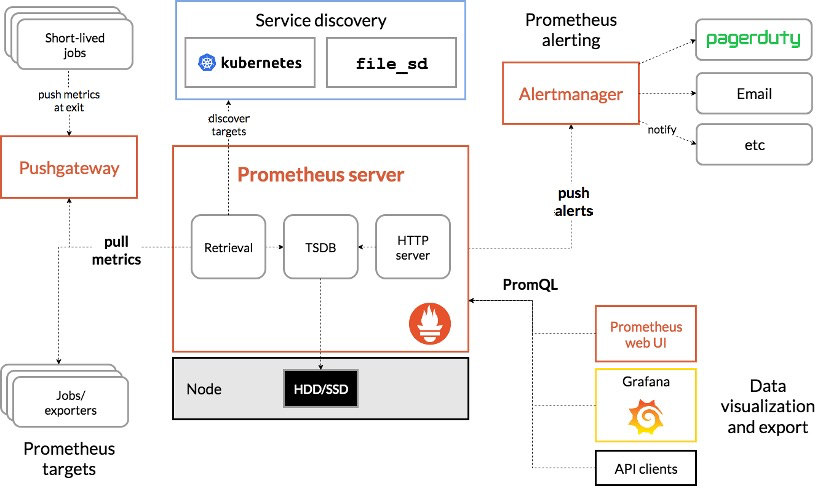
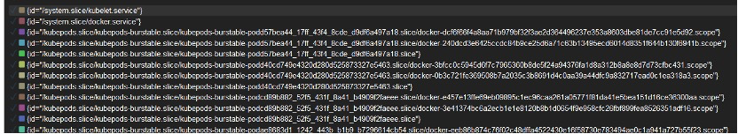

# prometheus

## 一、 prometheus介绍

prometheus 是一个采用 go 语言的监控平台，它是继 Kubernetes 后，第二个在Cloud Native Computing Foundation云原生基金会开源的项目。它的前身类似 Kubernetes 的前身brog 平台一样，也是在谷歌内使用的监控平台brogmon监控系统演变而来。

由于 prometheus 的特性，它非常适用于监控云原生环境，Prometheus性能足够支撑上万台规模的集群。

> Prometheus配置：https://prometheus.io/docs/prometheus/latest/configuration/configuration/
>
> Prometheus监控组件对应的exporter部署地址:https://prometheus.io/docs/instrumenting/exporters/
>
> Prometheus基于k8s服务发现参考:https://github.com/prometheus/prometheus/blob/release-2.31/documentation/examples/prometheus-kubernetes.yml

## 二、prometheus 特点

- 多维度数据模型
  - 时间序列数据通过 metric 名和键值对来区分。
  - 所有的 metrics 都可以设置任意的多维标签。
  - 数据模型更随意，不需要刻意设置为以点分隔的字符串。
  - 可以对数据模型进行聚合，切割和切片操作。
  - 支持双精度浮点类型，标签可以设为全 unicode。
- 灵活的查询语言（PromQL）：在同一个查询语句，可以对多个 metrics 进行乘法、加法、连接、取分数位等操作。
- 不依赖任何分布式存储
- 通过**拉取方式**采集数据，或者**通过中间网关推送方式**采集数据
- 通过服务发现或者静态配置来发现监控目标
- 支持多种图形界面展示方式

## 三、prometheus 组成

1. Prometheus Server: 用于收集和存储时间序列数据。

2. Client Library: 客户端库，检测应用程序代码，当Prometheus抓取实例的HTTP端点时，客户端库会将所有跟踪的metrics指标的当前状态发送到prometheus server端。

3. Exporters: prometheus支持多种exporter，通过exporter可以采集metrics数据，然后发送到prometheus server端，所有向promtheus server提供监控数据的程序都可以被称为exporter

4. Alertmanager: 从 Prometheus server 端接收到 alerts 后，会进行去重，分组，并路由到相应的接收方，发出报警，常见的接收方式有：电子邮件，微信，钉钉, slack等。

5. Grafana：监控仪表盘，可视化监控数据

6. pushgateway: 各个目标主机可上报数据到pushgateway，然后prometheus server统一从pushgateway拉取数据。

   

## 四、prometheus安装

### 1、docker 安装

#### 拉取 prometheus  image

```shell
docker pull  prom/prometheus
```

#### 配置 prometheus

```yaml
# my global config
global:
  scrape_interval:     15s # Set the scrape interval to every 15 seconds. Default is every 1 minute.
  evaluation_interval: 15s # Evaluate rules every 15 seconds. The default is every 1 minute.
  # scrape_timeout is set to the global default (10s).

# Alertmanager configuration
alerting:
  alertmanagers:
  - static_configs:
    - targets:
      # - alertmanager:9093

# Load rules once and periodically evaluate them according to the global 'evaluation_interval'.
rule_files:
  # - "first_rules.yml"
  # - "second_rules.yml"

# A scrape configuration containing exactly one endpoint to scrape:
# Here it's Prometheus itself.
scrape_configs:
  # The job name is added as a label `job=<job_name>` to any timeseries scraped from this config.
  - job_name: 'prometheus'

    # metrics_path defaults to '/metrics'
    # scheme defaults to 'http'.

    static_configs:
    - targets: ['localhost:9090']

```


#### 启动 prometheus

```shell
docker run -d -p 9090:9090 --name prometheus --restart=always -v /root/data/:/data  -v /root/prometheus.yml:/etc/prometheus/prometheus.yml -v /root/rule.yml:/etc/prometheus/rule.yml prom/prometheus --config.file=/etc/prometheus/prometheus.yml --web.enable-lifecycle --storage.tsdb.retention=90d
```

#### 安装 node-exporter

```shell
docker pull prom/node-exporter
ocker run -d --name node-exporter --restart=always -p 9100:9100 -v "/proc:/host/proc:ro" -v "/sys:/host/sys:ro" -v "/:/rootfs:ro" prom/node-exporter
```

#### 安装 granafa

```shell
docker pull grafana/grafana
docker run -d -p 3000:3000 --name=grafana grafana/grafana
```

### 2、二进制安装

#### 安装 prometheus


##### 配置 systemd

```
[Unit]
Description=prometheus service

[Service]
ExecStart=/usr/local/bin/prometheus/prometheus --config.file=/usr/local/bin/prometheus/prometheus.yml 
 
[Install]
WantedBy=multi-user.target
```


#### 安装 node-exporter


##### 配置 systemd

```
[Unit] Description=node exporter
[Service] ExecStart=/usr/local/bin/node_exporter/node_exporter
[Install] WantedBy=multi-user.target
```


#### 安装 granafa


### 3、Kubernetes 安装

#### 安装 prometheus


#### 安装 node-exporter


#### 安装 granafa


### 4、拓展延伸

#### prometheus 联邦


## 五、prometheus 监控


## 六、prometheus 告警


## 七、grafana配置


## 八、PromQL

PromQL（Prometheus Query Language）是 Prometheus 自己开发的表达式语言，语言表现力很丰富，内置函数也很多。使用它可以对时序数据进行筛选和聚合。

### 数据类型：

#### Counter

Counter是计数器类型：

1、Counter 用于累计值，例如记录请求次数、任务完成数、错误发生次数。

2、一直增加，不会减少。

3、重启进程后，会被重置。

例如：

http_response_total{method="GET",endpoint="/api/tracks"} 100

http_response_total{method="GET",endpoint="/api/tracks"} 160

Counter 类型数据可以让用户方便的了解事件产生的速率的变化，在PromQL内置的相关操作函数可以提供相应的分析，比如以HTTP应用请求量来进行说明：

1、通过rate()函数获取HTTP请求量的增长率

rate(http_requests_total[5m])

2、查询当前系统中，访问量前10的HTTP地址

topk(10, http_requests_total)

#### Gauge

Gauge是测量器类型：

1、Gauge是常规数值，例如温度变化、内存使用变化。

2、可变大，可变小。

3、重启进程后，会被重置

例如：

memory_usage_bytes{host="master-01"}  100

memory_usage_bytes{host="master-01"}  30

memory_usage_bytes{host="master-01"}  50

memory_usage_bytes{host="master-01"}  80 

对于 Gauge 类型的监控指标，通过 PromQL 内置函数 [delta()](https://www.yangcs.net/prometheus/3-prometheus/functions.html#delta) 可以获取样本在一段时间内的变化情况，例如，计算 CPU 温度在两小时内的差异：

dalta(cpu_temp_celsius{host="zeus"}[2h])

你还可以通过PromQL 内置函数 [predict_linear()](https://www.yangcs.net/prometheus/3-prometheus/functions.html#predictlinear) 基于简单线性回归的方式，对样本数据的变化趋势做出预测。例如，基于 2 小时的样本数据，来预测主机可用磁盘空间在 4 个小时之后的剩余情况：

predict_linear(node_filesystem_free{job="node"}[2h], 4 * 3600) < 0

#### histogram

histogram是柱状图，在Prometheus系统的查询语言中，有三种作用：

1、在一段时间范围内对数据进行采样（通常是请求持续时间或响应大小等），并将其计入可配置的存储桶（bucket）中. 后续可通过指定区间筛选样本，也可以统计样本总数，最后一般将数据展示为直方图。

2、对每个采样点值累计和(sum)

3、对采样点的次数累计和(count)

度量指标名称: [basename]_上面三类的作用度量指标名称

1、[basename]_bucket{le="上边界"}, 这个值为小于等于上边界的所有采样点数量

2、[basename]_sum

3、[basename]_count 

> 小结：如果定义一个度量类型为Histogram，则Prometheus会自动生成三个对应的指标

##### 为什需要用histogram柱状图？

在大多数情况下人们都倾向于使用某些量化指标的平均值，例如 CPU 的平均使用率、页面的平均响应时间。这种方式的问题很明显，以系统 API 调用的平均响应时间为例：如果大多数 API 请求都维持在 100ms 的响应时间范围内，而个别请求的响应时间需要 5s，那么就会导致某些 WEB 页面的响应时间落到中位数的情况，而这种现象被称为长尾问题。

为了区分是平均的慢还是长尾的慢，最简单的方式就是按照请求延迟的范围进行分组。例如，统计延迟在 0~10ms 之间的请求数有多少，而 10~20ms 之间的请求数又有多少。通过这种方式可以快速分析系统慢的原因。Histogram 和 Summary 都是为了能够解决这样问题的存在，通过 Histogram 和 Summary 类型的监控指标，我们可以快速了解监控样本的分布情况。

Histogram 类型的样本会提供三种指标（假设指标名称为 <basename>）：

样本的值分布在 bucket 中的数量，命名为 <basename>_bucket{le="<上边界>"}。解释的更通俗易懂一点，这个值表示指标值小于等于上边界的所有样本数量。

1、http 请求响应时间 <=0.005 秒 的请求次数为0

io_namespace_http_requests_latency_seconds_histogram_bucket{path="/",method="GET",code="200",le="0.005",} 0.0

2、http 请求响应时间 <=0.01 秒 的请求次数为0

io_namespace_http_requests_latency_seconds_histogram_bucket{path="/",method="GET",code="200",le="0.01",} 0.0

 3、http 请求响应时间 <=0.025 秒 的请求次数为0

io_namespace_http_requests_latency_seconds_histogram_bucket{path="/",method="GET",code="200",le="0.025",} 0.0

所有样本值的大小总和，命名为 <basename>_sum。

#### summary

与 Histogram 类型类似，用于表示一段时间内的数据采样结果（通常是请求持续时间或响应大小等），但它直接存储了分位数（通过客户端计算，然后展示出来），而不是通过区间来计算。它也有三种作用：

1、对于每个采样点进行统计，并形成分位图。（如：正态分布一样，统计低于60分不及格的同学比例，统计低于80分的同学比例，统计低于95分的同学比例）

2、统计班上所有同学的总成绩(sum)

3、统计班上同学的考试总人数(count)

带有度量指标的[basename]的summary 在抓取时间序列数据有如命名。

1、观察时间的φ-quantiles (0 ≤ φ ≤ 1), 显示为[basename]{分位数="[φ]"}

2、[basename]_sum， 是指所有观察值的总和

3、[basename]_count, 是指已观察到的事件计数值

样本值的分位数分布情况，命名为 <basename>`{quantile="`<φ>`"}`。

1、含义：这 12 次 http 请求中有 50% 的请求响应时间是 3.052404983s

 io_namespace_http_requests_latency_seconds_summary{path="/",method="GET",code="200",quantile="0.5",} 3.052404983

2、含义： http 请求中有 90% 的请求响应时间是 8.003261666s

 io_namespace_http_requests_latency_seconds_summary{path="/",method="GET",code="200",quantile="0.9",} 8.003261666

所有样本值的大小总和，命名为 <basename>`_sum`。

1、含义：http 请求的总响应时间为 51.029495508s

 io_namespace_http_requests_latency_seconds_summary_sum{path="/",method="GET",code="200",} 51.029495508

样本总数，命名为 <basename>`_count`。

1、含义：当前一共发生了 12 次 http 请求

 io_namespace_http_requests_latency_seconds_summary_count{path="/",method="GET",code="200",} 12.0

现在可以总结一下 Histogram 与 Summary 的异同：

它们都包含了 <basename>_sum 和 <basename>_count 指标

Histogram 需要通过 <basename>_bucket 来计算分位数，而 Summary 则直接存储了分位数的值。

prometheus_tsdb_wal_fsync_duration_seconds{quantile="0.5"} 0.012352463

prometheus_tsdb_wal_fsync_duration_seconds{quantile="0.9"} 0.014458005

prometheus_tsdb_wal_fsync_duration_seconds{quantile="0.99"} 0.017316173

prometheus_tsdb_wal_fsync_duration_seconds_sum 2.888716127000002

prometheus_tsdb_wal_fsync_duration_seconds_count 216

从上面的样本中可以得知当前Promtheus Server进行wal_fsync操作的总次数为216次，耗时2.888716127000002s。其中中位数（quantile=0.5）的耗时为0.012352463，9分位数（quantile=0.9）的耗时为0.014458005s。

### 函数

Prometheus 内置了一些函数来辅助计算，下面介绍一些典型的。

abs()：绝对值

sqrt()：平方根

exp()：指数计算

ln()：自然对数

ceil()：向上取整

floor()：向下取整

round()：四舍五入取整

delta()：计算区间向量里每一个时序第一个和最后一个的差值

sort()：排序

### 聚合操作符

PromQL 的聚合操作符用来将向量里的元素聚合得更少。总共有下面这些聚合操作符：

sum：求和

min：最小值

max：最大值

avg：平均值

stddev：标准差

stdvar：方差

count：元素个数

count_values：等于某值的元素个数

bottomk：最小的 k 个元素

topk：最大的 k 个元素

quantile：分位数 

如：

计算xianchaomaster1节点所有容器总计内存

sum(container_memory_usage_bytes{instance=~"xianchaomaster1"})/1024/1024/1024

计算xianchaomaster1节点最近1m所有容器cpu使用率

sum (rate (container_cpu_usage_seconds_total{instance=~"xianchaomaster1"}[1m])) / sum (machine_cpu_cores{ instance =~"xianchaomaster1"}) * 100

计算最近1m所有容器cpu使用率

sum (rate (container_cpu_usage_seconds_total{id!="/"}[1m])) by (id)

\#把id会打印出来

结果如下：



### 选择器

